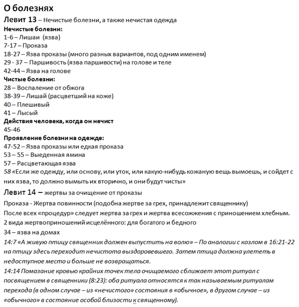
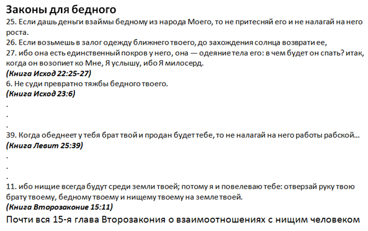

[&#8592; Глава 1](../01-Герменевтика "Герменевтика: герменевтическое исследование текста Священного Писания") &ensp;&ensp;&ensp;&ensp;[Оглавление](https://github.com/nyakovchuk/seminary-study-book) &ensp;&ensp;&ensp;&ensp; [Глава 3 &#8594;](../03-Философия "Философия: Библия о смысле и предназначении человека")

#### Часть 1
# Глава 2. Пятикнижие
# Бедные и больные Израиля. Законы для общества

[**Вступление**](#intro)

[**2.1. Бедные в Израиле**](#p21)

&ensp;&ensp;[2.1.1. Взаимоотношения с бедными в Израиле](#p211)

&ensp;&ensp;[2.1.2. Наше отношение к бедным](#p212)

[**2.2. Больные в Израиле**](#p22)

&ensp;&ensp;[2.2.1. Нечистые болезни на теле](#p221)

&ensp;&ensp;[2.2.2. Нечистые болезни – истечения из тела](#p222)

&ensp;&ensp;[2.2.3. Образы нечистых болезней для нас](#p223)

[**Вывод**](#conclusion)

Это был первый предмет, в котором был перечень тем для реферата. Выбор темы «о болезнях и бедности» вызывал интерес. Тема болезни касалась наших близких родственников, а когда эта тема тебя касается, то ты о ней размышляешь. О бедности, часто неправильно учат в церквях, сравнивая её исключительно с проклятием. Возникло желание раскрыть эту тему пусть и в свете Ветхого Завета, но я осознавал, что она будет точно актуальна и для нашего времени, ведь в ней заложены вечные Божьи принципы.

Чтобы написать данную работу, пришлось просмотреть всё Пятикнижие, получилась трудовая работа. Для работы создал черновой документ и разделил его на 3 части: «о болезнях», «о бедности» и «законы о обществе» в которые вносил соответствующие стихи или примечания из Пятикнижия, а также заметки из учебной Библии.

Черновой документ по мере внесения стихов из Библии получил ещё два раздела «ключевые стихи» и «мысли». В «ключевых стихах» я записывал стихи, которые определяли суть или подводили итог основным направлениям по темам. В «мыслях» записывал свои размышления. Свои комментарии я оставлял после каждого стиха в разделах «о болезнях», «о бедности», но в данном разделе эти мысли были обстоятельные и общие.

Данный подход переноса стихов в черновик не носит универсальный характер для всех случаев. Несомненный плюс этого подхода заключается в предмете, который был ограничен определёнными книгами, в данном случае Пятикнижия. Для всей Библии данный подход был бы очень затратным по времени. Следует учитывать, что описания о бедности и о болезнях, хоть и встречается на протяжении всех книг Пятикнижия, но обстоятельные учения сконцентрированы в определённых главах, что упрощает разработку темы.

**Рис. 2.1.** Фрагмент раздела «о болезнях» в черновом документе

**Рис. 2.2.** Фрагмент раздела «о бедности» в сокращённом виде

Это был первый трудовой реферат. И он на данный момент единственный, который не получил проходной бал и из-за чего пришлось его переделать. Это был серьёзный удар для начинающего студента, потому что я свою работу считал отличной. Причиной послужило то, что я неправильно понял тему, дословно она называлась: «Бедные и больные Израиля. Законы для общества». Я посчитал, что «законы для общества» это отдельный пункт, что конечно меня сильно смутило, ведь их в Пятикнижии много. Поэтому я не рассматривал их все, а обратил внимание, что законы для общества даны Израилю из-за основных двух причин, на которых акцентирует внимание Господь: **Бог – свят** и **Бог – это наш Бог**. Это надо всегда ясно осознавать. На основании этих выводов постарался выделить из данных законов основные принципы, которые будут полезны для нас, христиан Нового Завета. Как оказалось в итоге, «законы для общества» это просто было уточнение за бедных и больных. В результате мои старания по этому разделу, принесли ущерб работе почти на 20 баллов. Именно столько дополнительных баллов я получил, после того как удалил этот раздел и исправил введение и вывод, убрав из них упоминание законов для общества. Основной урок из этого, особенно для студентов заочного отделения, что все неясные моменты нужно уточнять и не нужно ничего додумывать. В данном случае мне было не сложно внести исправления в работу, а что если бы пришлось дописывать разделы? Это было бы очень неприятно, с учётом того, что оценки мы в основном узнаём через какое-то продолжительное время, когда мысли об этой теме точно остыли.

## Вступление

Цель – рассмотреть постановления от Господа относительно бедных и больных людей, а также законы данные Израилю по отношению к таковым людям. Изучить взаимоотношение Израиля с бедными и больными. Классифицировать нечистые болезни в Израильском народе. Рассмотреть процедуры возвращения (очищения) исцелённого человека в общество. Сделать правильные выводы на основе изученных данных.

## 2.1. Бедные в Израиле
>«ибо нищие всегда будут среди земли твоей;…» 
***(Вт.15:11)***

Данный отрывок специально вырван из контекста, звучит угрожающе и возможно даже неприятно и самое главное – это не проклятие. Взаимоотношению с бедными больше всего, из всего Пятикнижия, уделяется именно в 15-й главе Второзакония. Поэтому, данной главе будет уделено особое внимание. Также рассмотрим ключевые заповеди и постановления Божьи касаемо бедных. В Пятикнижии нет заповедей к бедным, кроме жертвоприношений, для возможности участвовать в служении Богу. Но много постановлений к остальным людям, чтобы у них было правильное отношение к бедному. Эти постановления описаны во всех четырёх книгах (от Исхода до Второзакония), когда Израиль стал народом.

### 2.1.1. Взаимоотношения с бедными в Израиле

15-я глава Второзакония известна не 11-м стихом, а 4-м и 6-м, которые ярко контрастируют с 11-м, и могут вызывать непонимание или ещё хуже чувства некоторого противоречия. Приведём их: *«Разве только не будет у тебя нищего: ибо благословит тебя Господь на той земле, которую Господь, Бог твой, дает тебе в удел, чтобы ты взял ее в наследство, если только будешь слушать гласа Господа, Бога твоего, и стараться исполнять все заповеди сии, которые я сегодня заповедую тебе; ибо Господь, Бог твой, благословит тебя, как Он говорил тебе, и ты будешь давать взаймы многим народам, а сам не будешь брать взаймы; и господствовать будешь над многими народами, а они над тобою не будут господствовать»* ***(Вт.15:4-6)***. Прекрасные слова благословения, может показаться, что неплохо бы закончить главу на 6-м стихе. По милости Божьей она заканчивается 23-м стихом, а до 17-го описаны взаимоотношения с нищим. 5-й стих даёт нам ответ, что нищие вокруг нас – они для нас, пока мы не научимся слушать голос Божий и исполнять заповеди Его. Господь печётся о каждом, особенно о тех, кто нуждается в этом и желание Бога, чтобы и Его народ был подобен Ему и в этом деле. И самое первое, что необходимо нам, это видеть в нищем – творение Божье, такого же человека, как и остальные. «Богатый и бедный встречаются друг с другом: того и другого создал Господь» (Прит.22:2). Если не будет этого понимания, то выполнение остальных заповедей касаемо нищих будут трудны и без любви, а как будет показано ниже эти заповеди особенно пропитаны милостью и любовью. Приведём и разберём некоторые из них:
1. **«Если дашь деньги взаймы бедному из народа Моего, то не притесняй его и не налагай на него роста. Если возьмешь в залог одежду ближнего твоего, до захождения солнца возврати ее, ибо она есть единственный покров у него, она — одеяние тела его: в чем будет он спать? итак, когда он возопиет ко Мне, Я услышу, ибо Я милосерд»** ***(Исх.22:25-27)***.
У этого отрывка есть продолжение, которое находится во Второзаконии в 24-й главе: «*если же он будет человек бедный, то ты не ложись спать, имея залог его: возврати ему залог при захождении солнца, чтоб он лег спать в одежде своей и благословил тебя, – и тебе поставится сие в праведность пред Господом, Богом твоим. Не обижай наемника, бедного и нищего, из братьев твоих или из пришельцев твоих, которые в земле твоей, в жилищах твоих; в тот же день отдай плату его, чтобы солнце не зашло прежде того, ибо он беден, и ждет ее душа его; чтоб он не возопил на тебя к Господу, и не было на тебе греха»* ***(Вт.24:12-15)***. Во втором отрывке описаны последствия от наших действий – это праведность пред Богом или грех, который придёт на нас. Конечно, условие «если дашь» даёт нам выбор, не ввязываться в такое предприятие, которое может помрачить нашу душу, но если возникли такие мысли, то значит «нищие всегда будут среди земли твоей». Более того, вторая часть 11-го стиха не даёт нам выбора – не помогать нуждающемуся *«…потому я и повелеваю тебе: отверзай руку твою брату твоему, бедному твоему и нищему твоему на земле твоей»* – прямое Божье повеление всегда участвовать в нуждах ближнему.

2. **«Не суди превратно тяжбы бедного твоего»** ***(Исх.23:6)***.
О лицемерном судействе бедного много говорится в Ветхом завете, да и в Новом завете также имеются предупреждения об этом. Насколько это важно пред Господом? Бог есть судия праведный и за всеми судами, которые совершаются  нами, Он пристально наблюдает. Судить праведно – это то, что пригодится нам в вечности и этому мы должны научиться на земле. Можно много писать о важности этого вопроса, но это всё будут размышления человеческие, зачем они нам, когда есть слова Божьи: *«Он разбирал дело бедного и нищего, и потому ему хорошо было. Не это ли значит знать Меня? говорит Господь»* ***(Иер.22:16)***. Комментарии после этих слов, уже излишни.

3. **«и виноградника твоего не обирай дочиста, и попадавших ягод в винограднике не подбирай; оставь это бедному и пришельцу. Я Господь, Бог ваш»** ***(Лев.19:10)***. **«Когда будете жать жатву на земле вашей, не дожинай до края поля твоего, когда жнешь, и оставшегося от жатвы твоей не подбирай; бедному и пришельцу оставь это. Я Господь, Бог ваш»** ***(Лев.23:22)***.
«Я Господь, Бог ваш» – понимание Кто твой Бог, даёт тебе страх Божий. Страх Божий – это начало мудрости, понимание того, что всё, что даёт тебе Бог, оно не только для тебя, поэтому оставляй и уделяй другим.

4. **«Если брат твой обеднеет и придет в упадок у тебя, то поддержи его, пришлец ли он, или поселенец, чтоб он жил с тобою; не бери от него роста и прибыли и бойся Бога твоего; чтоб жил брат твой с тобою; серебра твоего не отдавай ему в рост и хлеба твоего не отдавай ему для получения прибыли»** ***(Лев.25:35-37)*** и **«Когда обеднеет у тебя брат твой и продан будет тебе, то не налагай на него работы рабской…»** ***(Лев.25:39)***.
Суть этих заповедей одна – не рассчитывай (не планируй) заработать на бедном. Твоя цель позаботиться о нём, подкрепить его, помочь ему – это всё то, чего ты ждёшь от Господа когда *«Я же беден и нищ, но Господь печется о мне»* ***(Пс.39:18)***. Подражай Господу.

### 2.1.2. Наше отношение к бедным

Слово Божье не призывает нас, научить бедного зарабатывать, и не учит, как заработать деньги, чтобы не быть бедным (кроме очевидных случаев «отсутствие благословения» и «лень»). Слово Божие – это не бизнес книга, оно просто предупреждает –  «обеднеет у тебя брат твой» и ты будь готов благоразумно с ним поступать.

Слово Божье предупреждает и нас о том, что и мы можем обнищать, даже не смотря на наш труд и покров Божий. Основная наша цель – войти подобно Христу в Царство Небесное. Земное богатство – это дар Божий: *«И если какому человеку Бог дал богатство и имущество, и дал ему власть пользоваться от них и брать свою долю и наслаждаться от трудов своих, то это — дар Божий»* ***(Ек.5:18)***. Бедность – это тоже часть земной жизни, которая не обходит человека. В ней мы познаём особую заботу Господа о нас, стихи из слова Божьего исполняются в нашей жизни. Богатство и бедность это то, что будет сопровождать жизнь, возможно не лично в нашей жизни. Господь может сохранить нас от этого как, когда-то просил Агур, сын Иакеева: *«нищеты и богатства не давай мне»* ***(Прит.30:8)***. Но рядом с нами всегда будут нищие и богатые, и наша задача, не взирая на достаток людей, поступать с ними, так как желает этого Бог.

## 2.2. Больные в Израиле
> «Так предохраняйте сынов Израилевых от нечистоты их, чтоб они не умерли в нечистоте своей, оскверняя жилище Мое, которое среди них…» 
***(Лев.15:31)***

О болезнях в Израиле в Пятикнижие написано не много. Не встретим предписаний и о больных, что с ними делать, как лечить и т.д. Но есть особые болезни, несущие нечистоту, как для самых болящих, так и для тех, кто рядом с ними. Этим болезням уделяется особое внимание, потому что таким болящим запрещено входить в святилище. И не только в святилище, но при некоторых болезнях следовало выселение за стан. Почему настолько суровое наказание? Ответ дан в выше приведённом стихе, чтоб не оскверняли жилище Божье. Богу не всё равно в каком состоянии приходят в Его дом, какими руками касаются святынь и участвуют в жертвоприношениях. Господь не желает, чтобы последующие участники в служении, после «нечистого» чувствовали некоторую брезгливость к святыням и службе. Святость и чистота должны сопровождать служение Богу. И это требование, не только к служителям, но и ко всем ступающим в Скинию Собрания. Выселение за стан относилось только к тем, у кого болезнь «распространялась». Распространение болезни по телу, означало, что она может перейти и на следующего человека. Милость Божья, явленная в исцелении, позволяла каждому заболевшему вернуться в народ и входить во дворы Божьи. Эта надежда должна держать таких людей недалеко от стана.

### 2.2.1. Нечистые болезни на теле

#### Проявление болезни

13-я глава Левит написана о внешнем проявлении «проказы» на теле, одежде. Под «проказой», в данном случае, понимается не сама болезнь, а любое кожное проявление, описанное в данной главе и попадающее под категорию нечистота. В данной главе определены виды кожной болезни, а также как правильно их идентифицировать. Перечень болезней при которых человек становился нечистым:
* язва проказы ***(Лев.13:2-3, Лев.13:18-27)***;
* проказа ***(Лев.13:7-17)***;
* паршивость ***(Лев.13:29-37)***;
* язва на голове ***(Лев.13:42-44)***.

Определение чистый человек или нет, выносил священник. Если он не был уверен, что эта болезнь относится к нечистой категории, то человек заключался на семь дней и по завершении этих дней выносилось окончательное определение (для точного определения болезни – язва проказы или лишай могло потребоваться 14 дней).

Интересное предписание было для поведения человека с язвой на голове. Так как этот вид язвы можно не заметить, то ответственность о предупреждении нечистоты возлагалась на «прокажённого». *«У прокаженного, на котором эта язва, должна быть разодрана одежда, и голова его должна быть не покрыта, и до уст он должен быть закрыт, и кричать: «нечист! нечист!». Во все дни, доколе на нем язва, он должен быть нечист, нечист он; он должен жить отдельно, вне стана жилище его»* ***(Лев.13:45,46)***.

#### Очищение исцелённого от болезни

14-я глава Левит содержит процедуру вхождения в стан исцелённого от проказы. Данный ритуал одинаков для всех видов «проказы». Определение исцелён человек или нет – прерогатива священника. Он выходит за стан и осматривает прокажённого. Если человек исцелился от своей проказы, то священник приказывает принести к нему двух птиц. Одну птицу он закалывает над живою водою и этой водой с кровью кропит семь раз очищаемого от проказы. Объявляет его чистым и выпускает вторую птицу в поле. «*«А живую птицу священник должен выпустить на волю»* – По аналогии с козлом для отпущения в 16:21-22 на птицу здесь переходит нечистота выздоровевшего. Затем птица должна улететь в недоступное место и больше не возвращаться»**[1]**. После этого очищаемый должен омыть свои одежды, остричь все волосы и омыться водой и будет чист для того, чтобы войти в стан, но жить он должен вне шатра своего семь дней. В седьмой день он должен обрить все волосы свои, полностью все: на теле, голове, включая бороду и брови. Также нужно омыть одежды свои и тело своё и будет чист. На восьмой день необходимо представить человека Господу. Необходимо принести жертву повинности, и кровью жертвы повинности помазать крайние точки тела очищаемого *«..и возложит священник на край правого уха очищаемого, и на большой палец правой руки его, и на большой палец правой ноги его…»* ***(Лев.14:14)***. После сего священник должен покропить елеем с перста своего пред лицом Господа. Оставшимся елеем на его ладони коснутся всех точек тела очищаемого, где кровь жертвы повинности. После этого ладонь, на которой елей, возложит на голову очищаемого и очистится очищаемый перед лицом Господа. Далее  священнику следует принести жертву за грех и жертву всесожжения с хлебным приношением и снова очищаемый будет чист. «Если человек бедный, то для очистительной жертвы и всесожжения берутся птицы, а муки для хлебной жертвы в три раза меньше. Неизменной, остаётся возместительная жертва, а также количество масла для помазания»**[2]**.

### 2.2.2. Нечистые болезни – истечения из тела

В 15-й главе книге Левит описана болезнь, которая также делает человека нечистым. В данной главе описана и процедура очищения исцелённого человека перед Господом. Слово Божье не конкретизирует какое истечение чисто, а какое нечисто, не важна даже причина этого истечения. От любого истечения из тела человек нечист. Впервые вводится понятие перехода нечистоты с нечистого человека. Всякая вещь, к которой прикоснулся такой человек, становилось нечистой, и всякий человек при взаимодействии с нечистым становился сам нечистым человеком. Очищение от такой нечистоты, которую ты получил от нечистого, происходила в два этапа: омыться водою и дождаться окончания дня. Это также касается и любой вещи, она также должна была омыта водою и всё равно будет нечиста до вечера. Это важный момент, потому что если ты сегодня нечист (по неосторожности, или просто плюнули в тебя), то чтобы не произошло в этот день, вход в скинию для тебя закрыт. По особому звучат слова Иеремии о милосердии Божьем *«Оно обновляется каждое утро; велика верность Твоя!»* ***(Плач.3:23)***. Чтобы не случилось сегодня, есть надежда на завтрашний день.

Что делать человеку, у которого открыт этот источник нечистоты в теле?  Отметим, что он не исключён из общества Израиля, он живёт с народом вместе, но доступ в скинию у него закрыт. Он сам должен наблюдать за собою, чтобы когда придет исцеление отсчитать себе семь дней, омыть одежды свои и стать чистым. А раз чистый для общества Израиля, то пора идти к священнику, чтоб стать чистым и перед Господом. *«И в восьмой день возьмет он себе двух горлиц или двух молодых голубей, и придет пред лицо Господне, ко входу скинии собрания, и отдаст их священнику; и принесет священник из сих птиц одну в жертву за грех, а другую во всесожжение, и очистит его священник пред Господом от истечения его»* ***(Лев.15:14,15)***.

### 2.2.3. Образы нечистых болезней для нас

Ритуал возвращения исцелённого человека от проказы в стан, такой как и посвящение священника на служение Господу. Священник входил в скинию, как служитель; исцелённый человек входит в общество, как полноценный гражданин. Исцелённому от проказы необходимо было пройти 5 этапов очищения:
1. Священник окропит очищаемого водой с кровью птицы – открывается доступ к внешнему очищению, теперь оно имеет смысл [(Лев.14:7)](# "И покропит на очищаемого от проказы семь раз, и объявит его чистым, и пустит живую птицу в поле").
2. Очищаемый омоется и подстрижётся – доступ в стан, но не в свой шатёр, семь дней должен жить вне шатра [(Лев.14:8)](# "Очищаемый омоет одежды свои, острижет все волосы свои, омоется водою, и будет чист; потом войдет в стан и пробудет семь дней вне шатра своего").
3. Омыться и полностью сбрить волосы со своего тела – чист для того, чтобы взять жертвы и принести их священнику для приношения [(Лев.14:9,10)](# "В седьмой день обреет все волосы свои, голову свою, бороду свою, брови глаз своих, все волосы свои обреет, и омоет одежды свои, и омоет тело свое водою, и будет чист.
В восьмой день возьмет он двух овнов без порока, и одну овцу однолетнюю без порока, и три десятых части ефы пшеничной муки, смешанной с елеем, в приношение хлебное, и один лог елея…").
4. Совершается жертва за грех с окроплением крайних точек тела очищаемого кровью жертвы и елеем – чист для того, чтобы священник принёс жертву всесожжения и хлебное приношение [(Лев.14:19)](# "И совершит священник жертву за грех, и очистит очищаемого от нечистоты его; после того заколет жертву всесожжения").
5. Жертва всесожжения и хлебное приношение – чист пред лицом Божьим, полноправный гражданин общества [(Лев.14:20)](# "И возложит священник всесожжение и приношение хлебное на жертвенник; и очистит его священник, и он будет чист").

Господь исцелял прокажённого прикосновением к нему. Знаменитая фраза Христа: *«хочу, очистись»*, звучит в 3-х Евангелиях (***Мф.8:3, Мр.1:41, Лк.5:13***). Перед этими словами произошло нечто странное для закона – Иисус прикоснулся к прокажённому. Ещё более интересная реакция Христа на исцеление женщины с кровотечением ***(Мф.9:22)*** *«дерзай, дщерь! вера твоя спасла тебя»*. Именно этого желает от нас Господь, чтоб мы стремились к Нему, прикасались к Нему. Для этого Христос и пришёл: *«родился вам в городе Давидовом Спаситель»* ***(Лк.2:11)***.

Войти в стан – это радостное событие, войти в святилище – почётно, войти в святое святых, в Божье присутствие – непостижимо. Христос как первосвященник окропил нас Своей кровью. Он Сам принёс совершенную жертву, мы ничего не принесли Ему на жертвенник, чтобы войти в стан Божий и сделать это сразу (без всяких дополнительных шагов очищения). *«Некогда не народ, а ныне народ Божий; некогда непомилованные, а ныне помилованы»* ***(1Пет.2:10)*** и не просто войти, а устроить скинию собрания в сердце своём. «Свершилось» – это слова Иисуса Христа на кресте означают многое. И много событий произошло в духовном мире, и одно из них – Бог оставил земное святое святых, чтоб поселится в сердцах людей – это новая скиния. И за служение этой скинии отвечаем мы, царственное священство [1Пет.2:9](# "Но вы — род избранный, царственное священство, народ святой, люди, взятые в удел, дабы возвещать совершенства Призвавшего вас из тьмы в чудный Свой свет"). Христос сделал всё, чтобы мы имели круглосуточный доступ в святое святых.

В Ветхом Завете, люди не могли получить исцеление, не было ясно как себя вести в трудных обстоятельствах, но в Новом Завете христианин может воззвать и прикоснуться к Господу. Священник в Ветхом Завете – человек, который только даёт заключение, в Новом Завете – совершенный Бог, к которому нужно прикоснуться. И Он желает и ожидает, чтобы мы к нему прикасались. Наше прикосновение должно быть с верою.

## Вывод

Человек подвержен болезням, а также земля, на которой он живёт, нуждается в Божьем благословении. Интересно, что это знает Господь; но человек, живущий на земле, об этом часто забывает. Господь на страницах Своего Слова постоянно об этом напоминает. Напоминал Господь и Израилю, обещая особую заботу и свой покров, если они будут верными Ему *«служите Господу, Богу вашему, и Он благословит хлеб твой и воду твою; и отвращу от вас болезни»* ***(Исх.23:25)***.

Все заповеди данные Израилю по отношению к Богу и друг к другу заключены в двух заповедях, которые Иисус сказал законнику: *«…возлюби Господа Бога твоего всем сердцем твоим и всею душею твоею и всем разумением твоим: сия есть первая и наибольшая заповедь; вторая же подобная ей: возлюби ближнего твоего, как самого себя; на сих двух заповедях утверждается весь закон и пророки»* ***(Мф.22:37-40)***. Наше отношение к людям не должно зависеть от их материального или физического положения. Любовь не должна иметь лицеприятия. Любовь проявляется, прежде всего, в отклике на нужду человека. Бог желает, чтобы в этих вопросах мы были не просто подобны Ему, а совершенны как и Он *«Ибо если вы будете любить любящих вас, какая вам награда? Не то же ли делают и мытари? И если вы приветствуете только братьев ваших, что особенного делаете? Не так же ли поступают и язычники? Итак, будьте совершенны, как совершен Отец ваш Небесный»* ***(Мф.5:46-48)***.

---
1. Библия. Современный русский перевод. Учебное Издание. – С.198.
2. Там же. – С.199.

[&#8592; Глава 1](../01-Герменевтика "Герменевтика: герменевтическое исследование текста Священного Писания") &ensp;&ensp;&ensp;&ensp;[Оглавление](https://github.com/nyakovchuk/seminary-study-book) &ensp;&ensp;&ensp;&ensp; [Глава 3 &#8594;](../03-Философия "Философия: Библия о смысле и предназначении человека")
