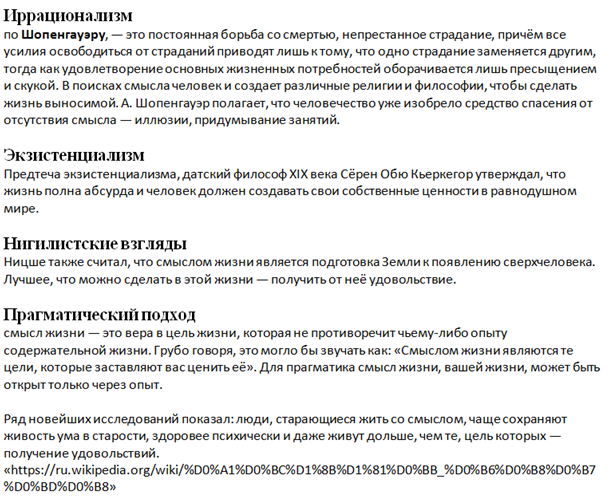
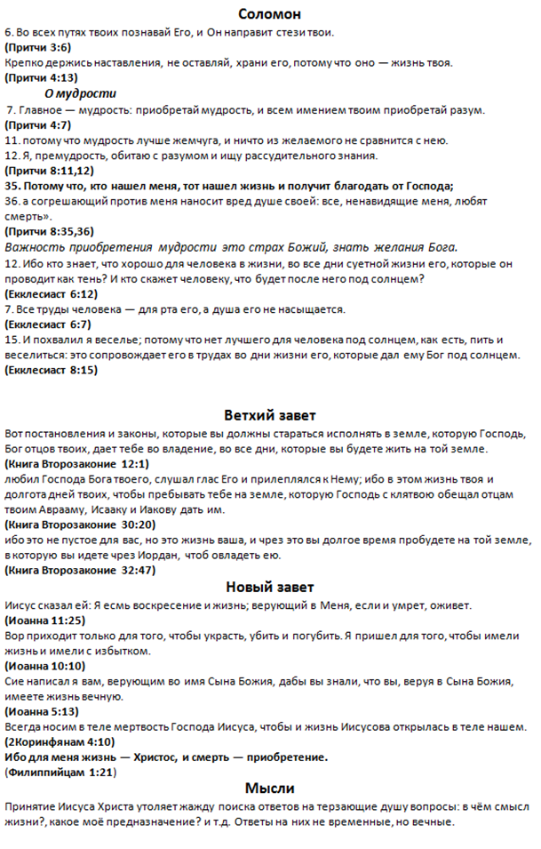

[&#8592; Глава 2](../02-Пятикнижие "Пятикнижие: бедные и больные Израиля. Законы для общества") &ensp;&ensp;&ensp;&ensp;[Оглавление](https://github.com/nyakovchuk/seminary-study-book) &ensp;&ensp;&ensp;&ensp; [Глава 4 &#8594;](../04-Обзор-Нового-Завета "Обзор Нового Завета: введение и обзор книги Послания Иуды")

#### Часть 1
# Глава 3. Философия
# Библия о смысле и предназначении человека

[Вступление](#intro)

[3.1. Смысл жизни в Ветхом Завете](#p31)

[3.2. Смысл жизни в книгах Соломона](#p32)

[3.3. Смысл жизни в Новом Завете](#p33)

[Вывод](#conclusion)

Подход к работе по философии, особо не отличался от предыдущей работы. Проблема заключалась в выборе темы. Не смотря на то, что тем предоставили нам 62, а это рекорд за 2 курса, выбрать из них тему, которая «легла» бы на сердце оказалось не просто. Ниже приведён фрагмент из перечня тем на украинском языке:

* Філософські погляди Апостола Павла в противагу Епікурейців та Стоїків.
* Філософія Фоми Аквінського та його докази Буття Бога у сучасному соціумі.
* Філософія блаженного Августина, та її сучасні реалії.
* Особливості єврейської філософії.
* Розуміння людини та світу у філософії Відродження.
* Реформація як нова сходина новітньої філософії.
* Особливості реформаторської філософії: Лютера, Кальвіна та Цвінглі.
* Німецька класична філософія: ідеалізм та християнські погляди І. Канта.
* Раціональна діалектика Г. Гегеля, та його розуміння Бога та християнської віри.
* Історико-культурні витоки вітчизняної філософії.
* Гуманізм філософії Г. Сковороди.
* Сутність єднання людини та Бога у філософії Г. Сковороди.
* Розвиток вітчизняної філософії у ХІХ – ХХ ст. (кирило-мифодіївці, П. Юркевич, В. Вернадський, М. Бердяєв).
* Постмодернізм як філософія ХХІ століття.
* Сутність та реалії християнської метафізики.
* и т.д.

Проблема очевидна, все темы требуют серьёзных временных затрат на их изучение. Я не могу сразу сесть и написать про особенности реформаторской философии, философии Возрождения, постмодернизма, Сковороды и т.д. Всё это требует изучение соответствующей литературы, её осмысления, а потом уже написания. Среди этих тем были вопросы, которые необходимо было разрешить на основании Библии именно на них я обратил пристальное внимание.

Поделюсь советом выбором темы, когда не знаешь что выбрать. Чаще всего я знаю о чём буду писать когда возвращаюсь домой с окончания семинарии (речь о первом курсе). Тем не менее, бывают моменты, когда определённости нет и присутствует некое чувство растерянности. Очень хорошо помогает перечитывание тем утром, днём и вечером (достаточно по одному разу) подкреплённое молитвой. Уже точно через несколько дней, скорее всего к третьему дню, при таком подходе вы заметите, что одна тема по-особенному тревожит вас, вы о ней думаете. Может быть даже несколько тем у вас на сердце, но одна как-то по-особенному выделяется среди них. Когда приступаете к работе над этой темой, становится очевидно, что Божье благословение с вами, пишется легко и вы заканчиваете эту работу вовремя. Так я выбрал тему «Библия про смысл и предназначение человека».

Я чувствовал себя уже опытным в написании рефератов и сразу создал черновой документ. Первое, что я туда внёс это мирские взгляды на смысл жизни (**рис. 3.1**), я посчитал, что это будет как трамплин для перехода к библейским взглядам. В целом необходимо будет увидеть разницу в чём смысл и задачи человека в мирском понимании и в понимании Божьем.

Далее я вспоминал и находил стихи и отрывки из Слова Божьего, которые касались смысла жизни. Я сразу разделил их по темам. Книгу Екклесиаста и Притчи сразу выделил в отдельную группу «книги Соломона» и это был мой раздел «смысл жизни в книгах Соломона». Со смыслом жизни в Новом Завете неопределённости нет, в учении Христа, апостолов он сводился к одному смыслу – «для меня жизнь – Христос …». В черновом документе ключевые стихи выделял полужирным шрифтом и в данном случае там эта фраза выделена **рис. 3.2**.

Далеко не всё, что находится в черновом документе нужно переносить в чистовую работу. У меня часто случается, что большая часть текста так и остаётся в черновом документе, не из-за того что он не важен, не интересен, потому что лимит страниц реферата надо также учитывать (здесь нет подтекста об увеличении страниц реферата, да сохранит Господь от таких мыслей преподавателей).

**Рис. 3.1.** Часть 1. Фрагмент рабочего документа по философии

Раздел «смысл жизни в Ветхом Завете» можно было разделить, как минимум, на два подпункта это «заложенный Богом при сотворении человека», его можно назвать райским смыслом жизни. Второй это заложенный в законе для Израиля. Смысл жизни по Соломону, находится как-то обособленно, он в некоторых моментах имеет философские нотки и я до сих пор считаю правильным вынести его в отдельный раздел, за пределы пункта «смысл жизни в Ветхом Завете». В рамках этого нового раздела уже разделить его на смысл жизни в Притчах и у Екклесиаста.

В разделе о Новом Завете, несмотря на ясность смысла жизни для верующего, он включает довольно серьёзные богословские мысли, правда в очень сжатом виде. Если Ветхий Завет, включая с книгами Соломона, мне пришлось обрабатывать, размышлять, то с Новым Заветом было не так, всё было проще. Описал, о чём думал, стараясь органично изложить мысли.

**Рис. 3.2.** Часть 2. Фрагмент рабочего документа по философии

## Вступление

В чём смысл жизни? Это вечный философский вопрос. Ответить на него пытались и пытаются все – лучшие умы и простые люди, наука и медицина, религия и политика. Ответов очень много, от глобальных «появление сверхчеловека» до индивидуальных «наслаждение жизнью, получение от неё удовольствия и т.д.». И, конечно же, присутствует мнение, что смысла жизни просто нет. Я не буду рассматривать смысл жизни с точки зрения различных религий, часть из них тесно пересекаются с философским подходом. Различие только в достижении смысла.  В любом случае, эта тема всегда тяжёлая для человека, везде чувствуется утопический настрой.  Определённого ответа не найти, нужно искать подходящий для себя из существующих, либо определить себе свой вариант.

Ответить на вопрос о смысле жизни с христианской стороны, намного проще. *«И познаете истину, и истина сделает вас свободными»* ***(Ин.8:32)***. Свобода заключается также в том, что вопросы, которые не давали покоя нам, получают ответы. Но существует проблема, что человеку неверующему этот ответ крайне сложен для понимания, как в своё время и Никодиму (начальнику иудейскому). *«Должно вам родиться свыше»* ***(Ин.3:7)***, тем не менее, Христос не заканчивает свою беседу с ним, а продолжает объяснять вечные истины. И мы знаем к чему это привело, когда после смерти Христа, все ученики его оставили. Открылись тайные ученики, которые, не взирая ни на что, погребли Иисуса Христа. *«Пришел также и Никодим, — приходивший прежде к Иисусу ночью, — и принес состав из смирны и алоя, литр около ста. Итак, они взяли тело Иисуса и обвили его пеленами с благовониями, как обыкновенно погребают Иудеи»* ***(Ин.19:39-40)***.  О христианском смысле жизни нужно говорить, не смотря на то, что он может быть непонятным для неверующего.

## 3.1. Смысл жизни в Ветхом Завете

Рассмотрим смысл жизни данный Господом до прихода Иисуса Христа на землю. Сделаем это с самого начала – создания человека. *«И сказал Бог: сотворим человека по образу Нашему и по подобию Нашему, и да владычествуют они над рыбами морскими, и над птицами небесными, и над скотом, и над всею землею, и над всеми гадами, пресмыкающимися по земле»* ***(Быт.1:26)***. Первые слова Бога к человеку очень важны для определения цели жизни *«И благословил их Бог, и сказал им Бог: плодитесь и размножайтесь, и наполняйте землю, и обладайте ею, и владычествуйте над рыбами морскими, и над птицами небесными, и над всяким животным, пресмыкающимся по земле»* ***(Быт.1:28)***. Слово «владычествуйте» встречается в двух приведённых отрывках Слова Божьего. Сразу в первой книге Библии в первой главе мы уже можем понять предназначение человека для планеты Земля – это быть владыкой над всем творением Божьим, хозяином планеты. Господь желает, чтобы человек осознавал, что всё, что вокруг создано, нуждается в мудром человеческом правлении и покровительстве. Вторая глава Бытие продолжает открывать завесу устройства земной жизни человека. Для человека определена первая заповедь от Господа, а также суровое наказание за её преступление. Заповедь была передана человеку напрямую из уст Божьих. Это второе, что должно наполнять жизнь человека – знать Божий голос и знать Божьи постановления для жизни. Бог даёт понять огромную важность заповедей, потому что через них определяется взаимоотношения с Господом. Преступив их, человек несёт смерть не только для собственной жизни, но и теряет отношения с Богом. Человек создан для вечной жизни с Богом. Третье, что должно быть устроено в жизни человека – это семья. И образец (эталон) какой должна быть семья Господь показал, создав её собственноручно и вложив в неё Свои принципы. Итак, выделим три основные задачи, которые Господь дал человеку: владычествовать над всем творением, знать и иметь взаимоотношения с Богом, жить в семье.

Прежде чем перейти к Израилю, отметим стих *«И ходил Енох пред Богом; и не стало его, потому что Бог взял его»* ***(Быт.5:24)***. Данный стих ярко показывает, что планета Земля создана не для того, чтобы человек прожил на ней и на этом всё. Бог желает быть с человеком вечно. А так как земля проклята, она не будет пребывать вечно. Поэтому для человека открывается новое место обитания – быть с Богом на Его территории. История патриархов, как и история всего Израиля до Христа – это подготовка к приходу Миссии на землю для искупления рода человеческого.

Господь могущественно вывел Израиль из Египта. Дал ему постановления и законы, отделив его от прочих народов. Данные законы помогали каждому человеку, вернуть то, что было утрачено – знать желания Бога и прилепляться к Нему. *«Вот постановления и законы, которые вы должны стараться исполнять в земле, которую Господь, Бог отцов твоих, дает тебе во владение, во все дни, которые вы будете жить на той земле»* ***(Вт.12:1)***. Бог желал, чтобы отношения с Ним были основаны на том, что держит всё – это любовь. Чтобы Его избранный народ *«любил Господа Бога твоего, слушал глас Его и прилеплялся к Нему; ибо в этом жизнь твоя и долгота дней твоих, чтобы пребывать тебе на земле, которую Господь с клятвою обещал отцам твоим Аврааму, Исааку и Иакову дать им»* ***(Вт.30:20)***. Именно в законах Божьих, данные Израилю, открывается смысл и предназначение человеку – полюбить Бога.  В этом всё, любовь к Богу придаёт смысл и полноту всей жизни человека. «Иисус сказал ему: *«возлюби Господа Бога твоего всем сердцем твоим и всею душою твоею и всем разумением твоим» – сия есть первая и наибольшая заповедь; вторая же подобная ей: «возлюби ближнего твоего, как самого себя»; на сих двух заповедях утверждается весь закон и пророки»* ***(Мф.22:37-40)***.

## 3.2. Смысл жизни в книгах Соломона
>«Потому что, кто нашел меня, тот нашел жизнь и получит благодать от Господа;» ***(Прит.8:35)***

Невозможно обойти вниманием притчи, написанные самым мудрым человеком на земле – Соломоном, а также его книгу «Екклесиаст». В приведённой цитате речь шла о мудрости, именно её необходимо искать. Поиск мудрости не напрасен, во первых жизнь наполняется смыслом, во вторых Бог даёт благодать (в других переводах милость) от Господа, т.е Господь по особенному расположен к такому человеку. Для поиска мудрости, Соломон призывает задействовать все средства: *«Главное – мудрость: приобретай мудрость, и всем имением твоим приобретай разум»* ***(Прит.4:7)***. Только мудрый человек желает приобретать мудрость, для него она вожделенна *«потому что мудрость лучше жемчуга, и ничто из желаемого не сравнится с нею»* ***(Прит.8:11)***. С чего же начинается мудрость и где её искать? С первой главе в притчах мы находим ответ: *«Начало мудрости — страх Господень; глупцы только презирают мудрость и наставление»* ***(Прит.1:7)***. Мудрость – это понимание, что есть Бог, который над всем. И Он есть Бог Святой, поэтому наши поступки также должны быть святы. О страхе Божьем как о начале мудрости написано не только в притчах:
* *«Начало мудрости – страх Господень; разум верный у всех, исполняющих [заповеди Его]. Хвала Ему пребудет вовек»* ***(Пс.110:10)***. Страх Божий  –  это верно исполнять заповеди Божьи, без лукавства.
* *«и сказал человеку: вот, страх Господень есть истинная премудрость, и удаление от зла – разум»* ***(Иов.28:28)***.  Иов цитирует слова Бога к человеку. Где сам Господь даёт прямое определение премудрости и разуму в жизни человека.

Притчи книга о мудрости, мудрость начинается с страха Божьего, неудивительно что именно в притчах написано очень много о страхе Божьем. Хождение в страхе Божьем обещает прекрасные обетования для жизни человека:
* *«Страх Господень прибавляет дней»* ***(Прит.10:27)***;
* *«Страх Господень – источник жизни, удаляющий от сетей смерти»* ***(Прит.14:27)***;
* *«Страх Господень научает мудрости»* ***(Прит.15:33)***;
* *«Милосердием и правдою очищается грех, и страх Господень отводит от зла»* ***(Прит.16:6)***;
* *«Страх Господень [ведет] к жизни, и [кто имеет его], всегда будет доволен, и зло не постигнет его»* ***(Прит.19:23)***.

Истинная мудрость ведёт к страху Божьему и страх Божий ведёт к мудрости, поэтому мудрость и страх Божий они неотделимы друг от друга.

Какое же определение смысла жизни даёт Соломон в притчах. Ходить в страхе Божьем перед Ним, познавать Его, искать Его и Бог сам будет направлять тебя по этой жизни *«во всех путях твоих познавай Его, и Он направит стези твои»* ***(Прит.3:6)***.

Книга Екклесиаста временами звучит как книга утомлённого мудреца. Она во многом похожа на книгу философов, которые пытаются найти смысл жизни без Бога, но каждый раз терпят крах. И какой бы человеческой мудростью он не обладал, но и тогда его жизнь не наполнена смыслом *«все труды человека – для рта его, а душа его не насыщается»* ***(Ек.6:7)***. Всё это приводит к *«и возненавидел я жизнь, потому что противны стали мне дела, которые делаются под солнцем; ибо все – суета и томление духа!»* ***(Ек.2:17)***. Среди всей «суеты сует» которые окружают человека, особо выделяются три стиха, которые созвучны и несут один посыл:
* *«Вот еще, что я нашел доброго и приятного: есть и пить и наслаждаться добром во всех трудах своих, какими кто трудится под солнцем во все дни жизни своей, которые дал ему Бог; потому что это его доля»* ***(Ек.5:17)***;
* *«И похвалил я веселье; потому что нет лучшего для человека под солнцем, как есть, пить и веселиться: это сопровождает его в трудах во дни жизни его, которые дал ему Бог под солнцем»* ***(Ек.8:15)***;
* *«Наслаждайся жизнью с женою, которую любишь, во все дни суетной жизни твоей, и которую дал тебе Бог под солнцем на все суетные дни твои; потому что это – доля твоя в жизни и в трудах твоих, какими ты трудишься под солнцем»* ***(Ек.9:9)***.

Обычная жизнь в труде, в семье – это лучшее наслаждение в жизни, лучшего ты не найдёшь. Созвучно с тремя задачами (раздел «смысл жизни в Ветхом завете»), которые дал Господь человеку, но где взаимоотношения с Творцом? Исследовав всё, ища смысл жизни, что наполнило бы душу веселием Соломон пришёл к выводу, что без Бога это невозможно. Заканчивается книга Екклесиаст знаменитым стихом: *«выслушаем сущность всего: бойся Бога и заповеди Его соблюдай, потому что в этом всё для человека»* ***(Ек.12:13)***. Как и в книге Притчи, настоящий смысл и удовлетворение от жизни возможен, только если в жизни присутствует страх Божий, который ведёт к исполнению Божьих заповедей.

## 3.3. Смысл жизни в Новом Завете

Новый завет дан всему человечеству. И его принёс нам с неба Иисус Христос и заключил его с нами на земле посредством Своей совершенной жертвы. Именно это совершенная жертва не просто искупительная для всех поверивших в Сына Божия, но она принесла в нашу жизнь благодать. Именно в благодати открывается особая непостижимая любовь Бога к человеку. Яркое отображение любви Божьей видим на Голгофском кресте, именно эта любовь позволила нам называться и быть детьми Божьими. Где же записан Новый завет? Ответ  на этот вопрос встречаем в Ветхом завете, когда Господь через пророка Иеремию говорил, что заключит совершенно новый завет. И апостол Павел в послании к Евреям дважды цитирует пророка Иеремию в Евреям 8:10 и Евреям 10:16. *«Вот завет, который завещаю им после тех дней, говорит Господь: вложу законы Мои в сердца их, и в мыслях их напишу их»* ***(Евр.10:16)***. Новый завет записан у каждого кто принял любовь Божью. И этот завет даёт нам новое мышление, новые желания, а с ними и новый смысл жизни.

Иисус Христос очень много говорил о жизни, с одной стороны это вечный вопрос который волнует человека. С другой стороны – сама Жизнь пришла к нам с небес *«ибо жизнь явилась, и мы видели и свидетельствуем, и возвещаем вам сию вечную жизнь, которая была у Отца и явилась нам»* ***(1 Ин.1:2)***. И эту Жизнь может принять каждый *«Свидетельство сие состоит в том, что Бог даровал нам жизнь вечную, и сия жизнь в Сыне Его. Имеющий Сына (Божия) имеет жизнь; не имеющий Сына Божия не имеет жизни»* ***(1 Ин.5:11,12)***. Принятие Иисуса Христа меняет всё в жизни и это изменение в первую очередь внутреннее *«а кто будет пить воду, которую Я дам ему, тот не будет жаждать вовек; но вода, которую Я дам ему, сделается в нем источником воды, текущей в жизнь вечную»* ***(Ин.4:14)***. Второй подобный отрывок *«В последний же великий день праздника стоял Иисус и возгласил, говоря: кто жаждет, иди ко Мне и пей. Кто верует в Меня, у того, как сказано в Писании, из чрева потекут реки воды живой. Сие сказал Он о Духе, Которого имели принять верующие в Него: ибо еще не было на них Духа Святого, потому что Иисус еще не был прославлен»* ***(Ин.7:37-39)***. Работа Иисуса Христа, как человека, на земле окончена, работа Духа Святого – нет. Именно Дух Святой, которого мы получили от Бога производит свою работу в нашей внутренности, давая нам новые стремления, новые желания и все эти желания «текут в жизнь вечную», они для Бога, для Его Царства. Апостол Павел называет такие помышления духовными, так как они рождаются в духе *«Помышления плотские суть смерть, а помышления духовные – жизнь и мир»* ***(Рим.8:6)***. Нельзя не отметить тот факт, что Иисус Христос называет себя *«Я хлеб живой, сшедший с небес; ядущий хлеб сей будет жить вовек; хлеб же, который Я дам, есть Плоть Моя, которую Я отдам за жизнь мира»* ***(Ин.6:51)***, это указывает нам на нашу постоянную потребность в Господе. Только из чрева напитанного хлебом живым, могут потечь «реки воды живой». Насколько часто мы должны насыщаться хлебом жизни? Апостол Павел пишет *«Всегда носим в теле мертвость Господа Иисуса, чтобы и жизнь Иисусова открылась в теле нашем. Ибо мы, живые, непрестанно предаемся на смерть ради Иисуса, чтобы и жизнь Иисусова открылась в смертной плоти нашей»* ***(2 Кор.4:10,11)***. Ответ очевиден «всегда и непрестанно», и всё это для того «чтобы и жизнь Иисусова открылась» в нас – это дважды подчёркивает Павел.

Говоря о жизни, говорим о Христе, говоря о Христе, говорим о жизни. Поэтому ответить на вопрос «в чём смысл жизни?» для верующего человека во Христа не составляет затруднений.  Ответ и прост и сложен одновременно, смысл жизни – Христос. Апостол Павел прямо об этом пишет в своём послании к Филипийцам *«Ибо для меня жизнь – Христос, и смерть – приобретение»* ***(Фил.1:21)***. Во Христе у нас появляется не просто временный смысл жизни, пока мы существуем на земле. Смысл жизни – вечный и неизменный, как и сама жизнь *«свидетельство сие состоит в том, что Бог даровал нам жизнь вечную, и сия жизнь в Сыне Его»* ***(1 Ин.5:11)***. *«Ибо жизнь явилась, и мы видели и свидетельствуем, и возвещаем вам сию вечную жизнь, которая была у Отца и явилась нам»* ***(1 Ин.1:2)*** – эта жизнь дана нам по Божьей благодати и о ней мы должны свидетельствовать. О свидетельстве, о жизни апостол Иоанн пишет также и в своём евангелие *«я пришел для того, чтобы имели жизнь и имели с избытком»* ***(Ин.10:10)***. Иисус Христос даровал нам не просто жизнь, но избыток жизни, которым необходимо делиться с окружающими.

## Вывод

Рассмотрен библейский взгляд на смысл жизни для человека. Начиная с самого начала – сотворения человека, какую цель (предназначение) ставил для него Господь. Затронуто избрание Израиля и его предназначение, и определение Божье для него. Проанализированы две книги из Библии мудрейшего человека на земле – Соломона, его взгляд на смысл жизни. Найден окончательный и неизменный ответ на вопрос «в чём смысл жизни?» в Новом завете. Этот вопрос вечен для философии по одной причине, что его нельзя постичь умом, ответ на него дан нам с неба. И этот ответ полностью удовлетворяет наше внутреннее естество на всю нашу земную и вечную жизнь. Для этого достаточно только принять Христа и жить с Ним.

[&#8592; Глава 2](../02-Пятикнижие "Пятикнижие: бедные и больные Израиля. Законы для общества") &ensp;&ensp;&ensp;&ensp;[Оглавление](https://github.com/nyakovchuk/seminary-study-book) &ensp;&ensp;&ensp;&ensp; [Глава 4 &#8594;](../04-Обзор-Нового-Завета "Обзор Нового Завета: введение и обзор книги Послания Иуды")
