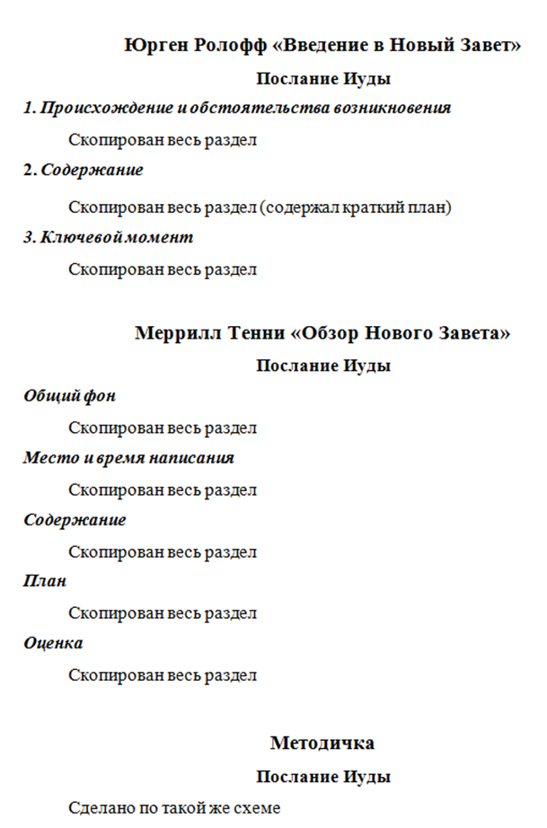

[&#8592; Глава 3](../03-Философия "Философия: Библия о смысле и предназначении человека") &ensp;&ensp;&ensp;&ensp;[Оглавление](https://github.com/nyakovchuk/seminary-study-book) &ensp;&ensp;&ensp;&ensp; [Глава 5 &#8594;](../05-Гомилетика "Гомилетика: примеры плана проповедей")

#### Часть 1
# Глава 4. Обзор Нового Завета
# Введение и обзор книги Послания Иуды

[Вступление](#intro)

[4.1. Авторство и время написания письма](#p41)

[4.2. Адресат книги](#p42)

[4.3. Структура письма](#p43)

[4.4. Содержание](#p44)

[Вывод](#conclusion)

Метод написание реферата для четвёртой сессии сильно отличался, от предыдущих практик. Начнём с выбора темы, как было выбрано послание Иуды для обзора?

Выбор темы «обзор послание Иуды», обусловлен был тем, что преподаватель сообщил, что оно ему по-особому нравится. У меня были интересные размышления на счёт некоторых стихов послания Иуды, в частности, я до сих пор так считаю, что стихи которыми оно заканчивается являются одними из самых радостных во всей Библии. Возникло желание поделиться размышлениями на последние стихи послания Иуды, сконцентрировав особое внимание на них. Тем не менее, я не был уверен, что следует делать обзор послания Иуды, были мысли в сторону послания Иакова. Причиной этого служило, то что послание Иуды является небольшим письмом, в котором негде «разогнаться» в разделе «содержание». Разделы работы были даны нам преподавателем, поэтому присутствовало ясное понимание как должен выглядеть реферат.

При написании работы использовал две новые методики, к которым иногда возвращался для написания последующих работ. Первую практику использую до сих пор при написании работы, а вторую чаще всего, когда испытываю проблемы с написанием реферата. Первая методика – подготовка чернового документа с цитатами из книг (**рис. 4.1**) и потом их последующая обработка для разделов реферата. Вторая – почти недельная молитва духом для написания реферата. Это мера вынужденная, так учил меня Господь. Садясь писать реферат, имея мысли (откровения), которые мне казались интересными и точно даны Господом, я не мог написать ничего, сразу всё уходило. Сажусь писать, всё уходит, как вроде ничего нет, не могу ничего написать, пустота и т.д. В выходные практически ничего не написал, причина непонятна. Непонятное чувство и состояние. Пришло на сердце молиться духом. С понедельника начал такую молитву. Наутро пятницы вернулся к написанию реферата, а также приступил к толкованию первых 4-х стихов послания. Потратил два часа. В субботу утром, за три часа, реферат был готов. Важно отметить, что при написании, также пребывал в молитвенном состоянии. Интересный, неожиданный, новый опыт. Несмотря на то, что прошу Господа благословения на работы, такого подхода к написанию реферата у меня не было, нечто новому научил меня Бог. Наверно самое основное понимание, которое пришло ко мне, что имея откровения Божьи, нам всё равно нужно усиленно искать Бога и быть в Его присутствии. Второе, что тоже не маловажно при таком подходе, приходит ясное понимание, что это не моя работа, а Его, это дело Божье. Только благодаря Ему получил такой реферат, и работа наполнена содержанием о котором я даже не думал. Я просто сидел и писал, что давал мне Дух Святой. В субботу надеялся написать толкование хотя бы до 10-го стиха, но при написании, я чувствовал сильное побуждение писать дальше и присутствие Духа Святого, который вразумлял меня. Не рассчитывал, что напишу толкование послания, почти за три часа, не читая ни одного толкования по посланию Иуды и не обращаясь ни к одному источнику трактующих стихи этого послания. В тот день я был очень рад, что реферат написан, особенно таким способом, находясь под водительством Духа Святого.

**Рис. 4.1.** Черновой документ по Обзору НЗ

## Вступление

Послание Иуды входило в перечень наиболее оспариваемых книг. Для этого были причины: авторство и время написания не были точно известны, цитирование апокрифической литературы, да и краткость письма не способствовала его широкому распространению. Несомненно, послание Иуды является богодухновенной книгой, которая достигла нас в списке канонических книг. Центральной темой данного послания, является резкая критика лжеучителей. Лжеучениям уделено мало внимания, тем не менее, их суть нам ясна – вседозволенность и безнравственный образ жизни. Не с ересями борется Иуда, но с лжеучителями. И на эту борьбу за веру, он просит подвязаться всех. Но не плотскими методами мы воинствуем, а следуем призыву апостола Павла: *«оружия воинствования нашего не плотские, но сильные Богом на разрушение твердынь: ими ниспровергаем замыслы и всякое превозношение, восстающее против познания Божия, и пленяем всякое помышление в послушание Христу, и готовы наказать всякое непослушание, когда ваше послушание исполнится»* ***(2 Кор.10:4-6)***. И это ещё одна из причин, чтобы христианам всегда бодрствовать, особенно после прочтения послания Иуды.

## 4.1. Авторство и время написания письма

Автора послания Иуды сложно однозначно определить. Его приписывают многим людям. Рассмотрим самые популярные варианты:
* Иуда, брат Иакова. В Древней Церкви самым известным Иаковом – был брат Господа Иисуса, поэтому автора письма отождествляют с его младшим братом, имя которого упоминается в Евангелиях. Церковное предание называет его третьим епископом Иерусалимской церкви.
* Апостол Иуда, называемый в Евангелиях от Матфея и Марка, Фаддеем. Это мнение особенно было распространено в средние века.
* Сын Иакова – в греческом оригинале он назван «Иаковлев», что может означать не только брата, но и сына Иакова.
* Иуда – это псевдоним. В пользу этой теории приводится следующие аргументы: «Послание смотрит на «апостолов Господа нашего Иисуса Христа», как на фигуры давно ушедшей эпохи [(Иуд.1:17)](# "Но вы, возлюбленные, помните предсказанное Апостолами Господа нашего Иисуса Христа"), и в остальном его содержание отражает ситуацию третьего поколения»**[1]**.

Существующая неопределённость с автором порождают разные времена написания письма. Одни относят его к началу 50-х гг., но большинство склоняется к более позднему периоду – к 90 гг., I века или даже к началу II века (до 130г.).

## 4.2. Адресат книги

Письмо относится к Соборным посланиям, оно адресовано *«всем, кто призван Богом Отцом жить в Его любви и под защитой Иисуса Христа»* (Современный русский перевод 1-го стиха послания Иуды). Следовательно, оно обращено ко всей Церкви, причем повод обращения – опасное для Церкви лжеучение. «Контуры этого учения не обрисованы четко. Можно разве что распознать признаки гностицизма, имеющего либертинистскую окраску»**[2]**, «толкующие христианскую свободу как вседозволенность и ведущие безнравственный образ жизни»**[3]**.

## 4.3. Структура письма

Письмо очень короткое, в нём 25 стихов. Оно начинается с адреса и приветствия, а затем автор переходит к главному предмету – обличению лжеучителей. Приведя ряд примеров из Священной истории, он предрекает им печальный конец. Письмо завершается наставлением и славословием Богу. В **таблице 1** приведены разделы послания.

Стихи | Содержание
------| ------------
1-2   | Приветствие
3-4   | Тема письма
5-19  | Лжеучителя и их участь
20-21 | Призыв хранить веру
22-23 | Методы спасения обольщённых
24-25 | Славословие

**Таблица 1**. Разделы послания Иуды

## 4.4. Содержание

Учитывая, что Послание Иуды очень короткое, поэтому проведём его анализ для каждого стиха. Данный анализ не является детальным, всего лишь акцентирую внимание на основных моментах письма и постараюсь выделить основные мысли.

>**1.** Иуда, раб Иисуса Христа, брат Иакова, призванным, которые освящены Богом Отцом и сохранены Иисусом Христом:

Первый стих начинается с представления автора послания. Авторство послания разобрано в разделе [«4.1. Авторство и время написания письма»](#p41). Когда Иуда пишет, «брат Иакова», он рассчитывает, что читателям этого будет достаточно чтобы понять кто автор. Прежде всего, Иуда называет себя рабом Иисуса Христа и этому званию выдаётся наивысший приоритет. Это очень перекликается с посланиями апостола Павла, в которых он упоминает, что он раб Иисуса Христа. Во всех посланиях Павла звание раб идёт на первом месте (послание к Римлянам, Филипийцам и т.д.). Итак, независимо кто мы по плоти или даже по Божьему призванию и служению, самое главное находиться всегда в полной воле у Бога – это наша цель и жизненный статус номер 1.
Вторая часть первого стиха довольно сильно перекликается с 24 стихом. Поэтому, я его рассмотрю детально при разборе 24-го стиха.

>**2.** милость вам и мир и любовь да умножатся.

Милость, мир и любовь – это то, что дано нам Господом Иисусом Христом по благодати. Но эти три плода духа не просто появляются в жизни христиан, не просто пребывают, но должны умножатся. Как и любой плод духа они должны умножаться в течении всей нашей жизни. И это хорошие критерии проверки для нас, что мы продолжаем ходить в Его святости и сохраняться Господом.

>**3.** Возлюбленные! имея все усердие писать вам об общем спасении, я почел за нужное написать вам увещание — подвизаться за веру, однажды преданную святым.

«Подвизаться за веру» – трубный зов мобилизации в Божьем стане. И причина этого зова очень серьёзная. Так что даже остановлена весть или учение о спасении, которому мы всегда определяем первое место в нашем собрании и в нашей жизни. Потребность в учении о лжеучителях и их разоблачение оказалось на данном этапе важнее. Какой смысл сеять в заражённую землю, или выходить на сеянье с заражёнными семенами? Нужно обеззаразить, перебрать их. Именно такой приоритет расставил Иуда. Это оказалось важнее.

>**4.** Ибо вкрались некоторые люди, издревле предназначенные к сему осуждению, нечестивые, обращающие благодать Бога нашего в повод к распутству и отвергающиеся единого Владыки Бога и Господа нашего Иисуса Христа.

Иуда приводит полную характеристику лжеучителей и их лжеучения. Первое на чём акцентирует внимание Иуда это то, что лжеучителя не вошли явно, они вкрались. Их появления в церкви не было явно. Далеко не всегда лжеучение входит в широкую дверь, оно способно выжидать «подходящее» время. Время, когда нужно идти дальше в учении о спасении и духовном росте. Иуда пишет, что лжеучителя уже давно предназначены к осуждению, созвучно со словами апостола Петра *«суд им давно готов, и погибель их не дремлет»* ***(2 Пет.2:3)***. Лжеучение состоит из трёх основ: извращённое учение о Божьей благодати, Бог не единый Владыка, Иисус Христос не Господь.

>**5.** Я хочу напомнить вам, уже знающим это, что Господь, избавив народ из земли Египетской, потом неверовавших погубил, **6.** и ангелов, не сохранивших своего достоинства, но оставивших свое жилище, соблюдает в вечных узах, под мраком, на суд великого дня. **7.** Как Содом и Гоморра и окрестные города, подобно им блудодействовавшие и ходившие за иною плотию, подвергшись казни огня вечного, поставлены в пример,

Три примера напоминает нам Иуда о суровом Божьем наказании. Эти примеры мы знаем, это не что-то новое, они оставлены нам как образы.

Первый пример *«избавив народ из земли Египетской, потом неверовавших погубил»*. Великие чудеса и обетования даны народу Израильскому, вышедшему из Египта. Это поколение видело величайшее избавление в истории от рабства. Каждый день видели славу Божью в виде столпа огненного и облачного. Сверхъестественная Божья забота о всём народе, питались манной небесной каждый день. Моисей описывает её следующими словами: *«и в пустыне сей, где, как ты видел, Господь, Бог твой, носил тебя, как человек носит сына своего, на всем пути, которым вы проходили до пришествия вашего на сие место. Но и при этом вы не верили Господу, Богу вашему»* ***(Вт.1:31-32)***. Но вместо осуществления обетования *«число дней твоих сделаю полным»* ***(Исх.23:26)***. Господь умертвил их в пустыне *«И поднял Он руку Свою на них, чтобы низложить их в пустыне»* ***(Пс.105:26)***, *«С тех пор, как мы пошли в Кадес‐Варни и как прошли долину Заред, минуло тридцать восемь лет, и у нас перевелся из среды стана весь род ходящих на войну, как клялся им Господь; да и рука Господня была на них, чтоб истреблять их из среды стана, пока не вымерли»* ***(Вт.2:14,15)***. Неправильное понимание благодати Божьей – это неверие Cлову Божьему. Когда независимо от того, что ты будешь делать, ты будешь жить. Жить милостью и обетованиями Бога. Покаяться всегда успеешь, Бог позаботиться об этом. Это вечное лжеучение для людей обольщённых похотью.

Второй пример, очень похож на первый. Видеть всегда славу Божью, но не покориться Сыну Божьему Иисусу Христу. Попали под вечное осуждение.

Третий пример не имеет явных чудес Божьих, но погибшие города знали истину. Видели жизнь праведников, в первую очередь Лота, который был всегда недалеко от них, и несмотря ни на что, оставался праведным пред Богом. Но такая жизнь не устраивала их. И они подверглись не просто наказанию огня, но огня вечного.

Во всех примерах суд Божий необратимый, полная обречённость. Отсутствует прямой зов покаяния, нет точки возврата, только казнь. Всё очень серьёзно, смертельно. И на это в первую очередь обращает внимание Иуда. Бог справедлив. И Он Бог. Зная Его, Его желания, Его определения в твоей жизни и жить по плоти или проявлять неверие – это неуважение к Господу, несущее для жизни смерть.

>**8.** так точно будет и с сими мечтателями, которые оскверняют плоть, отвергают начальства и злословят высокие власти.

Ещё раз Иуда подчёркивает свою основную мысль. За такие действия им участь одна – вечный огонь. Наказание очень суровое. Иуда продолжает их характеристику, открывая полный образ этих людей. Показывая на чём строится их учение. В русском синодальном переводе фраза «с сими мечтателями» не до конца показывает основание лжеучения. В остальных переводах, включая современный русский перевод или украинский (перевод Огиенко), должным образом показаны врата лжеучения. Приведём в пример современный русский перевод фразы «с сими мечтателями», она звучит  – «на основании своих сновидений». Жизнь лжеучителей не соответствует принципам Слова Божьего и учению Христа. Их жизнь полна скверн плоти (например: пьянство, блуд, всякая нечистота, которая оскверняет плоть). Но у них есть оправдание, они имеют на это особое «своё откровение», которое дано только им через сновидения или личные откровения, потому что они особые, избранные люди. Отвержение и злословие всякого начальства в духовном мире это как следствие их особой избранности. Нужно показать всем остальным людям, что они имеют власть в духовном мире, превосходство над священнослужителями, поэтому им даётся послабление во многих плотских вопросах.

>**9.** Михаил Архангел, когда говорил с диаволом, споря о Моисеевом теле, не смел произнести укоризненного суда, но сказал: «да запретит тебе Господь». **10.** А сии злословят то, чего не знают; что же по природе, как бессловесные животные, знают, тем растлевают себя.

В первый раз Иуда ссылается на апокрифическую литературу в частности на книгу «Завещание Моисея». Скорее всего, он это делал, так как данные книги пользовались авторитетом в его время, особенно 1-я Еноха, к которой он также обратиться. Иуда хотел показать нормальное, правильное отношение к высоким властям, которое понимается всеми людьми, этим он показывает насколько духовно низко пали лжеучителя. Десятый стих звучит радикально в отношении лжеучителей, Иуда продолжает не скупиться на эпитеты. Сравнивает их с животными, все их знания ограничиваются низменными плотскими инстинктами, которым они и предаются, поэтому они злословят чего не понимают.

>**11.** Горе им, потому что идут путем Каиновым, предаются обольщению мзды, как Валаам, и в упорстве погибают, как Корей.

*«Горе им»*, почти также начиналось обличительное обращение Иисуса Христа к фарисеям. Иуда в данном стихе называет троих людей, к которым Господь по-особенному был близок, но все они не ценили этого из-за чего и погибли.

Первый из них – Каин. Господь лично с ним общался, желая уберечь его от тяжелейшего греха – убийства. Но Каина ничего из Божьих слов не волновало, ни его жертва, ни грех на его пороге, ни тем более как господствовать над грехом. Его волновало, что кто-то успешнее его в служении, это видимо для всех. Путь Каина –  не слушаться голоса Божьего, и как следствие не вникать в себя, не исправлять себя, а поражать других, которые лучше в каких-то, очевидных для всех, сферах служения.

Второй Валаам. Неоднозначная личность в Библии, в плане понимания кто он. Но несомненно он был тем, с кем считался весь духовный мир и с кем имел общение сам Бог. Его слова имели необычайный вес, он имел Дух Божий. Один из первых пророчестовал о Христе. Но он не избрал себе того о чём пророчествовал – *«Да умрет душа моя смертью праведников, и да будет кончина моя, как их!»* ***(Чис.23:10)***. И не просто не избрал, но богатство Моавитское не давало ему покоя и он нашёл способ как его получить, введя в грех народ Израильский. И умер не как праведник, но был убит Израилем. Обольщение мздой – жить для богатства и умереть за него, не считаясь с Богом и Его великими благословениями для твоей жизни.

Корей – третий и последний пример. *«И в упорстве погибают»* в других переводах (современный русский перевод или украинский (Огиенко)) употребляется слова: бунтуют или восстают как Корей. И снова как в предыдущих двух примерах пред нами предстаёт человек, который близок к Господу и служению Ему. Моисей его вразумлял, но он его не слушал. Успех в своём служении, для них означает, что они успешны во всём. Способны самостоятельно повести народ Божий дальше, устранив служителей которых поставил Бог. Божье наказание к таким очень суровое, вплоть до истребления всего их семейства и домов.

>**12.** Таковые бывают соблазном на ваших вечерях любви; пиршествуя с вами, без страха утучняют себя. Это безводные облака, носимые ветром; осенние деревья, бесплодные, дважды умершие, исторгнутые;

Характеристика лжеучителей продолжается, но Иуда перестаёт их сравнивать с нечестивыми людьми из Библии, а обращает внимание на природу, описывая красочно многие её элементы. Желание Иуды, чтобы каждый человек, даже слабо знакомый со словом Божьим, уразумел всё внутреннее естество лжеучителей. Но прежде чем перейти к этим сравнениям. Иуда обращает внимание, что от таких людей исходит соблазн не только в служении, но и вечерях любви. Такие люди ненасытны для своей плоти.

*«Безводные облака, носимые ветром»* – первое сравнение. Облака без воды, не несут пользы. «Носимые ветром» – эти люди переключаются на каждое дело, они не постоянны. Они также и везде, не только в пределах своей церкви. При всём этом вникая во всё, пользы от них нет, в них нет воды, а значит отсутствует жизнь для окружающих.

Переходя к «осенним деревья» отметим тот факт, что к ним относятся сразу три характеристики: бесплодные, дважды умершие и исторгнутые. Это выбывается из общего контекста, где используется один эпитет для каждого элемента природы (см. ст.13). Не исключено, что *«дважды умершие, исторгнутые»* это отдельное сравнение. И это имеет смысл, но при толковании я буду придерживаться классического варианта, что все три характеристики относятся к деревьям. Итак, деревья осенние, а значит они достигли сезона плодов, но их нет. Оказывается они дважды умершие, т.е не только видимая часть засохла, но и корень оказался сухим. Как следствие они исторгнутые или в некоторых переводах «вырванные с корнем». Это не менее ужасающее и безнадёжное сравнение для этих людей, с которыми мы снова сталкиваемся. Они не просто бесплодны для Царствия Божия. Они не способны принести плод, как бы мы над ними не трудились, увещевали, «поливали», их корень сух, они уже исторгнутые Богом.

>**13.** свирепые морские волны, пенящиеся срамотами своими; звезды блуждающие, которым блюдется мрак тьмы навеки.»

Не просто морские волны, они свирепые, т.е усердно хвалятся своими срамотами, не имеющие стыда.

*«Звезды блуждающие»*, скорее всего уже здесь идёт отсылка к ещё одной апокрафической книги – первая Еноха. Именно так назывались ангелы, вышедшие из Божественного подчинения, тогда становится понятным, почему им блюдётся вечный мрак тьмы. Хотя в наш век «звезды блуждающие» звучат не менее ясно для окружающих и можно добавить немного эйзегетики предположив, что эти «знаменитые» люди своими лжеучениями, ходят по церквям пытаясь их обольстить, им не сидится на месте.

>**14.** О них пророчествовал и Енох, седьмой от Адама, говоря: «се, идет Господь со тьмами святых Ангелов Своих — **15.** сотворить суд над всеми и обличить всех между ними нечестивых во всех делах, которые произвело их нечестие, и во всех жестоких словах, которые произносили на Него нечестивые грешники».

В 14-м стихе явно используется первая книга Еноха, не вошедшая в канон. Иуда вновь напоминает, что суд Божий неизбежен для всех нечестивых. И этот суд грядёт с силой Божьей. И за каждое нечестивое дело и хулу на Бога придётся дать отчёт.

>**16.** Это ропотники, ничем не довольные, поступающие по своим похотям [нечестиво и беззаконно]; уста их произносят надутые слова; они оказывают лицеприятие для корысти.

Иуда не останавливается, продолжает описывать лжеучителей со всех сторон. Данным людям присущий во-первых ропот. Причём ропот на всё, они ничем не довольные. Снова автор послания упоминает, что они водимые похотями. Их слова напыщенны и высокомерны, в своих речах они ставят себя высоко. Раз эти люди живут для себя, то они и лицеприятны, ведь самое главное в их жизни получить для себя выгоду во всём.

>**17.** Но вы, возлюбленные, помните предсказанное Апостолами Господа нашего Иисуса Христа.

Данный стих является краеугольным, когда речь идёт о времени написания послания Иуды. Он сообщает, что адресатам уже передано учение через апостолов. Но на самом деле слово «предсказанное» не означает написанные послания, да и кому адресовано это послание неизвестно. Мы можем предположить, что апостолы лично или даже заочно в устной форме могли передать им наставление. Суть этого стиха в другом. После упоминания примеров из Ветхого Завета, далее апокрифической литературы, Иуда переходит к самому сильному аргументу – к словам апостолов. Именно они должны убедить всех окончательно, что появление в церкви лжеучителей и людей водимых плотью неизбежно. И к этому нужно быть готовым для того, чтоб отразить их атаку.

>**18.** Они говорили вам, что в последнее время появятся ругатели, поступающие по своим нечестивым похотям.

Снова и снова Иуда обращает наше внимание, что эти люди будут водимы похотями. В данном случае, он их называет ругателями, но это не его слово, он цитирует слова апостолов. Это позволяет нам понять, что не один Иуда был резок в словах по отношению к лжеучителям. Но в целом «столпы Церкви» создавали атмосферу нетерпимости не просто к лжеучениям, но к лжеучителям в частности.

>**19.** Это люди, отделяющие себя [от единства веры], душевные, не имеющие духа.

Последний стих, который относится к лжеучителям. Как и предыдущие, он крайне резок. Во-первых эти люди не ищут единства, они ставят себя по особому. Во-вторых, это душевные люди, они водятся природными инстинктами, у них нет духа.

>**20.** А вы, возлюбленные, назидая себя на святейшей вере вашей, молясь Духом Святым, **21.** сохраняйте себя в любви Божией, ожидая милости от Господа нашего Иисуса Христа, для вечной жизни.

Иуда даёт совет, как сохранить себя от воздействия лжеучений. Распознать лжеучения и лжеучителей это одно дело, но этого не достаточно, чтобы сохранить себя для вечной жизни. Какие советы даёт нам Иуда. Не останавливаться в развитии, продолжать обустраивать свой духовный храм поможет нам святая вера. Святейшая вера, не имеющая ничего общего с миром или плотью. Источник такой веры –  это Слово Божье. Далее, что поможет остаться христианину в уделе Божьем – это молитва Духом Святым. Именно такая молитва способна вливать в нас любовь Божью, *«потому что любовь Божия излилась в сердца наши Духом Святым»* ***(Рим.5:5)***. И она продолжает изливаться при каждой такой молитве. А любовь Божья способна сохранять нас от всякого искушения. И последнее всегда нужно помнить, что мы никак не можем заслужить вечную жизнь, она нам дана Иисусом Христом по его великой милости и любви к нам.

>**22.** И к одним будьте милостивы, с рассмотрением,

Что делать с людьми, которые попали в обольщение или в другой грех через лжеучение? Иуда даёт совет, быть милосердным к таковым. Фраза «с рассмотрением» встречается только в синодальном переводе и она говорит о том, что не ко всем нужно быть милостивым. Другие переводы говорят, что нужно быть милостивым для тех, кто сомневается, у кого поколебалась вера из-за лжеучений.

>**23.** а других страхом спасайте, исторгая из огня, обличайте же со страхом, гнушаясь даже одеждою, которая осквернена плотью.

Как и предыдущий стих, он не совсем прост для понимания. Рассмотрим его синодальный перевод, а потом приведу без объяснения современный русский перевод, хотя фактически подойдёт любой другой перевод, они все тождественны. Иуда говорит, что многие уже под воздействием лжеучений погрузились в этот вечный огонь и их спасти можно только страхом. Обличая и говоря им, что они уже в огне, их конец предопределён. Но обличать нужно с опасением за свою жизнь, чтобы и самому не попасть в этот огонь. И проведена граница этого опасения. Не дотрагиваться даже осквернённой одежды этих людей. Это важно помнить, что спасая других, касаясь этого огня, есть опасность сгореть спасаемым. Но спасать надо, Иуда пишет «спасайте» и даёт правильные советы. Приведу этот стих в современном русском переводе *«одних спасайте, выхватывая из огня; к другим же будьте милосердны, но опасайтесь их, ненавидя даже их одежду, скверную от развратной плоти»*.

>**24.** Могущему же соблюсти вас от падения и поставить пред славою Своею непорочными в радости,

Один из самых радостных стихов в Библии. Который говорит, что наш Господь Иисус Христос способен сохранить нас от падения. И не просто сохранить, но он доведёт нас до конца, без порока, чтобы поставить пред собой в Своей славе. Этот путь не лёгкий, но Иисус обещает, что наша дорога будет в радости. И это один из моментов для проверки нашего хождения пред Богом, чтобы проверить, как мы спасаемся. Если наше спасение тяжёлое, забирает все наши силы, мы утомились, то скорее всего, мы взяли его в свои руки. Совершение нашего спасения нужно доверить в руки Христа, Он его начал, Он силен его и закончить. И путь спасения он радостный для сердца, когда его проводником является Иисус Христос.

>**25.** Единому Премудрому Богу, Спасителю нашему чрез Иисуса Христа Господа нашего, слава и величие, сила и власть прежде всех веков, ныне и во все веки. Аминь.

Вся слава Богу, и всё наше спасение только через Иисуса Христа. Аминь.

## Вывод

Исследовано послание Иуды, его происхождение и обстоятельства возникновения. Рассмотрена структура письма, разделы книги. Детально проанализировано содержание книги. Ключевая тема послания Иуды – лжеучителя. Они рассмотрены со всех сторон: Ветхий Завет, природа, апокрифической литературы, наставления апостолов. Иуда желал достучаться до всех, чтобы все поняли величайшую опасность от лжеучителей. Это предупреждение для христиан на века, всегда помнить, что в церкви были и будут появляться люди ищущие своего, водимые плотью, обольщённые дьяволом. Это сражение внутри церкви, когда нужно подвязаться за веру, спасать тех, кто попал под влияние лжеучения. Иуда даёт простые и эффективные советы каждому верующему как сохранить себя от лжеучения. Не смотря на полезные советы, которым определённо нужно следовать, следует всегда помнить, что более всех в нашем спасении заинтересован Иисус Христос. И только доверившись Его руководству, можно пройти этот земной путь так, чтобы предстать пред Его славою в непорочности. Только Он силен это осуществить и Он это соделает и за это слава Богу, во все дни нашей жизни. Так возвышенно и радостно заканчивается послание Иуды. Так должна заканчиваться непростая жизнь христианина.

---
1. Ролофф Юрген. Введение в Новый Завет. – С.185.
2. Там же. – С.185.
3. Учебная Библия в современном русском переводе Российского Библейского Общества. – С.2521.

[&#8592; Глава 3](../03-Философия "Философия: Библия о смысле и предназначении человека") &ensp;&ensp;&ensp;&ensp;[Оглавление](https://github.com/nyakovchuk/seminary-study-book) &ensp;&ensp;&ensp;&ensp; [Глава 5 &#8594;](../05-Гомилетика "Гомилетика: примеры плана проповедей")
