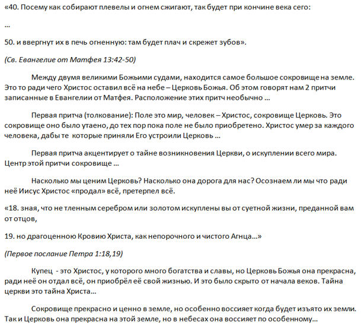
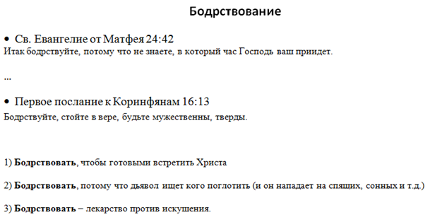

[&#8592; Глава 4](../04-Обзор-Нового-Завета "Обзор Нового Завета: введение и обзор книги Послания Иуды") &ensp;&ensp;&ensp;&ensp;[Оглавление](https://github.com/nyakovchuk/seminary-study-book) &ensp;&ensp;&ensp;&ensp; [Глава 6 &#8594;](../06-Систематическая-теология–1 "Систематическая теология – 1: абсолютные атрибуты Бога")

#### Часть 1
# Глава 5. Гомилетика
# Примеры плана проповедей

[5.1. Полный текст разъяснительной проповеди](#p51)

[5.2. Пример плана тематической проповеди](#p52)

[5.3. Пример плана текстуальной проповеди](#p53)

По предмету гомилетика, необходимо было разработать три проповеди разных типов: разъяснительную, тематическую и текстуальную. Одну разъяснительную проповедь необходимо было полностью написать, дословно, как вроде бы ты вышел проповедовать, по двум остальным составить краткий план. В работе присутствовала и практическая часть, необходимо было полностью написанную проповедь произнести в церкви. Для человека, который не участвовал в публичной проповеди это было неожиданное задание. Сразу скажу, что теоретическая часть была выполнена, практическая нет. В данной книге я представлю эти проповеди, возможно, они будут назидательны и в таком виде.

Выбор темы разъяснительной проповеди состоял из моих последних размышлений о толковании собственных притч Иисусом Христом. Читая Евангелие, я обратил внимание, что Иисус Христос, при толковании притч, всегда отождествляет себя с человеком, не с вещью. В свете этого я заново пересмотрел все притчи и на фоне свежести этих мыслей писал отчёт по гомилетики, где предоставил толкование двух притч в этом свете. В работе не приведено новое толкование, хотя в своей христианской практике слышал множество толкований на эту тему, и всего лишь одну проповедь, которая согласуется с моей трактовкой. Я проверил всевозможные толкования притчи о купце и найденной жемчужине. К своей большой радости обнаружил, что есть толкования (пусть они не самые популярные), которые согласуются с моим обновлённым пониманием данной притчи. Всегда желательно искать подтверждения, чему-то новому, необычному, даже когда оно от Господа. Этот вопрос я подниму в разделе [«соборные послания»](). Господь всегда удостоверяет человека в своих откровениях, желаниях, воли, если он просит подтверждения. Здесь не стоит вопрос веры и доверия, тут совершенно иное дело, меня смущают новые и уникальные откровения, которые идут вразрез с классической интерпретацией мест Писания. Речь идёт о личных вразумлениях от Господа, когда Он открывает. Господь видя сердечное смущение готов подтверждать Свои слова.

В рабочий документ выписал полностью отрывок на который буду писать проповедь. Перечитывал его и дополнял этот документ записями мыслей. На **рис. 5.1** представлен сокращённый вариант этого документа (Вместо троеточия «…» есть продолжение в черновом документе). Такой подход важен для более глубокой обработки стихов Слова Божьего. Чтобы несколько дней размышлять об этом, постоянно перечитывая, освежать все подробности и прося Господа, чтобы Он благословил, ведь это Его Слово. Очень много хороших мыслей приходят в молитве. Главное, не забывать всё записывать, иначе можно некоторые важные детали упустить.

**Рис. 5.1.** Сокращённый фрагмент из рабочего документа

Выбор тематической проповеди – **«бодрствование»**. Именно об этом состоянии хотелось написать. При составлении плана проповеди выбрал все слова «бодрствуйте» из Нового Завета (см. **рис. 5.2**) и на основании их составил план проповеди.

**Рис. 5.2.** Сокращённый фрагмент из рабочего документа

План текстуальной проповеди был составлен из просмотра своих старых записей, размышлений о Слове Божьем. Выбирал тему, в которой выражены три пункта. В итоге после нескольких пересмотров заметок остановился на теме восстановлении жертвенника Ездрой.

## Полный текст разъяснительной проповеди
**Тема:** *Драгоценная Церковь*.

**Название:** Великое сокровище Христа.

**Текст:**
>**40.** Посему как собирают плевелы и огнем сжигают, так будет при кончине века сего: **41.** пошлет Сын Человеческий Ангелов Своих, и соберут из Царства Его все соблазны и делающих беззаконие **42.** и ввергнут их в печь огненную; там будет плач и скрежет зубов; **43.** тогда праведники воссияют, как солнце, в Царстве Отца их. Кто имеет уши слышать, да слышит! **44.** Еще: подобно Царство Небесное сокровищу, скрытому на поле, которое, найдя, человек утаил, и от радости о нем идет и продает всё, что имеет, и покупает поле то. **45.** Еще: подобно Царство Небесное купцу, ищущему хороших жемчужин, **46.** который, найдя одну драгоценную жемчужину, пошел и продал всё, что имел, и купил ее.  **47.** Еще: подобно Царство Небесное неводу, закинутому в море и захватившему рыб всякого рода, **48.** который, когда наполнился, вытащили на берег и, сев, хорошее собрали в сосуды, а худое выбросили вон. **49.** Так будет при кончине века: изыдут Ангелы, и отделят злых из среды праведных, **50.** и ввергнут их в печь огненную: там будет плач и скрежет зубов. ***(Мф.13:40-50)***

Слава Богу! Знаем ли мы насколько дороги мы Христу, насколько дорога для Него Церковь? На Голгофском кресте Иисус Христос совершил всё, отдал Себя самого полностью, чтобы мы могли иметь спасение и жизнь вечную. Когда мы говорим: «совершил всё», мы всегда подразумеваем земную часть; что нашу чашу искупления, предназначенную Богом Отцом, Он выпил до конца. Ничего не осталось того, что Христос не совершил, пожалев Себя или пренебрегши волей Отца. Но это земное, а что насчёт небесного, что пришлось оставить Христу на небе, и ради чего это всё Он совершил?

В прочитанном нами отрывке Евангелия от Матфея находятся две уникальные притчи. Одна из них о сокровище и человеке, который его приобрёл. Вторая притча о купце и приобретённой жемчужине. Уникальность данных притч состоит в нескольких причинах. Во-первых, эти притчи описаны только в Евангелии от Матфея. Во-вторых, их расположение очень интересно. Они находятся между притчами о последнем времени, о праведном Божьем суде. Эти две притчи о кончине времён заканчиваются одинаковыми словами «плач и скрежет зубов». И между этими двумя притчами о кончине веков Иисус раскрывает, то ради чего Он здесь – Церковь Божья. Церковь Божья – это спасённые грешники, которые приняли Божье искупление в свою жизнь. Бог возлюбил каждого, и в этой любви родилось величайшее сокровище для Сына Божьего – это Церковь. Если бы Иисус Христос не пришёл в этот мир, у нас бы со всех сторон, оставался только *«плач и скрежет зубов»*. Но слава Богу, милость Его к нам велика!

Какое же толкование первой притчи о сокровище и человеке, как правильно её понимать? Будем следовать эталонному примеру толкования притч, оставленному нам Иисусом Христом. Оно показано в трёх Евангелиях и это разъяснение притчи о сеятеле. Итак, поле – это мир, человек – Христос, сокровище – народ Божий, Церковь. Отметим, что сокровище было утаено, до тех пор, пока поле не было приобретено.

Христос умер за каждого человека, дабы те, которые приняли Его, устроили Церковь. И тайна Церкви была скрыта от родов, от пророков. Не было раскрыто её появление. И только после уплаты Христом всей цены за грех мира, посредством Своей совершенной жертвы, чтобы каждый человек был искуплен от власти греха, начинает рождаться Церковь. Цена нашего искупления велика, это кровь Агнца. Апостол Пётр напоминает это нам *«зная, что не тленным серебром или золотом искуплены вы от суетной жизни, преданной вам от отцов, но драгоценною Кровию Христа, как непорочного и чистого Агнца»* ***(1 Пет.1:18,19)***. Дороже её нет ничего в мире. После воскресения Иисуса Христа, завеса о тайне Церкви начинает открываться и её начинает открывать Дух Святой. Именно Он занимается подготовкой Церкви, как невесты для Христа.

Если первая притча акцентирует наше внимание на тайне возникновения Церкви, о искуплении всего мира. Центром этой притчи является сокровище. Она повествует о человеке, который отдал всё. Но что именно всё, много ли у него было? Вторая притча раскрывает того, кто отдал всё и описывает красоту Церкви. Это был не просто человек, это купец. Он не просто покупает какие-то вещи. Но он покупает очень хорошие, драгоценные вещи, жемчужины. И найдя одну драгоценную жемчужину, он продал всё, чтобы приобрести её. Цена её велика, она перекрывает все накопленные богатства купца. Купец – это Христос, у Которого много богатства и славы. Жемчужина – это Церковь Божья, она прекрасна, ради неё Он отдал всё, Он приобрёл её своей жизнью. И это было скрыто от начала веков. Тайна церкви – это тайна Христа. Настолько сильно Господь оценил Церковь, настолько дорога и прекрасна она для Него. Ради неё был оставлен престол и слава неба, чтобы приобрести её.

Сокровище прекрасно и ценно в земле, но особенно воссияет, когда будет изъято из земли. Так и Церковь она уже прекрасна на этой земле, но в небесах она воссияет по-особенному.

Насколько мы ценим Церковь? Насколько она дорога для нас? Осознаем ли мы, что ради неё Иисус Христос «продал» всё, претерпел всё. Нам необходимо понимать, что такое Церковь для Иисуса Христа, тогда и наше отношение к Церкви и в Церкви будет соответствующее Божьим ожиданиям.

Ещё раз хочется напомнить, что Церковь – это грешные люди, искупленные Богом. Войти в Церковь не сложно, достаточно поверить и принять в своё сердце, что Иисус Христос – Бог, который искупил тебя от суетной жизни, от греха. Будешь ли ты пренебрегать тем, Кто так дорого оценил тебя, Кто отдал всё ради тебя. И Кто дарует тебе Церковь. Величайшее Божье сокровище на земле. Аминь.

## Пример плана тематической проповеди.

**Тема:** *Бодрствование.*

**Название:** *«Итак, бодрствуйте».*

**Введение:** Иисус Христос особое внимание акцентировал на бодрствование. Бодрствование в жизни христианина равняется жизни, а духовный сон – смерти.

**Основная часть:** Причины всегда нам бодрствовать:
1. Бодрствовать, чтобы готовыми встретить Христа ([Мф.24:42](# "Итак, бодрствуйте, потому что не знаете, в который час Господь ваш приидет"),  [Мф.25:13](# "Итак, бодрствуйте, потому что не знаете ни дня, ни часа, в который приидет Сын Человеческий")).
2. Бодрствовать, потому что дьявол ищет, кого поглотить (он нападает на спящих, сонных и т.д.) ([1 Пет.5:8](# "Трезвитесь, бодрствуйте, потому что противник ваш диавол ходит, как рыкающий лев, ища, кого поглотить")).
3. Бодрствовать – это лекарство против искушения ([Мк.14:38](# "Бодрствуйте и молитесь, чтобы не впасть в искушение: дух бодр, плоть же немощна")).

**Заключение:** Сон – удел мёртвых. Для живых христиан это неприемлемо. Слова Христа звучат для всех на все времена: *«А что вам говорю, говорю всем: бодрствуйте»* ***(Мк.13:37)***.

## Пример плана текстуальной проповеди

**Тема:** *Страх перед нечестивыми людьми.*

**Название:** *Как избавиться от страха перед угрожающими людьми?*

**Текст:**
>«И поставили жертвенник на основании его, так как они были в страхе от иноземных народов; и стали возносить на нем всесожжения Господу, всесожжения утренние и вечерние» ***(Езд.3:3)***.

**Введение:** Одна из основных причин страха от окружающего мира, это разрушений жертвенник для всесожжений Господу.

**Основная часть:**
1. Восстановление жертвенника
	а. Поставить новый жертвенник вместо разрушенного.
	б. Поставить новый жертвенник на старом основании.
2. Вознесение всесожжений Господу
	а. Вознесение всесожжений на восстановленном жертвеннике.
	б. Вознесение всесожжений утренних.
	в. Вознесение всесожжений вечерних.

**Заключение:** Правильное служение Богу, которое Он определил для каждого, даёт силы победить страх перед внешней угрозой.

[&#8592; Глава 4](../04-Обзор-Нового-Завета "Обзор Нового Завета: введение и обзор книги Послания Иуды") &ensp;&ensp;&ensp;&ensp;[Оглавление](https://github.com/nyakovchuk/seminary-study-book) &ensp;&ensp;&ensp;&ensp; [Глава 6 &#8594;](../06-Систематическая-теология–1 "Систематическая теология – 1: абсолютные атрибуты Бога")
