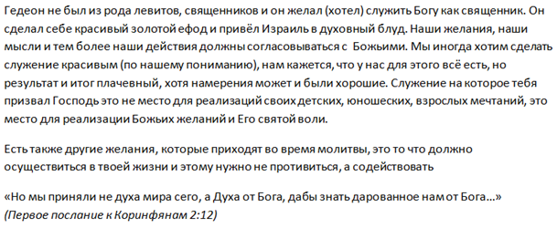

[&#8592; Глава 6](../06-Систематическая-теология–1 "Систематическая теология – 1: абсолютные атрибуты Бога") &ensp;&ensp;&ensp;&ensp;[Оглавление](https://github.com/nyakovchuk/seminary-study-book) &ensp;&ensp;&ensp;&ensp; [Глава 8 &#8594;](../08-Синоптические-Евангелия "Синоптические Евангелия: преображения Христа")

#### Часть 1
# Глава 7. Исторические книги Ветхого Завета
# Гедеон. Солдат. Вождь. Духовный лидер. Анализ правления

[Вступление](#intro)

[7.1. Гедеон – муж сильный](#p71)

[7.2. Гедеон – солдат](#p72)

[7.3. Гедеон – вождь](#p73)

[7.4. Гедеон – духовный лидер](#p74)

[Вывод](#conclusion)

Выбор темы был обусловлен моими свежими размышлениями о Гедеоне. Основную часть этих размышлений перенёс в черновой документ, но в работу они вошли не все на **рис. 7.1** из «не вошедшего». В целом заметок в черновом документе, было немного, чуть больше чем на полстранички, это больше выглядело как направление для дальнейшего развития темы. Дополнительной литературой не пользовался, это не совсем правильно с точки зрения широкого осмысления темы, но мне нравиться писать именно такие работы, я чувствую в них уверенность. Уверенность в прогнозировании времени (это не так затратно), нет необходимости в обработке дополнительной литературы и мыслей их авторов и т.д. Есть только Библия, Бог и ты. Всё что нужно для написания такого реферата это Божье вразумление и наполнение от Духа Святого. Большой минус, что такие рефераты не являются научными или аналитическими. Конечно, для любой работы важно, чтобы Господь вразумлял, открывая Своё Слово. Написать своё всегда можно, но хочется писать Божье, независимо от вида и формы работы.

**Рис. 7.1.** Мысли не вошедшие в реферат из чернового документа

## Вступление

Один из самых знаменитых людей Ветхого Завета – Гедеон. О его истории знают многие, о нём рассказывают детям, даже неверующие слышали о нём. Истории о нём увековечены в картинах. К примеру, в четырёх росписях Золотой палаты Кремлёвского Дворца находила отражение библейская история Гедеона **[1]**. Ему уделено всего лишь 3 главы в Библии. Тем не менее, история Гедеона должна занимать почётное место в нашем списке героев веры, как это сделал апостол Павел в послании к Евреям.

Подробно рассмотрим этапы становления Гедеона судьей Израиля, начиная с его призвания Господом. Попробуем выяснить, почему Бог назвал его мужем сильным, а ведь именно эта характеристика повлияла на его избрание. Дадим характеристику Гедеону, как солдату, вождю и духовному лидеру. Проанализируем каждую сферу его деятельности. Конечно же, попробуем взять себе духовные уроки из жизни этого великого мужа Божьего.

## 7.1. Гедеон – муж сильный

Муж сильный – именно с такой характеристикой предстаёт пред нами Гедеон. Мы не знаём ещё о нём как о солдате, вожде или духовном лидере, но мы уже знаем, что этот человек силен в глазах Божьих. Прежде чем мы рассмотрим, кем стал Гедеон, попробуем выяснить, в чем его сила? Чем был силен Гедеон, что на него обратил внимание Господь? По-человечески сильный – это решительный, смелый человек. Верующие люди добавят к этой характеристике веру, что этот человек был исполнен веры. Но таким ли перед нами предстаёт Гедеон? Добывая пропитание себе и своей семье, он скрывался от мадианитян. Молол пшеницу в точиле, т.е в винограднике, это описывает насколько в угнетённом положении находился он и весь Израиль в то время **[2]**.

История о Гедеоне начинается с трёх событий, первое из них – это отступничество Израиля от Бога. Это событие имеет последствие *«И весьма обнищал Израиль от Мадианитян, и возопили сыны Израилевы к Господу»* ***(Суд.6:6)***. Второе событие – это вопль Израиля на притеснения. Третье событие – реакция Бога на вопль Своего народа, приходит пророк. Пророк говорит о Египте, угнетении и великом избавлении из земли Египетской, напоминая Кто настоящий Бог Израиля. Напоминает, чтобы они были верны Господу, перестали совершать идолопоклонство *«…не чтите богов Аморрейских, в земле которых вы живете…»* ***(Суд.6:10)***. Если после 10 стиха мы ожидаем глубокого покаяния Израиля, то сильно ошибёмся.

В чём же сила Гедеона, что к нему был направлен Ангел Божий? Ответ заключается в реакции Гедеона на приветствие ангела. Он говорит, что Бог нас оставил, нет чудес Его и поэтому с нами приключилось такое горе. *«Господь, воззрев на него, сказал: иди с этою силою твоею и спаси Израиля от руки Мадианитян; Я посылаю тебя»* ***(Суд.6:14)***. Ревность о Боге, это и есть сила. Когда множество людей слышали пророка, только сердце Гедеона забилось учащёно о Божьих чудесах и избавлении. Его мысли направились в сторону Бога. Бог всегда открывается тем, у которых горит сердце от Его слова, которые размышляют над ним. Два ученика, идущие в Еммаус, рассуждали о Христе и последних событиях связанных с Ним. Христос пристал к ним в дороге, их сердце загорелось, пришло прозрение от откровения Бога и это кардинально изменило их путь. С Гедеоном произошло похожее, его жизнь кардинально изменилась, с ним начал говорить Бог. Он увидел проявления чудес Божьих, прямо в винограднике. Первое чудо –  пищу для ангела поглотил огонь с камня, второе чудо – ангел сверхъестественным способом скрылся от него, третье чудо – он начал слышать голос Божий.

Ревность о Боге, поиск Его силы не означает жизнь в святости Божьей. Есть столько вещей, которые со стороны вызывают удивление и непонимание. Гедеон не является исключением. Кажется как так можно, так жить и думать о силе Божьей? Удивляют слова Гедеона: *«… если Господь с нами, то отчего постигло нас все это? и где все чудеса Его …»* ***(Суд.6:13)***. Это действительно искреннее непонимание, почему так происходит. Со стороны это кажется непонятным. Гедеон, разве ты не видишь жертвенник Ваала в доме своего отца, разве при нём не растёт священное дерево, а народ в городе кому кланяется? Жизнь внутри греховного общества, греховных обычаев, которые кажутся уже естественными и нормальными приводит к духовной слепоте.

Гедеон непосредственно в винограднике, устрояет жертвенник Богу. В ту ночь Бог учил Гедеона, как приносить правильную жертву, на которую Он призрит. Бог не есть Бог компромиссов, Он Единственный в жизни и всё наполнение жизни должно быть Божьим. Это первое чему учит Бог Гедеона. Для Гедеона это было испытанием веры, которое он успешно прошёл. Именно после этого Дух Божий сможет объять его в нужное время.

## 7.2. Гедеон – солдат

Бог по-особому формирует Гедеона, как солдата, воина Божьего. Вся седьмая глава книги Судей показывает нам путь Гедеона-воина, от его становления до успеха в сражении. Бог просеивает пришедших на войну через два сита отбора, показывая Гедеону, с кем Он будет воевать и с кем Гедеон может одержать победу. Первый отбор – отсеивает всех боязливых и робких. А что делает второй отбор? Оставляет самых лучших из смелых? Нет, *«Он привел народ к воде. И сказал Господь Гедеону: кто будет лакать воду языком своим, как лакает пес, того ставь особо, так же и тех всех, которые будут наклоняться на колени свои и пить»* ***(Суд.7:5)***.

Кто пил воду из речки знает, что гедеоновые воины пили воду так, как обычно никто её не пьёт. Это не практично. Легче наклонится и пить прямо с речки. Набирать воду в руки и с них лакать – крайне неудобно и странно. Можно сказать, что эти люди неприспособленны к выживанию. Бог выбрал таких людей Гедеону, необычных, странных, но способных держать в своих руках не только воду, но и трубу с светильником. Способных своим языком не только лакать воду, но и кричать «меч Господа и Гедеона!». Именно к такой войне они были готовы лучше всех. Уверен, что на этих людей, как они пили воду, смотрели необычно, может быть даже смеялись, но Бог дал им победу. Бог не даёт победу необычным или непонятным людям, но Он даёт победу униженным и смиренным, дабы было видно всем, что это Божья победа.

Врядли Гедеон ограничился бы двумя знамениями, если бы знал, что в итоге от его войска останется всего лишь 300 человек (войско уменьшилось более чем в 100 раз). Господь не открывал ему и каким способом Он даст ему победу. Сильному мужу необходимо было стать сильным воином. Господь поэтапно его готовил к этому.

Полное избавление от страха у Гедеона произошло в ночь битвы. Для этого не надо было каких-то сверхъестественных знамений. Достаточно было спуститься в стан врага, которому не было числа и послушать, о чём они говорят. Именно после этого Гедеон возревновал, поклонился Богу. Вернувшись назад в стан, он, не медля, пробудил своих людей и повёл их в битву.

Гедеон-содат научился одерживать победы без меча, без огромного воинства, но доверяя Богу, Его голосу. Это была удивительная инструкция Бога, как овладеть мечем Господним. Это самое главное для победной жизни. В дальнейшем эти 300 человек стали способны воевать и железным мечём. Утомлённые и голодные они преследовали остаток врага. Они смело уже выходили на бой днём, и поражали врага в количестве 15 тысяч, осаждали города. На все эти подвиги были готовы люди избранные Богом, и прежде всего, наученные воевать Божьим мечём.

## 7.3. Гедеон – вождь

Великая победа Гедеона дала ему признание всего Израиля. Они увидели в нём царя, желали, чтобы род Гедеона владел ими. Гедеон не принял царство, направив взор Израиля к Господу. Израиль – Божий народ и только Бог может владычествовать над ним.

Сорок лет Гедеон был судьёй в Израиле. И о его правления написано мало *«… и покоилась земля сорок лет во дни Гедеона»* ***(Суд.8:28)***. Фраза *«покоилась земля сорок лет»* говорит нам о многом. Сорок лет это достаточно большой срок для правления. В «золотые времена» Израиля столько царствовали Давид и Соломон. *«Покоилась земля»* означает, что на ней не проливалась человеческая кровь.

Гедеон-вождь предстаёт пред нами мудрым и жёстким правителем. Говоря о его мудрости, вспоминается разговор с ефремлянами. Которые с дерзостью пришли к нему, ссорясь с ним, но мудрые слова Гедеона успокоили их дух. В этих словах замечаем, что он не гнался за славой, зная, что она не ему принадлежит. Есть и противоположная сторона Гедеона – это жестокость. Он не прощает насмешки и презрение, помнит всё, что ему сделали и воздаёт за это. Два города были перебиты Гедеоном за то, что отказали в хлебе его войску и насмехались над ним, когда он гнался за врагами. На обратном пути он крайне жестоко их поразил. Гедеон помнит зло, какое ему делали и воздаёт. За зло воздаёт жестоко. Тем не менее, он готов миловать тех, кто проявляет милость. Гедеон был готов помиловать двух мадиамских царей, если бы они в своё время помиловали братьев Гедеона. Для своего времени, Гедеон был великим и справедливым вождём Израиля.

## 7.4. Гедеон – духовный лидер

Гедеон не был из рода левитов, он также не жил в городе левитов. До великой победы над мадианитянами, он соорудил два жертвенника. Первый жертвенник был личный, имел название Иегова-Шалом. Гедеон воздвиг его в память о Боге, который дал ему мир. Второй жертвенник сказал возвести ему Бог. Второй жертвенник был путеводным листом от Господа, как следует оставить идолов и служить Богу Живому.

После окончательной победы над врагами Гедеон совершил нечто своё, человеческое для служения Богу. Он сделал золотой ефод. У нас много может быть вариантов, зачем Гедеон сделал это. *«Был ли это идол, или просто памятник победы, или какое-то подобие ефода первосвященника (Исх.27:6-14) – неизвестно»* **[3]**. Возможно, это был памятник Божьей победы или просто подарок, дань Богу. Скорее всего, Гедеон его сделал из хороших побуждений. Основу этого ефода составляли золотые серьги мадианитян, которые он выпросил у народа. Создание этого ефода, напоминает создание золотого тельца Аароном. Как и в тельце, основу составили серьги. В каждом из этих идолов была частица украшения каждого человека из народа. В нём было что-то своё, дорогое, что было украшением для его тела. В то же время это собирательный образ единства всего народа. Каждый мог сказать: там есть и моя часть. Ефод, по задуму Гедеона, должен быть памятью для народа о выходе из угнетения, напоминанием о силе Божьей. Ефод привёл народ в духовно-блудное состояние и стал *«сетью Гедеону и всему дому его»*. Вместо того, чтобы идти на поклонение Богу в Скинию находящуюся в Силоме, народ начал приходить в Офру и совершать служение там. Рукотворная память о великой победе стала великим поражением дому Гедеона и всему Израилю.

Гедеон не возвратил народ к служению Богу. Почтил Господа своими методами, по-человечески. По-человечески это было красиво, прекрасная одежда из драгоценностей, побеждённых врагов, которыми обогатился Израиль. В Библии, мы встречаем памятники, которые служили напоминанием о делах Божьих. Иисус Навин поставил такой после перехода Иордана. Самуил воздвиг такой после победы над филистимлянами в Евен-Езер. Данные памятники были сделаны по принципу жертвенника из необтёсанных камней. Гедеон захотел сделать нечто особенное, своё. Это не послужило обращением к Богу народа Израильского, они просто получили себе ещё одного, уже «своего», идола.

## Вывод

Правление Гедеона принесло избавление Израилю от великого угнетения мадианитянами. С духовной стороны, Господь был особенно близок к нему. Мы не найдём ни одного судью с которым Господь так непосредственно общался. Бог научил его всему: как быть воином, вождём, духовным лидером. Но не всю науку Божью Гедеон впитал. С духовных основ начал Господь Свою науку Гедеону. С этого начинается и должно начинаться всё в нашей жизни. Должны быть уничтожены все «идолы» и «священные деревья» в нашей жизни. Уничтожены без малейшего шанса на восстановление, через сожжение на жертвеннике Божьем. Жертвенник Божий должен находится не в винограднике, в этом укромном месте, но на вершине скалы, вершине скалы нашей жизни. Его должно быть видно всем. Результатом построения второго жертвенника стало новое имя, которое получил Гедеон от людей. Его уже знают по-новому, как того, кто ведёт войну с Ваалом. Гедеон для нас является примером великой веры Богу. Доверяя Богу, он одержал чудесные победы над врагами. Он для нас и пример восстановления служения Богу, к сожалению, негативный пример. Не идя дорогой Божьих заповедей, он восстановил служение по-своему пониманию, современному, актуальному для того времени. Он увековечил победу Божью по-человечески. Именно это послужило *«… сетью Гедеону и всему дому его»* ***(Суд.8:27)***, сетью гибельной, когда почти весь род Гедеона был уничтожен.

Несмотря на свои промахи в восстановлении служения Богу, Гедеон является героем веры и поправу сопричислен к ним в 11-й главе Евреям.

---
1. Забелин И. Е. Домашний быт русских царей в XVI и XVII столетиях. – С.198.
2. Библия. Современный русский перевод. Учебное Издание. – С.435.
3. Самуил Дж. Шульц. Ветхий Завет говорит. – С.76.

[&#8592; Глава 6](../06-Систематическая-теология–1 "Систематическая теология – 1: абсолютные атрибуты Бога") &ensp;&ensp;&ensp;&ensp;[Оглавление](https://github.com/nyakovchuk/seminary-study-book) &ensp;&ensp;&ensp;&ensp; [Глава 8 &#8594;](../08-Синоптические-Евангелия "Синоптические Евангелия: преображения Христа")
