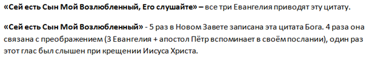
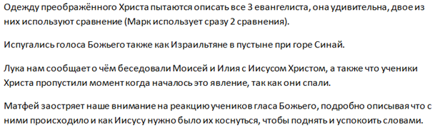

[&#8592; Глава 7](../07-Исторические-книги-Ветхого-Завета "Исторические книги Ветхого Завета: Гедеон. Солдат. Вождь. Духовный лидер. Анализ правления") &ensp;&ensp;&ensp;&ensp;[Оглавление](https://github.com/nyakovchuk/seminary-study-book) &ensp;&ensp;&ensp;&ensp; [Глава 9 &#8594;](../09-Гомилетика-2 "Гомилетика-2: примеры плана экзегетических текстовых проповедей")

#### Часть 1
# Глава 8. Синоптические Евангелия
# Преображения Христа

[Вступление](#intro)

[8.1. Синоптический анализ преображения Христа](#p81)

[8.2. Преображение Христа как проявление Божьего Царства](#p82)

[Вывод](#conclusion)

Данной работой завершался мой первый курс. Скажу откровенно, я уже чувствовал себя специалистом по написанию письменных работ. К окончанию первого курса, подходил к написанию уверенно, понимая и видя конечный результат, а самое главное знал, как его достигнуть, чтобы моё представление о работе было должным образом перенесено в печатный вид. Я чувствовал Божье благословение при написании, Его рука была со мной. Появились и новые переживания, а что делать если вдруг Господь перестанет вразумлять как тогда быть, это будет очевидно, ведь уровень работ упадёт, на «старых» откровениях не «выедешь», ведь и они нуждаются в свежем елее при их обработке. Такие мысли меня посещали и на втором курсе. Благодарение Господу, что Он был всегда со мной при написании работ и эта книга подтверждение этому. После краткого отступления о переживаниях студента, возвратимся к последней работе.

Выбор темы был обусловлен тем, что у меня были размышления, о том что значит **«Царствие Божие в силе»**. Это откровение можно понять в полноте только взойдя на гору Преображения, а так как это событие описано во всех трёх Евангелиях, то тема идеально подходит к данному предмету. Меня не остановило даже то, что мы разобрали на лекциях согласованность событий на горе Преображения в синоптических Евангелиях.

Рабочий документ состоял из нескольких разделов. Вначале были тексты Писаний из всех трёх Евангелий. Удобно перечитывать их когда они сгруппированы в одном месте. После них идут заметки по этим Евангелиям, это не размышления, просто интересные наблюдения. Таких заметок немного, пример таких заметок на **рис. 8.1**.

**Рис. 8.1.** Пример заметок

После заметок сделал таблицу из трёх столбцов, где каждый столбец содержал историю преображения из трёх Евангелий. Каждая ячейка таблицы содержала определённый стих. Изначальна это была просто компактная версия, где содержались события, произошедшие на горе Преображения. Просил у Господа мудрости как сделать лучше. Результатом этой просьбы стало преображение таблицы, теперь в ней стихи расположены в хронологическом порядке, в результате чего образовались пустые ячейки в таблице, но эти пустые ячейки показывали на чём не акцентировал внимание евангелист, что было важно для анализа. Пример таблицы приводить не буду, она есть непосредственно в работе, но следует учитывать, что она там оказалась в результате её перемещения из чернового документа.

Далее ниже таблицы были заметки непосредственно основанные на этой таблице, это уже аналитическая часть. Именно такие заметки стали основой моей работы, на **рис. 8.2** приведена часть этих заметок

**Рис. 8.2.** Пример заметок в рабочем документе.

После заметок я выписал комментарии на эти события из своей учебной Библии, они тоже очень важны и часть из них была включена в работу (например, о какой горе идёт речь). Дополнительной литературой и толкованиями не пользовался.

Так закончился мой первый год обучения и первый опыт в написании работ. Он не был простым, но это был хороший фундамент для второго курса.

## Вступление

Одной из целей учения Иисуса Христа было открытие и утверждение Царствия Божьего. Царству Божьему посвящено почти половина притч Христа. Но не только в притчах излагалась суть Царствия Божьего, оно было показано Иисусом Христом в Его преображении. Преображение Христа – это эталон Царствия Божьего, именно к этому должен стремиться христианин. Евангелист Марк цитируя слова Христа, пишет *«…Царствие Божие, пришедшее в силе»* ***(Мк.9:1)***. Именно к такому образцу мы должны стремиться в своей жизни, чтобы Царствие Божие было сильным в нашей земной жизни. Иисусу Христу было очень важно показать до Своего Воскресения Царствие Божие, тем самим, давая понять, что оно принадлежит не прославленному телу, а каждому человеку.

В данной работе проведён синоптический анализ преображения Христа. Рассмотрено значение данного события для каждого верующего человека.

## 8.1. Синоптический анализ преображения Христа

Преображение Иисуса Христа описано в трёх синоптических Евангелиях. Ни в одном Евангелии это событие не описано в полной мере, каждый евангелист дополняет его новыми нюансами. Некоторые евангелисты акцентируют внимание на определённых событиях в преображении Господнем.

В **таблице 2**, приведён параллельный анализ данного события по всем трём Евангелиям в хронологическом порядке.

 Матфей (16:28, 17:1-9) | Марк (9:1-9) | Лука (9:27-36)
------------------------|--------------|---------------
***28.*** Истинно говорю вам: есть некоторые из стоящих здесь, которые не вкусят смерти, как уже увидят Сына Человеческого, грядущего в Царствии Своем.| ***1.*** И сказал им: истинно говорю вам: есть некоторые из стоящих здесь, которые не вкусят смерти, как уже увидят Царствие Божие, пришедшее в силе | ***27.*** Говорю же вам истинно: есть некоторые из стоящих здесь, которые не вкусят смерти, как уже увидят Царствие Божие
***1.*** По прошествии дней шести, взял Иисус Петра, Иакова и Иоанна, брата его, и возвел их на гору высокую одних | ***2.*** И, по прошествии дней шести, взял Иисус Петра, Иакова и Иоанна, и возвел на гору высокую особо их одних, и **преобразился** перед ними | ***28*** После сих слов, дней через восемь, взяв Петра, Иоанна и Иакова, взошел Он на гору помолиться
***2.*** и **преобразился** пред ними: и просияло лицо Его, как солнце, одежды же Его сделались белыми, как свет. | ***3.*** Одежды Его сделались блистающими, весьма белыми, как снег, как на земле белильщик не может выбелить. | ***29.*** И когда молился, вид лица Его изменился, и одежда Его сделалась белою, блистающею.
***3.*** И вот, явились им Моисей и Илия, с Ним беседующие | ***4.*** И явился им Илия с Моисеем; и беседовали с Иисусом. | ***30.*** И вот, два мужа беседовали с Ним, которые были Моисей и Илия;
  |   | ***31.*** явившись во славе, они говорили об исходе Его, который Ему надлежало совершить в Иерусалиме.
  |   | ***32.*** Петр же и бывшие с ним отягчены были сном; но, пробудившись, увидели славу Его и двух мужей, стоявших с Ним.
***4.*** При сем Петр сказал Иисусу: Господи! хорошо нам здесь быть; если хочешь, сделаем здесь три кущи: Тебе одну, и Моисею одну, и одну Илии. | ***5.*** При сем Петр сказал Иисусу: Равви́! хорошо нам здесь быть; сделаем три кущи: Тебе одну, Моисею одну, и одну Илии. | ***33.*** И когда они отходили от Него, сказал Петр Иисусу: Наставник! хорошо нам здесь быть; сделаем три кущи: одну Тебе, одну Моисею и одну Илии, — не зная, что́ говорил.
  | ***6.*** Ибо не знал, что сказать; потому что они были в страхе. |
***5.*** Когда он еще говорил, се, облако светлое осенило их; и се, глас из облака глаголющий: **Сей есть Сын Мой Возлюбленный**, в Котором Мое благоволение; **Его слушайте.** | ***7.*** И явилось облако, осеняющее их, и из облака исшел глас, глаголющий: **Сей есть Сын Мой возлюбленный; Его слушайте.** | ***34.*** Когда же он говорил это, явилось облако и осенило их; и устрашились, когда вошли в облако.  ***35.*** И был из облака глас, глаголющий: **Сей есть Сын Мой Возлюбленный, Его слушайте.**
***6.*** И, услышав, ученики пали на лица свои и очень испугались. |   |
***7.*** Но Иисус, приступив, коснулся их и сказал: встаньте и не бойтесь.|   |
***8.*** Возведя же очи свои, они никого не увидели, кроме одного Иисуса.  ***9.*** И когда сходили они с горы, Иисус запретил им, говоря: никому не сказывайте о сем видении, доколе Сын Человеческий не воскреснет из мертвых.| ***8.*** И, внезапно посмотрев вокруг, никого более с собою не видели, кроме одного Иисуса.  ***9.*** Когда же сходили они с горы, Он не велел никому рассказывать о том, что видели, доколе Сын Человеческий не воскреснет из мертвых. | ***36.*** Когда был глас сей, остался Иисус один. И они умолчали, и никому не говорили в те дни о том, что видели.

**Таблица 2.** Параллельный анализ стихов преображения Христа

Читая о преображении Иисуса Христа используя **таблицу 2**, получаем более полную картину произошедших событий на горе. Видны уникальные моменты, которые записаны только в одном Евангелии. Есть возможность прочитать полную версию происшедшего начиная с каждого Евангелия, заполняя «пустые ячейки» параллельными стихами с других Евангелий, чтобы повествование было более полным. Больше всего «пустых ячеек» в колонке Марк – четыре, Евангелие от Луки наиболее полно описывает преображение, всего две «пустые ячейки».

Проведём синоптический анализ преображения Господнего. Данный анализ не будет тщательным, каждый стих не будет подробно рассмотрен во всех аспектах. Анализ будет включать интересные особенности, которые помогут сложить общую картину произошедшего на высокой горе **[1]**.

При анализе этих текстов мы сразу сталкиваемся с синоптической проблемой. Два евангелиста нам указывают, что преображение случилось «по прошествии дней шести», а Лука сообщает, что «дней через восемь». Отметим, что все евангелисты выбирают одну точку отсчёта – это день обещания Иисуса о том, что некоторые ученики «не вкусят смерти, как уже увидят Царствие Божие». Богословы считают **[2]**, что разрешение этого вопроса находится в дне отсчёта. Лука прибавляет к шести дням день, когда Иисус Христос пообещал показать Царствие Божие и день самого Господнего преображения. Марк и Матфей считают полные дни после слов Господних, это ясно видно в фразе «по прошествии дней шести», она указывает на целостность прошедших дней.

Преображение произошло, когда Иисус пошёл на гору помолиться (скорее всего, вечером, как обыкновенно он делал). Во время вечерней молитвы Христа с Ним, иногда, происходили разные сверхъестественные события (явление Моисея и Илия, ангел приходил и подкреплял Его). В нашей жизни во время молитвы с нами также могут происходит сверхъестественные вещи.

Преображение Христа принесло два изменения, первое – изменилось лицо Христа, об этом нам сообщает Матфей и Лука. Но только Матфей пишет, какие изменения произошли с лицом Христа, оно «просияло как солнце». Второе изменение произошло с одеждой Христа. Именно об изменённой одежде нам сообщают все три евангелиста. Двое евангелистов пытаются (Матфей и Марк) охарактеризовать её сравнительными образами, Марк использует даже два сравнения.

После изменения лица и одежды Иисуса Христа явились два мужа для беседы с Ним. Все три евангелиста однозначно сообщают, кто это были – это Моисей и Илия. Не у всех они расположены в таком порядке, Марк на первое место ставит Илию. Это уже говорит нам о многом, что порядок важности тут не определяющий. Два этих мужа во многом схожи, обоим Господь показывал Свою славу, Господь лично осуществлял их земной переход **[3]** в небесный град.

Только Лука сообщает нам предмет общения Моисея и Илия с Иисусом Христом, а также о том, что ученики Христа пропустили момент, когда началось это явление, так как они спали. Всё это хорошо видно в таблице, именно на этих событиях Лука акцентирует внимание.

После беседы Иисуса Христа с представителями Ветхого Завета. Когда они начали уходить, Пётр предложил поставить всем им по кущу, аргументируя, что *«хорошо нам здесь быть»* **[4]** . Возможно, говоря о трёх кущах, Пётр хотел чтобы Моисей и Илия не уходили с этого места или, по крайней мере, не уходили назад, а поселились в кущах, и Иисус временами приходил к ним для общения. О трёх кущах и о том, что ученикам там было хорошо, говорят все три Евангелия, но Лука в данном событии более остальных евангелистов приводит нам дополнительные сведенья.

Когда Пётр ещё продолжал свою речь о кущах, явилось облако, которое их осенило (покрыло их своей тенью) и из облака слышен был глас говорящий: *«Сей есть Сын Мой возлюбленный; Его слушайте»*. Эта фраза приводится во всех трёх Евангелиях, Матфей приводит её полную версию дополняя словами *«в Котором Мое благоволение»*. Зная, что Евангелие от Матфея было адресовано в первую очередь евреям, это очень важные слова для них в свете беседы Иисуса Христа с Моисеем и Илией. Голос из облака очень сильно испугал учеников, так что они пали на свои лица. Здесь очень яркая аналогия с Израилем, когда Израильтяне испугались голоса Божьего в пустыне при горе Синай. Именно Матфей заостряет наше внимание на реакцию учеников гласа Божьего. Подробно описывает, что с ними происходило и как Иисусу нужно было их коснуться, чтобы поднять и словесно успокоить их.

Появление облака означает Божье присутствие. При посвящении храма Соломона появилось облако. Во время посвящения Скинии Собрания в пустыне явилось облако. Облако вело Израиль – это знак Божьего присутствия.

Преображение Христа, это не просто яркое событие в жизни учеников, но оно было наполнено страхами, которые со временем пребывания на горе усиливались. Перечислим причины вызывающие страх у учеников:
* увидели преображённого Христа с Моисеем и Илиёй;
* их покрыло облако и это устрашило их;
* услышали глас Божий, упали на свои лица.

Первый страх заставил говорить Петра о своих чувствах. Второй привёл их в безмолвие, а третий страх заставил их упасть на свои лица. Поднять их на ноги смог только Христос.

После гласа с облака, все Евангелисты пишут, что Иисус остался один. Во время появления облака, Моисей и Илия ещё не исчезли, они просто продолжали уходить от Иисуса, повторюсь, скорее всего, этим вызвано желание Петра поставить кущи, чтобы они далеко не удалялись.

Заканчивается данное событие тем, что они никому не рассказали о том, что видели на горе, об этом упоминают все три евангелиста. Матфей и Марк говорят причину, о которой они не рассказывали о данном событии остальным, это запрет Иисуса Христа. Также Матфей с Марком сообщает срок окончания запрета – воскресение Иисуса Христа. Причину этого можем допустить, что Иисус Христос должен быть прославлен. Для этого Он должен окончить Свою миссию на земле.

## 8.2. Преображение Христа как проявление Божьего Царства

Учению о Царствии Божьем Иисус Христос уделил много времени в Своей земной жизни. Подавляющая часть притч Иисуса посвящены учению о Царствии Божьем. Это очень важная часть служения Иисуса Христа, которую Он желал нам оставить. Не беря во внимание преображение Иисуса Христа, очень сложно ответить на вопрос: как должно проявляться Царствие Божие в нашей жизни? Красота Царствия Божьего открывается в преображении Христа.

Что же такое Царствие Божие? Христос говорит ученикам, что *«увидят Сына Человеческого, грядущего в Царствии Своём»* ***(Мф.16:28)***. Слово **«грядущий»**, не означает пришедшего, но речь по смыслу идёт как о восседающем в Царствии Божьем, т.е они увидят Христа и то, что ожидает Его Церковь. Так как жертва нашего Господа ещё не состоялась на момент преображения Христа, то ученики увидели величайшее откровение и план Божий для человека.

Царство Божие – это не закон или пророки (Моисей и Илия), хотя и оно славно, но когда пробудились ученики, они увидели Славу Христа, которая покрывала двух мужей. Эта слава была, несомненно, сильнее, с ней ничего не могло сравниться. С Иисусом предстояли два величайших мужа Ветхого Завета, которым Бог показывал Свою славу явно, не в видениях. Один представитель закона. Закон Божий, который получил Моисей, часто называли его именем. Второй человек – это величайший пророк. Чаянья людей были, что ещё должен придти человек в «духе Илии». И вот все они говорили об исходе (о миссии), которую должен совершить Иисус Христос в Иерусалиме. Взор всего Ветхого Завета направлен на искупление человечества, которое должен совершить Миссия. Слава, служение, учение Иисуса Христа несравненно славнее служения Моисеева Закона и пророков.

События на высокой горе позволяют нам правильно интерпретировать Царствие Божие, здесь оно открыто и явно. Именно преображение Господне позволяет нам ответить на вопрос: *«что есть Царствие Божие?»*. **Царствие Божье** – это когда человек погружён в Дух Святой и слышит голос Божий, уже нет закона, нет пророков, есть один Иисус Христос. Это когда в жизни человека Иисус центр всего. Это то, что ожидает каждого верующего человека в небесах. В небе мы не просто будем находиться со Христом, который облечён в Своей славе, но и будем покрыты Духом Святым и слышать голос Бога благословляющего нас. И к этому состоянию нам нужно стремиться на земле.

Воскресение Иисуса Христа принесло Царствие Божие в этот мир. Апостол Павел пишет: *«Ибо Царствие Божие не пища и питие, но праведность и мир и радость во Святом Духе»* ***(Рим.14:17)***. В данном стихе имеется в виду не только радость во Святом Духе, но и праведность в Духе Святом и мир в Духе Святом, т.е Дух Святой покрывает полностью человека. Ещё одно определение Царствия Божьего согласно преображению Христа звучит следующим образом: **Царствие Божье** – это не просто небесное состояние Церкви, но это состояние уже доступно и на земле, когда в жизни человека проявляют Себя все три личности Бога, и Их цель, чтобы Иисус Христос был не просто больше всего прославлен в жизни человека, но чтобы Его слава покрывала всё в жизни последовавшего за Ним человека. И к этому можно прийти только через Иисуса Христа.

Преображения Христа должно произойти в жизни каждого человека, если Иисус Христос не является прославленным превыше всего в его жизни. Голос Божий о Христе *«Его слушайте»* – это краеугольный камень христианской веры. Учение Христа в нашей жизни должно быть чистым, без примесей закона, пророчеств и т.д. Весь закон и пророков уже исполнил в Своей земной жизни Христос, освободив нас от того, чего человек не смог исполнить. Благодать дана верующему человеку для исполнения учения Христа. Всё в жизни человека должно вести к прославленному Христу. Все пророчества, все правила, весь земной путь. И это осуществимо только Иисусом Христом. Только Он смог взять учеников и повести их одних на высокую гору. Так же и в жизни каждого верующего человека. Только Он один, может взять каждого лично и повести на высокую гору, гору Его Преображения. Это действительно высочайшая гора, на которой мы должны находиться. Каждый должен довериться Ему, чтобы взойти на эту высокую гору, гору славы и величия Иисуса Христа. И познать, что *«… все из Него, Им и к Нему. Ему слава вовеки, аминь»* ***(Рим.11:36)***.

## Вывод
События на высокой горе отразились на всех участников этого действия. Они не были кратковременны, это не было просто красивое видение. Апостол Пётр через десятилетия вспоминает в своём послании: *«ибо мы возвестили вам силу и пришествие Господа нашего Иисуса Христа, не хитросплетенным басням последуя, но быв очевидцами Его величия. Ибо Он принял от Бога Отца честь и славу, когда от велелепной славы принесся к Нему такой глас: «Сей есть Сын Мой возлюбленный, в Котором Мое благоволение». И этот глас, принесшийся с небес, мы слышали, будучи с Ним на святой горе»* ***(2 Пет.1:16-18)***.

В данной работе был проведён синоптический анализ преображения Иисуса Христа. Упорядочены события в хронологическом порядке, позволяющие прочитать о преображении Господнем учитывая все подробности.

Была раскрыта сущность Божьего Царства, в свете событий на высокой горе. Даны определения Царствия Божия и указан путь для достижения прославленного Иисуса Христа в жизни каждого верующего человека.

---
1. *«на высокую гору.»* – Никто из евангелистов не называет гору. Двое из них указывают, что эта гора была высокой. «Название горы неизвестно, хотя в христианской традиции её отождествляют с горой Фавор (Табор). Но гора Фавор далеко от Кесарии, высота её всего 600 м, и на её вершине в те времена располагался римский гарнизон. Больше подходит гора Хермон, в 20 км от Кесарии – её высота 2700 м.» – Библия. Современный русский перевод. Учебное Издание. – С.1972.
2. [http://bible.optina.ru/new:mf:17:01](http://bible.optina.ru/new:mf:17:01)
3. *«По народным представлениям, они оба были взяты живыми на небо.»* – Библия. Современный русский перевод. Учебное Издание. – С.1972.
4. *…как хорошо нам здесь!* – Греческий язык допускает возможность иного перевода: *«как хорошо, что мы здесь»*. – там же, С.1972.

[&#8592; Глава 7](../07-Исторические-книги-Ветхого-Завета "Исторические книги Ветхого Завета: Гедеон. Солдат. Вождь. Духовный лидер. Анализ правления") &ensp;&ensp;&ensp;&ensp;[Оглавление](https://github.com/nyakovchuk/seminary-study-book) &ensp;&ensp;&ensp;&ensp; [Глава 9 &#8594;](../09-Гомилетика-2 "Гомилетика-2: примеры плана экзегетических текстовых проповедей")
