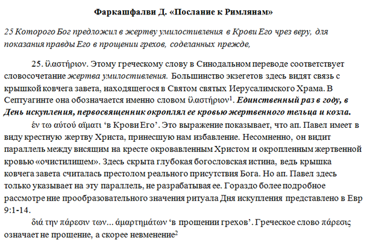
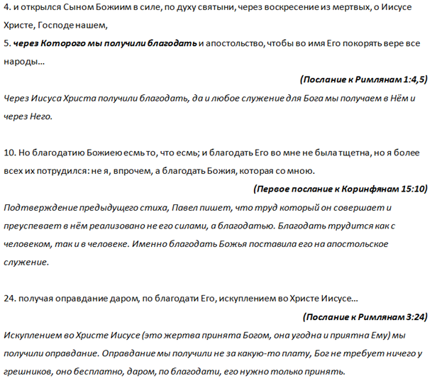
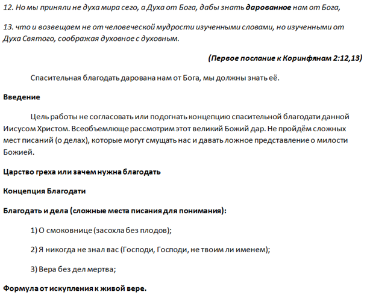

[&#8592; Глава 10](../10-История-Церкви-1 "История Церкви-1: I Вселенский собор в Никее") &ensp;&ensp;&ensp;&ensp;[Оглавление](https://github.com/nyakovchuk/seminary-study-book) &ensp;&ensp;&ensp;&ensp; [Глава 12 &#8594;](../12-Пасторские-послания-апостола-Павла "Пасторские послания апостола Павла: 6 тактов гимна «Тайны благочестия»")

#### Часть 2
# Глава 11. Послание к Римлянам
# Разработка учения спасения по благодати

[Вступление](#intro)

[11.1. Царство греха или зачем нужна благодать?](#p111)

[11.2. Концепция благодати](#p112)

[11.3. Благодать, вера и дела (сложные места Писания для понимания)](#p113)

[Вывод](#conclusion)

Последняя работа в старом стиле с тремя разделами в которых нет подпунктов. Именно на этой общей проблеме для студентов акцентировал внимание наш куратор после проверки работы. Данное замечание было учтено и остальные работы приобретут немного иной вид.

Тема для реферата была выбрана описанным ранее способом – это молитвенно с перечитыванием задания, пока точно ты не почувствуешь что это «твоя» тема.

После выбора темы я начал работать над рефератом. У меня образовались три черновых документа. Первый с заметками из книг. По факту, в данной работе у меня почти отсутствовали заметки. Документ состоял всего из двух страниц. Причиной этому послужило, моё понимание что нет смысла выделять какие-то детали из толкований книг по Римлянам. В частности из книг Барта и Лютера, единственная книга, которая попала в заметки и то два отрывка, это толкование по Римлянам католического богослова Фаркашфалви, на **рис. 11.1** пример такой заметки.

**Рис. 11.1.** Заметка из чернового документа по книгам

Второй документ состоял из стихов Нового Завета говорившей о спасительной благодати (в первую очередь там были все стихи с послания Римлянам), под каждым стихом я оставлял комментарий. Это самый важный черновой документ, который перечитывал и дополнял комментариями. На **рис.12** пример как выглядел этот документ (я его слегка «приукрасил для книги»). Документ состоял из четырёх страниц.

**Рис. 11.2.** Черновой документ с стихами из Нового Завета

Третий документ был самым рабочим из всех. Это была основа для моего реферата, в нём записывались все мои мысли, разрабатывалось содержание документа и т.д. На **рис. 11.3** приведен краткий вид данного рабочего документа. Я оставил только заголовки основных пунктов они выделены полужирным шрифтом и краткий начальный комментарий в «введении» для общего представления, чтобы было видно, что это холст для «наброска» мыслей. Документ состоял из трёх страниц, но размер шрифта использовался мелкий, поэтому несмотря на компактность, заметки были довольно объёмные. Отмечу, что реферат состоит не только из мыслей записанных в черновых документах, чаще всего это как вспомогательный материал, направление движения. В процессе написания реферата, он заполняется «горячими» мыслями и размышлениями, которых не было до начала его написания. Очень часто садясь писать реферат, я не знаю его итог, какой он получится при окончании. Бывает, что мои разделы полностью меняются, появляются новые пункты, о которых ранее не думал. Всё это никак не может приуменьшить работу с черновыми документами, они позволяют собраться в тонус, понять точку отсчёта и уверенно начать написание реферата. Без них приступая к работе чувствуешь себя растерянным. Поэтому я всегда два, три дня уделяю внимание черновым документам, а также размышлениям на эти темы. Особенно эффективны молитвенные размышления, т.е внезапные мысли о работе, которые приходят в процессе молитвы. Чаще всего они неожиданные, открывающие новую грань вопроса о которой даже и не подозреваешь и самое главное они дают уверенность, что ты пишешь не своё понимание, а то что Бог открывает.

**Рис. 11.3.** Черновой документ с основными разделами и размышлениями

## Вступление

>Но мы приняли не духа мира сего, а Духа от Бога,
дабы знать дарованное нам от Бога,
что и возвещаем не от человеческой мудрости изученными словами,
но изученными от Духа Святого, соображая духовное с духовным ***(1-е Кор. 2:12-13)***

Цель данной работы изучить (увидеть) концепцию спасительной благодати, данной нам небом, через Иисуса Христа для каждого человека. Постараемся, как только возможно, в рамках данного учебного реферата, раскрыть тему благодати, причём только спасительной (одна из двух сторон благодати). Всеобъемлюще рассмотреть этот великий Божий дар не получится, но суть благодати будет раскрыта. Посмотрим на сложные места Нового Завета о «спасении» по делам, противоречат ли они благодати, о чём там идёт речь. Почти на все эти вопросы нам отвечает послание к Римлянам. Именно оно будет в основании данной работы.

Стих выбранный в виде цитаты во вступлении отвечает на вопрос, почему мы сможем разобраться с данной задачей – разработки концепции спасительной благодати.

## 11.1. Царство греха или зачем нужна благодать?

Для каждого человека важно понять, зачем ему нужна благодать. Кто-то знает себя, что он не способен жить в праведности, кто-то должен это увидеть, уразуметь, осознать. По этой причине апостол Павел предваряет учение о спасительной благодати учением о грехе. Доказывая и приводя аргументы, что каждый человек заключён в грех, что от него нет избавления ни иудею, ни язычнику. И если с язычниками с их постыдными делами, описанными в первой главе послания к Римлянам, к которым привела их мудрость, не имеющая Бога в разуме и не прославляющего Его как Творца, всё выглядит более менее ясно, то иудеям Павел уделяет намного больше времени. За иудеями стояло избрание, закон, обрезание. Столько всего, чем можно себя выставить лучше и выше язычника. Безусловно, быть иудеем преимущество, это очевидно, об этом пишет и Павел. Именно эти основания, за которые держались Иудеи и считали себя угодными Богу, разбивает Павел: избрание, обрезание, закон. Приводя всё к единому знаменателю *« … ибо нет различия, потому что все согрешили и лишены славы Божией»* ***(Рим.3:22,23)***. Какой смысл всех Божьих даяний, если грех продолжает царствовать, если, не смотря на все старания, человек остаётся неспособным исполнить закон, если праведность Божья она остаётся неудовлетворительной.

Раз все грешны то, что нам делать? Есть ли вообще выход, что для нас предусмотрел Господь? Именно такие вопросы должны предварять учение о благодати. Человек должен полностью осознать царство греха в своём теле и жизни, разувериться в себе как праведном человеке или человеке способным жить по правде. И подняв голову к небу ожидать спасение от Бога.

## 11.2. Концепция благодати

Необходимо сразу сделать оговорку, данный реферат это не разработка концепции спасительной благодати, это всего лишь название темы из предложенных тем для реферата к предмету «послания к Римлянам». Разработкой данной концепции занималась вся Божественная Троица ещё до начала времён, создания Вселенной, Земли. Её кульминацией стала Голгофа, место где «свершилось» всё. Без искупления нет благодати. Именно там, на самом греховном месте всей земли, когда от концентрации греха, померкло солнце, тяжелейшая атмосфера, тяжесть греха всего мира за всё время существования Земли (именно за всё время – включая будущее время) легла на Иисуса Христа. Сын Божий совершал всё, чтобы благодать, которая к нам придёт от Него имела совершенную спасительную функцию. На Голгофе Иисус Христос оставался Сыном Божьим, Его слова имели силу, Его слова спасали. Его смерть устранила разделение между Богом и человеком. Завеса в храме разорвалась, не просто для свободного доступа к Богу в храме. Абсолютно не так. Завеса была разорвана Богом, сверху до низу, чтобы выйти из Святого Святых. Бог видимо вышел из места Своего пребывания, куда заходил первосвященник для ходатайства за израильский народ, Святого Святых, чтобы поселится в сердцах верующих людей. Сердце – это святое святых телесного храма. *«И будет у них жилище Мое, и буду их Богом, а они будут Моим народом»* ***(Иез.37:27)***. Наступил час последнего времени, времени совершенного завета, Нового Завета. Новый Завет основан на благодати. Рассмотрим в чём заключается спасительная благодать.

**Фундаментальный стих** в послании к Римлянам о спасительной благодати содержится в стихе *«получая оправдание даром, по благодати Его, искуплением во Христе Иисусе…»* ***(Рим.3:24)***. Этот стих идёт сразу после сообщения апостола Павла, что все грешны и находятся за пределами достижения славы Божьей. Создаётся впечатление, что Павел не даёт времени унывать верующим в Риме, сразу сообщая им радостную весть. И лишь после этого объясняет и утверждает верующих в Бога об этой удивительной радости. Это совершенно другой подход после учения о грехе. Если для осознания себя грешником требуется уразуметь это, понять, чтобы точно и твёрдо сказать: *«я грешник и не способен ни к чему доброму»*, то радостную весть о Евангелии Павел сообщает сразу. Добрую весть от Бога нужно, в первую очередь, принять верой и сделать это как можно скорее. И уже потом, принявши благодать, размышлять и созерцать её. Да и только принявшим Христа, тем которые откликнулись на Божий зов, тех к Себе приближает Господь, она открывается им в полной мере, разум способен вместить её. Апостол сразу сообщает нам, что искуплением в Иисусе Христе мы получили оправдание. Жертва Иисуса Христа является совершенной, она приятна и угодна Богу, она удовлетворяет справедливость Божью, это и есть полная цена нашего искупления. В эту цену ничего не нужно добавлять ни Богу, ни тем более людям. И как свидетельство, что она совершенна, это полное оправдание человека пред Богом. Именно такой подход к жертве Иисуса Христа и благодати апостол Павел желает, чтобы был у каждого человека, он продолжает удостоверять в этом всех читающих его послания. Давайте последуем за апостолом Павлом исполненного Духа Святого и рассмотрим некоторые стихи о благодати более подробно.

**Первый отрывок** из слова Божьего который будет рассмотрен это стих *«… через Которого верою и получили мы доступ к той благодати, в которой стоим и хвалимся надеждою славы Божией»* ***(Рим.5:2)***. Данный стих сообщает очень многое. Во-первых, доступ к благодати имеют не все, а только уверовавшие в Иисуса Христа, слово *«Которого»* здесь отдельно от контекста, но оно однозначно сообщает, что речь об Искупителе всего человечества – единородном Сыне Божьем Иисусе Христе. Только вера в то, что Иисус Христос совершил полный искупительный акт *«лично за меня»* спасает человека. Такая вера становится ключом к открытию великой Божьей двери – это благодать во Христе. Зайдя в которую **верующий получает всё**: *оправдание* ([Рим.3:24](# "Получая оправдание даром, по благодати Его, искуплением во Христе Иисусе"), [Рим.4:25](# "Который предан за грехи наши и воскрес для оправдания нашего")), *примирение* ([Рим.5:11](# "И не довольно сего, но и хвалимся Богом чрез Господа нашего Иисуса Христа, посредством Которого мы получили ныне примирение")), *усыновление* ([Рим.8:15](# "Потому что вы не приняли духа рабства, чтобы опять жить в страхе, но приняли Духа усыновления, Которым взываем: «Авва, Отче!»"), [Гал.4:5,6](# "Чтобы искупить подзаконных, дабы нам получить усыновление.
А как вы — сыны, то Бог послал в сердца ваши Духа Сына Своего, вопиющего: «авва, Отче!»")) и т.д. Всё это окрыляет нас и даёт дерзновение хвалиться новой надеждой, надеждой что войдём в славу Божью, потому что мы Его дети по благодати.

**Второй отрывок** довольно большой, он содержится в стихах с 15-го по 21-й пятой главы послания к Римлянам. Из-за его важности приведу его полный текст, но разобью на фрагменты для очень коротких комментариев:
* *«Но дар благодати не как преступление. Ибо если преступлением одного подверглись смерти многие, то тем более благодать Божия и дар по благодати одного Человека, Иисуса Христа, преизбыточествуют для многих. И дар не как суд за одного согрешившего; ибо суд за одно преступление – к осуждению; а дар благодати – к оправданию от многих преступлений»* ***(Рим.5:15-16)***.   Апостол Павел акцентирует внимание римлян, на словосочетании *«дар благодати»*, который встречается здесь 3 раза, а само слово «дар» четыре раза. Все это делается с одной целью, чтобы верующие твёрдо приняли, что **благодать – это дар**. Для исключения недопонимания, уточню что *«дар благодати»* – здесь не означает, что у благодати есть какие-то дары (хотя благодать во Христе изобилует дарами), правильнее понимать, что это дарованная благодать, т.е не наша, не заработанная, не заслуженная и т.д., она дарована Иисусом Христом. В данной благодати не может быть недостатка, её не следует как-то дополнять, для человека её сверх достаточно, она преизбыточествует для него – это то, что нам нужно всегда помнить.
* *«Ибо если преступлением одного смерть царствовала посредством одного, то тем более приемлющие обилие благодати и дар праведности будут царствовать в жизни посредством единого Иисуса Христа. Посему как преступлением одного – всем человекам осуждение, так правдою одного – всем человекам оправдание к жизни. Ибо как непослушанием одного человека сделались многие грешными, так и послушанием одного сделаются праведными многие»* ***(Рим.5:17-19)***.  Градус важности апостол Павел не снижает, сообщая снова, что только через Иисуса Христа может царствовать в жизни человека обилие благодати и дарованная праведность. Стих 18 и 19 утверждают силу Христа – **всё, что мы можем получить от Бога только через Него**.
* *«Закон же пришел после, и таким образом умножилось преступление. А когда умножился грех, стала преизобиловать благодать, дабы, как грех царствовал к смерти, так и благодать воцарилась через праведность к жизни вечной Иисусом Христом, Господом нашим»* ***(Рим.5:20,21)***.  Какой бы не был грех, благодати всегда будет более чем достаточно, она преизобилует над грехом. 21-й стих является переходным стихом от спасающей благодати к действующей благодати. В данном стихе сообщается, что благодать должна воцарится в человеке и указан путь для восхода благодати на трон – это праведность, но не человеческая, а та которая ведёт к вечной жизни. Слово *«воцарится»* означает, что благодать не одна царствует в нашей жизни, она восходит на престол вместе с Иисусом Христом. Необходимо всегда помнить, что благодать может быть ущемлена, но она должна царствовать вместе с Иисусом Христом в нашей жизни. Она царствует через праведность, которую нам даёт Господь, и которой мы должны дорожить. Именно эта праведность должна сопровождать нас на пути к вечной жизни. В данном реферате не раскрывается учение о действующей благодати, которой посвящена вся 6-я глава к Римлянам, именно там апостол Павел раскрывает все подробности воцарения благодати в человеке.

**Третий отрывок**, который рассмотрим, будет один стих, он взят вне контекста, но это тот случай, где смысл не меняется, это очень красноречивый стих определяющий благодать и дающий хороший переход к третьему разделу реферата: *«Но если по благодати, то не по делам; иначе благодать не была бы уже благодатью. А если по делам, то это уже не благодать; иначе дело не есть уже дело»* ***(Рим.11:6)***. Данный стих хорошо отвечает на вопрос, **как связаны дела и благодать, ответ: никак**. В 11-й главе речь идёт об избрании Божьем, важно понять что никакое дело не может повлиять на избрание Божье, на то чтобы Его святой взор смотрел на тебя, только благодать даёт возможность быть избранным Богом и стать для Него своим.

**Четвёртым отрывком** закончим рассмотрение концепции благодати. Данный стих принадлежит авторству апостола Петра: *«благодать и мир вам да умножится в познании Бога и Христа Иисуса, Господа нашего»* ***(2 Пет.1:2)***. **Благодать не только должна воцарится, но она должна умножаться**, именно при её умножении, её царствование в человеке становится сильнее. Благодать умножается через познание Бога. Чем дальше от Бога, тем пренебрежительней отношение к благодати считая, что её недостаточно, необходимо что то ещё. Когда приближаемся к Богу, то понимаем: всё наше нечисто, нечем хвалиться, всё что имеем только от Него и благодаря Ему. Всё что мы имеем в Нём открывается нам всё более и более, понимая в какую величественную славу Божью входим и с нетерпением ожидаем её.

## 11.3. Благодать, вера и дела (сложные места Писания для понимания)

Слово Божье содержит достаточно много текстов о делах. Часто дела люди ставят в край угла, когда говорят о спасении, это происходит не обязательно сознательно, многие на подсознательном уровне считают что без дел не обойтись. Всё это обосновано многими местами Писания:
* ***Отк.14:13***: *«… они успокоятся от трудов своих, и дела их идут вслед за ними»*;
* [Иак.2:20](# "Но хочешь ли знать, неосновательный человек, что вера без дел мертва?") и [2:26](# "Ибо, как тело без духа мертво, так и вера без дел мертва."): *«вера без дел мертва»*;
* [Мф.21:19](# "И увидев при дороге одну смоковницу, подошел к ней и, ничего не найдя на ней, кроме одних листьев, говорит ей: да не будет же впредь от тебя плода вовек. И смоковница тотчас засохла"). Очень яркий пример о смоковнице без плодов, которая засохла по слову Христа;
* [Мф.7:19](# "Всякое дерево, не приносящее плода доброго, срубают и бросают в огонь"). Притча о сухом бесплодном дереве, которое бросят в огонь;
* [Мф.3:10](# "Уже и секира при корне дерев лежит: всякое дерево, не приносящее доброго плода, срубают и бросают в огонь"). Слова-предостережения Иоанна Крестителя, о дереве без добрых плодов;
* **Мф.25:31-46**. Рассказ Христа о Его суде, когда овцы будут отделены от козлов, козлы это те, которые упорствовали совершать дела Божьи;
* Подобных мест в Слове Божьем великое множество.

Опасения искупленных не напрасны, очень много предостережений, к которым необходимо обязательно прислушаться. Возникает тогда вопрос: как обстоит дело с благодатью Божьей? Ведь в концепцию благодати не входят человеческие дела, она не может быть хоть как-то смешана с делами, любое дело отравляет её, она перестаёт быть благодатью. Это те моменты, которые нуждаются в освещении, их необходимо знать. Без понимания которых благодать не способна воцарится в нас в полной мере, а тем более умножаться и преизобиловать. Проповеди о благодати исключающие ответ на эти вопросы выглядят недосказанными, незавершёнными. После них у верующих несколько путей: или откинуть все непонятные места слова Божьего о делах, доверяясь только благодати Божьей или быть в смущении задавая себе вопросы и самостоятельно ища ответы, а может даже и не ища ответы на них, продолжая жить так как жил или искать учение, которое все-таки как-то свяжет дела и благодать и таких разных «или» может быть много. Именно поэтому в данном разделе взгляд на спасающую благодать будет более узко направлен в сторону веры и дел, дабы устранить все смущающие моменты.

Концепция благодати говорит, что благодать не совместима с делами, они устраняют друг друга. Если есть в благодати человеческое дело, то это уже не благодать. Их нельзя смешивать, нельзя в благодать добавлять дело, она тогда растворится, её не будет. Нельзя упразднять и ругаться над великим искуплением, которое дал верующим Христос, а дела именно это делают над ним. Класть на Божий жертвенник рядом с Его великой жертвой человеческое, противное, источающее смрад, чем являются наши дела, которые заглушают источающее приятное благоухание от Его голгофской жертвы – это бесчинство и непокорность Богу.

Если человек делая добро, хвалит себя: *«какой я сердечный, хороший, добрый человек»*, то это означает что он не знает себя, благодать Божья не воцарилась ещё в нём. Все хорошие дела которые делаем по благодати, не ищут своего, но Божией славы. Люди не способны сделать ничего хорошего в чистоте сердца. Сердце испорченно и это отражается на всех «добрых делах». Хорошее дело в Боге это когда не человека похвалили за его дело, а поблагодарили Бога. Если не фокусируется внимание на Боге при любом хорошем деле, а принимается слава от человеков, ожидаем её, то в полной мере не знаем, что такое воцарившаяся благодать.

Господь – есть Бог действующий, проявляющий Себя во всём. Так и вера в Бога она действующая. Вера не статична, она динамична. Вера от слышания Слова Божьего, Слово Божье звучит в верующем человеке, оно подсказывает. Когда мы ничего не делаем, это означает что Слово Божие уже заглушено в жизни, тогда и Дух Святой не может проявиться в нас, трудясь над нами. Вера уходит, она перестаёт быть Божией. Поэтому хорошая проверка, лакмус в вере ли мы – это дела. Именно дела побуждает нас делать Бог. Цель возрастания в вере – это дела, которые Бог может делать в нас и через нас. Когда Иисус подходил к смоковнице, там не было плодов. Если нет плодов, вера, которая в человеке, уже не работает, она заглушенная, оставила этого человека. Человек может думать, что он богат, что его вера правильная, но это иллюзия ослеплённого человека.

Все ли дела угодны Богу? Нет, только те, к которым побуждает Бог, дела которые совершаются побуждаемые Богом, должны быть в Нём. Человек делает не для себя, не для своей славы, не для славы своего служения, но для Божией славы. Нужно помнить, что можно извратить Божие дело, конечно Бог и при таком подходе, сделает это во благо для окружающих, но для данного человека оно не будет благом. Павел пишет к [Филиппийцам 1:15,16](# "Некоторые, правда, по зависти и любопрению, а другие с добрым расположением проповедуют Христа.
Одни по любопрению проповедуют Христа не чисто, думая увеличить тяжесть уз моих"), что некоторые проповедуют с корыстью, ищут своего. Павел же сообщает, что он проповедует чисто, ища Божьего [(2 Кор.2:17)](# "Ибо мы не повреждаем слова Божия, как многие, но проповедуем искренно, как от Бога, пред Богом, во Христе").

Вера Божия производит в нас те плоды, которыми может «насытиться» Иисус Христос. Это не просто что-то делать, считая что я для Бога много сделал, потрудился. Да сохранит Господь нас думать, что без нас Бог бы тут и не справился или что Господь должен нам за наши дела. Это величайшее заблуждение которое должно приводить к немедленному покаянию. Всё доброе, что мы имеем это от Него, это по Его благодати. Мудрость, способность и побуждение к добрым делам это всё от Него, это не наше, мы это – [Рим.3:10-18](# "Rак написано: «нет праведного ни одного;
нет разумевающего; никто не ищет Бога;
все совратились с пути, до одного негодны; нет делающего добро, нет ни одного».
«Гортань их — открытый гроб; языком своим обманывают; яд аспидов на губах их».
«Уста их полны злословия и горечи».
«Ноги их быстры на пролитие крови;
разрушение и пагуба на путях их;
они не знают пути мира».
«Нет страха Божия перед глазами их»").

**Подводя итог**, попробуем дойти от искупления к делам через веру. Иисус Христос искупил верующего от всякого греха, в Нём (от Него) человек получил всё, это и есть благодать. В благодати принимаем всё от Бога, всё что в христианах начинает появляться после Его прикосновения к ним это Его, это не спящий добрый человек пробудился внутри, получив силу от Него. Нет, это новое, оно пришло с небес через Голгофу (место искупления каждого человека). Вера в то, что в Нём имеем всё *«Как от Божественной силы Его даровано нам все потребное для жизни и благочестия, через познание Призвавшего нас славою и благостию»* ***(2 Пет.1:3)***, то есть ничего своего, это и есть Божья вера. Божья вера действует, она живая, она желает проявлять себя со всех сторон нашего нового человека, в любой сфере деятельности. Позволяя ей действовать верующий приносит Божьи плоды, плоды которым радуется Бог, они Его, они совершенны. Какие же это плоды? *«… вера действующая любовью»* ***(Гал.5:6)***. Вера не просто приводит в движение всё естество, она действует в любви, именно любовь к Богу, к людям, ко всему окружающему миру это то, что изливается Духом Святым в наши сердца. Такая вера она окружена, окутана любовью, потому что эта *«любовь излилась в сердца наши Духом Святым»* ***(Рим.5:5)***. А так как любовь это полнота совершенств, то в ней проявляется всё: милость, доброта, сострадание, кротость, …

Когда мы вспоминаем слова Иисуса Христа *«… Я никогда не знал вас …»* ***(Мф.7:23)***, то очевидно там была не та действующая вера о которой мечтал Бог для жизни человека. Там были не дела, к которым Бог побуждает. Там было своё, приправленное силой Божией в исцелении, освобождение и т.д. Но ничего человеческое не сможет войти в небо. Туда войдёт только Божие, всё в Нём и для Него, поэтому доверимся Богу, примем полноту Его благодати, укрепившись верой в Него, что в Нём и с Ним сможем всё.

Живая вера побуждает к добрым делам, она подсказывает, что нужно сделать. Не всегда хочется, не всегда удобно, но необходимо учиться доверять Богу. Это то чему нужно учиться, чтобы вера достигала совершенства.

## Вывод

В данной работе была сформирована концепция спасительной благодати. Достаточно подробно рассмотрено учение благодати, через Божье откровение, описанное в послании к Римлянам. Попробовали разобраться, почему к благодати нужно подходить через осознания царства греха. Всё это способствовало единому правильному выводу, что искупление, оправдание получаем не за какую-то плату, Бог не требует ничего у грешников, оно бесплатно, даром, по благодати, его нужно только принять верой. Верой, что Христос умер на Голгофе за меня, как за грешника, ни способного ни к чему хорошему. Просмотрели места Писания о спасении и делах, где они идут рядом, разобрались, что это дела созидались верой действующей любовью в искупленных Божьих людей. Бог в человеке не может бездействовать, воцарившаяся благодать не способна к затворничеству. Она открывает великие благословения в Иисусе Христе, укрепляя веру и открывая Бога. Она должна всегда царствовать в человеке. Все послания апостола Павла к церквям заканчиваются словами «благодать с вами», это слова напоминания, ободрения, они полны Божьей силы. Хочется также закончить реферат полным апостольским благословением, где благодати отведено первое место, возможно порядок в нём и не важен. Тем не менее, без благодати Иисуса Христа не постичь ни любви Отчей, ни общения Святого Духа. *«Благодать Господа нашего Иисуса Христа, и любовь Бога Отца, и общение Святого Духа со всеми вами. Аминь»* ***(2 Кор.13:13)***.

[&#8592; Глава 10](../10-История-Церкви-1 "История Церкви-1: I Вселенский собор в Никее") &ensp;&ensp;&ensp;&ensp;[Оглавление](https://github.com/nyakovchuk/seminary-study-book) &ensp;&ensp;&ensp;&ensp; [Глава 12 &#8594;](../12-Пасторские-послания-апостола-Павла "Пасторские послания апостола Павла: 6 тактов гимна «Тайны благочестия»")
