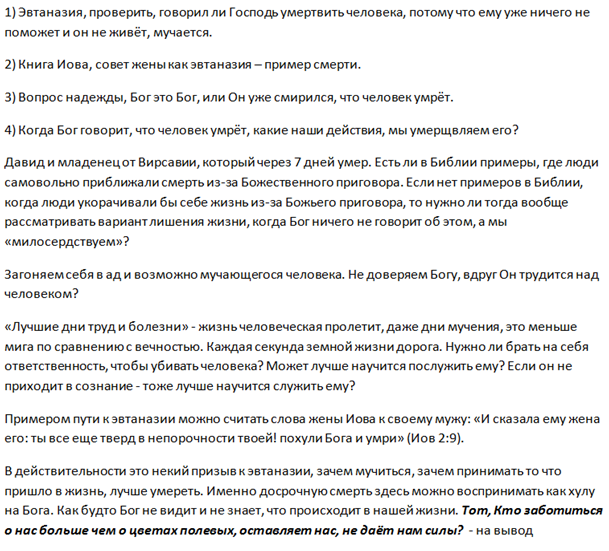

[&#8592; Глава 12](../12-Пасторские-послания-апостола-Павла "Пасторские послания апостола Павла: 6 тактов гимна «Тайны благочестия»") &ensp;&ensp;&ensp;&ensp;[Оглавление](https://github.com/nyakovchuk/seminary-study-book) &ensp;&ensp;&ensp;&ensp; [Глава 14 &#8594;](../14-Евангелизация-и-ученичество "Евангелизация и ученичество: отчет по проведению благовестия и ученичества")

#### Часть 2
# Глава 13. Христианская этика
# Христианский взгляд на эвтаназию

[**Вступление**](#intro)

[**13.1. Что такое эвтаназия?**](#p131)

&ensp;&ensp;[13.1.1 Определение «эвтаназии»](#p1311)

&ensp;&ensp;[13.1.2 История возникновения эвтаназии](#p1312)

&ensp;&ensp;[13.1.3 Виды эвтаназии](#p1313)

[**13.2. Эвтаназия в Библии**](#p132)

&ensp;&ensp;[13.2.1 Библейские тексты](#p1321)

&ensp;&ensp;[13.2.2 Принципы жизни и смерти в Слове Божьем](#p1322)

[**13.3. Отношения христианина к эвтаназии**](#p133)

[**Вывод**](#conclusion)

Довольно сложный предмет во всех смыслах, в первую очередь я имею в виду курс в семинарии, с другой стороны – практическая жизнь христианина, в её разнообразии, может привносить много неоднозначностей, которые нужно согласовывать со Словом Божьим. Именно поэтому христианину так нужно водительство Духа Святого. Остановлюсь, пока не начал здесь писать реферат и перейду к истории реализации работы.

Традиционно столкнувшись со сложностями в выборе темы реферата, а с ней действительно было сложно определиться. Перечень тем на выбор был небольшим, часть из них была на грани неоднозначности, когда понимаешь что раскрыть тему невозможно, просто ответив положительно или отрицательно на вопрос темы. Определяющим фактором стала близость теме ко мне. Этот вопрос поднимался, близкими ко мне христианами, в лояльном отношении к нему. Так я выбрал тему *«христианский взгляд на эвтаназию»*. Как подтверждение правильного выбора темы, мне пришли на память несколько библейских историй, которые косвенно можно рассмотреть в плоскости эвтаназии.

При написании работы задействовал много черновых документов. Один из них содержал рабочее оглавление работы, в нём я размышлял из каких разделов будет состоять моя работа. Во втором документе были скопированы тексты из книг говорившие об эвтаназии. Эти тексты нужны для удобства перечитывания размышлений богословов, ведь при таком подходе весь текст сконцентрирован в одном месте, что даёт плюс при написании реферата, ведь с ними легче работать. Для моих размышлений использовал два черновых документа. В одном из них, мысли были изложены подробно, они практически не нуждались в доработке. В другом эти размышления носили тезисный характер и имели вид плана для работы, я делал себе там заметки, которые нужно было разработать, на **рис. 13.1** отрывок из этого чернового документа.

**Рис. 13.1.** Пример рабочего документа по христианской этике

## Вступление

Вопрос эвтаназии, это не теоретический вопрос, это не просто размышления на высокие темы, как «зарядка для ума» – **это вопрос жизни и смерти, её ценности и смысла**. Этический вопрос эвтаназии идёт следом за абортом, он набирает популярности в западных странах, довольно широко обсуждается на национальном и европейском уровне, некоторые страны с начала XXI века легализировали данную процедуру, количество стран стремящихся узаконить эвтаназию растёт. Обсуждение этой проблемы носит массовый характер, общество становится более лояльным к данному вопросу. Как церкви реагировать на всё это, ведь речь о достоинстве жизни – это то к чему апеллируют пропагандисты эвтаназии?

Цель данной работы выработать христианский взгляд на эвтаназию. Изучить библейский подход к этой теме. Определить отношение христианина к данному вопросу.

## 13.1. Что такое эвтаназия?

Перед рассмотрением вопроса и этических проблем, которые несёт в себе эвтаназия, необходимо дать чёткое определение этому слову и данному социальному явлению в целом. Необходимо ясно понять фундамент строительства социального института эвтаназии, заложены ли в нём моральные, христианские ценности. Для этого придется рассмотреть исторический контекст и развитие данного этического явления, определить его аспекты.

### 13.1.1 Определение «эвтаназии»

Дословно термин «эвтаназия» в переводе с греческого означает *«благая смерть»*. В более широком понимании эвтаназия – это сознательное причинение смерти или содействие в ее наступлении неизлечимо больному человеку, иногда по его желанию **[1]**. В данном определении не указано, кто и какое содействие должен оказать больному человеку в прекращении его существования. Существует классическое понимание эвтаназии – это прекращение жизни неизлечимо больного человека по его просьбе с помощью врача. Встречаются и следующие определения: эвтаназия – это намеренное убийство (прерывание жизни) человека, путем какого-либо действия или бездействия, организм которого не в состоянии самостоятельно поддерживать все необходимые процессы для продолжения жизни и нуждается в регулярной подпитке извне **[2]**. Данное определение нельзя назвать корректным, эвтаназия это не искусственное поддерживание жизни организма, когда тело без аппаратуры неспособно продолжать жить. **Эвтаназия – это сознательное сокращение жизни человека, способного или имеющего функцию самостоятельно жить, но по разным причинам (физические, моральные и т.д.) не желающего продолжать свою жизнь**. Именно из-за сознательного принудительного прерывания жизни этот вопрос и носит острый этический характер, из-за этого в католическом понимании эвтаназию иногда называют *«добыванием»*.

### 13.1.2 История возникновения эвтаназии

Эвтаназия, как социальный институт, основанный на идее автономии личности, не имеет давней истории. Тем не менее, вопрос жизни и смерти берёт своё начало с грехопадения первых людей и достигает кульминации греха в Каине, когда становится ясно, что человек способен лишить другого человека жизни, дарованной ему Богом. Всё это приводит к тому, что достоинство человеческой жизни обесценивается. Во многих странах глубокой древности, поощрялось уничтожение (или самоуничтожение) слабых и больных членов общества – достаточно вспомнить граждан Спарты, которые сбрасывали со скалы младенцев, родившихся с теми или иными уродствами, или стариков в Японии, уходивших в горы, чтобы умереть там в одиночестве **[3]**. Не удивительно, что придерживаясь такого подхода к смерти появлялись и врачи в задачи которых было не только облегчить или продлить жизнь человеку, но и помочь разрешиться с ней.

Философские, религиозные и этические проблемы эвтаназии не давали ей окрепнуть в сознании людей как нечто морально приемлемое во все времена во вселенском масштабе, но всё изменилось в ХХ веке. Именно ХХ век заложил прочный фундамент для того, чтобы уже в ХХI веке эвтаназию начали узаконивать во многих странах. В 1920 году вышла немецкая книга под названием *«Гарантировать выдачу разрешения на прекращение недостойной жизни»*, написанная адвокатом К. Биндингом (Binding) и психиатром А. Хоком (Hoche). Эта книга получила большой резонанс и может считаться одним из главных ключевых элементов феномена эвтаназии в Германии в 20 – 30-е годы. Аргументами в пользу эвтаназии были скорее сострадание, значительное снижение качества жизни в некоторых случаях и необходимость ограничения социальных расходов **[4]**. В 1935 г. в Лондоне было создано первое в мире общество добровольной эвтаназии (Voluntary Euthajiasia Society). Основателем этого общества стал К. Милард. Общество возглавляли известные люди Великобритании, даже нобелевские лауреаты. Работа общества была направлена на пропаганду идеи о том, что взрослому человеку, который тяжело страдает от неизлечимой болезни, законом должно быть предоставлено право на безболезненную смерть при условии, что на это есть желание больного. Общество также должно было способствовать созданию законодательства по этой проблеме **[5]**. Немного позже разработанная нацистами практика эвтаназии стала первой политической программой эвтаназии, которая была реализована. Согласно данным, которые мы находим в актах Нюрнбергского процесса, между 1939 и 1941 годами было уничтожено 70 тыс. жизней, определенных как *«существования, лишенные жизненной ценности»* **[6]**. Конечно, сравнивать причины, которые выдвигают современные сторонники эвтаназии с нацистскими крайне некорректно. При всей этой некорректности, сложно не отметить единое сходство, которое умаляет человеческую жизнь, на которую теперь могут притязать государство или прочие люди, если она, по их мнению, не ценна, не выгодна и т.д. Дискредитированная нацистским режимом эвтаназия не умерла, она имела активных своих сторонников, к примеру, американский врач Джек Кеворкян, построивший «машину самоубийства» с помощью которой досрочно покинули жизнь 130 больных **[7]**. Особый подъём вопрос эвтаназии начался с конца 90-х годов ХХ века, когда государства стали легализировать «добрую смерть»: США (штат Орегон, этому примеру последовали и другие штаты), – 1998г., Нидерланды, Бельгия – 2002г., далее Люксембург, Колумбия, Германия, Канада, Швейцария. Существуют все предпосылки для того, чтобы список этих стран увеличивался и сторонников её становится всё больше, христиане не исключение, они все более лояльно смотрят на это смертельное явление.

### 13.1.3 Виды эвтаназии

Для христианского мира не существует разделения греха, христиане не ищут в нём нечто доброе или снисходительное, он в своём явлении и сущности уже мерзок для Бога и конечно для усыновлённых детей Божьих. Этим и объясняется христианское стремление в борьбе с грехом и любым его проявлением. Мир смотрит по-другому, есть вещи, которые он ещё не может принять, а есть вещи, которые уже может, но с некоторыми оговорками. Эвтаназия входит в их число. Социальный институт эвтаназии развивается, появляются разные его аспекты, что-то уже можно называть моральным и этически обоснованным, а что-то ещё нет. Вследствие этого принято делить эвтаназию на четыре типа:
* *добровольная* – человек сам принимает решение, чтобы ему помогли уйти из жизни;
* *принудительная* – человека лишают жизни без его согласия;
* *активная* – больному вводят активные лекарства;
* *пассивная* – отказ от лечения.

Из всех перечисленных пунктов для христиан вызывает особый интерес *«пассивная эвтаназия»*. Можно ли считать отказом от лечения самоубийством? В католической врачебной этике принято различать «обычные» и «чрезвычайные», «пропорциональные» и «непропорциональные» средства для квалификации терапевтических действий. «Чрезвычайные» средства являются особенно болезненными, могут нести моральный или физический вред, а также являться причиной больших материальных затрат. *«Отказ от чрезвычайных и преувеличенных средств не тождествен самоубийству или эвтаназии; в нем скорее выражено смирение с человеческой природой на пороге смерти. Однако необходимо поддерживать нормальную терапию и применять обычные средства, соответствующие состоянию больного (например, кормление, обезболивание)»* **[8]**  – это позиция католической церкви. В действительности это разумный подход, с одной стороны ценить жизнь данную Богом, с другой не хвататься за неё всеми немыслимыми способами, как люди, не имеющие надежды. Верующему человеку всегда нужно помнить, что жизнь находится в Боге, искать решение возникших затруднений в первую очередь с Ним потому, что Он есть Бог Ревнитель и в том, чтобы Его дети в первую очередь прибегали к Нему за помощью и советом. Женщина растратила всё на врачей, ничего не помогло, но одно прикосновение к Христу изменило всю её жизнь. Именно прикосновения к Богу, к Источнику Жизни, желает верующий человек, особенно когда болен и к этому необходимо стремиться. Вопрос, стоит ли продолжать лечение, очень индивидуален, это вопрос совести человека. В первую очередь нужно стремиться иметь живые отношения с Богом и Господь будет подсказывать, как действовать, иногда это ведёт к полному отказу от медицинской помощи, а иногда наоборот. Христиане руководствуются не своеволием, а волей Божьей, в некоторых случаях она крайне индивидуальна и неповторима, достойна подражания лишь вера и упование на Бога.

## 13.2. Эвтаназия в Библии

Эвтаназия предстаёт перед нами довольно серьёзной проблемой, насущность которой увеличивается с каждым годом. Смерть не обойдёт никого, это *«путь всей земли»* ***(И. Нав.23:14)***. Важно знать чему учит Библия, для того чтобы у верующего человека выработалось верное библейское отношение и понимание к данному этическому вопросу. Сложность заключается, что в Библии не содержатся прямых высказываний на эту тематику. Несмотря на все эти сложности, попробуем рассмотреть библейские тексты, которые косвенно указывают на существующую возможность досрочного прерывания жизни. В данном разделе также рассмотрим евангельские принципы относительно жизни, чему учил Христос. Всё это должно помочь пролить свет на вопросы жизни и смерти в разрезе эвтаназии.

### 13.2.1 Библейские тексты

**Смерть Саула** ([1 Цар.31:4](# "И сказал Саул оруженосцу своему: обнажи твой меч и заколи меня им, чтобы не пришли эти необрезанные и не убили меня и не издевались надо мною. Но оруженосец не хотел, ибо очень боялся. Тогда Саул взял меч свой и пал на него") и [2 Цар.1:9,10](# "Тогда он сказал мне: «подойди ко мне и убей меня, ибо тоска смертная объяла меня, душа моя все еще во мне».
И я подошел к нему и убил его, ибо знал, что он не будет жив после своего падения; и взял я венец, бывший на голове его, и запястье, бывшее на руке его, и принес их к господину моему сюда.")). Вопрос эвтаназии и самоубийства тесно связан. Эвтаназия это разрешение на убийство государством, обществом людей (врачей) или самим человеком, не касаемся вопроса, насколько это обоснованное разрешение, какое давление оказывается на человека и т.д. Суть в том, что принято и утверждено решение, что твоя жизнь смысла и ценности не имеет, поэтому необходимо её прервать. В двух вариантах смерти царя Саула прослеживается эта линия. В первом случае слуга мог помочь умереть израненному Саулу, во втором случае амаликитянин совершил «эвтаназию». Не существует цели в данной работе рассмотреть достоверность второго варианта рассказанного амаликитянином или согласовать эти отрывки. Интересен только способ смерти израненного Саула, потому что он отдалённо напоминает эвтаназию. В первом случае оруженосец побоялся лишить жизни царя, во втором случае амаликитянин удовлетворил его просьбу и помог Саулу умереть. Если предположить, что оба варианта истинны, то кто поступил правильно с точки зрения этики и морали, кого мы понимаем и оправдываем, а кого осуждаем? *«Тогда Давид сказал ему: как не побоялся ты поднять руку, чтобы убить помазанника Господня? И призвал Давид одного из отроков и сказал ему: подойди, убей его. И тот убил его, и он умер. И сказал к нему Давид: кровь твоя на голове твоей, ибо твои уста свидетельствовали на тебя, когда ты говорил: «я убил помазанника Господня»»* ***(2 Цар.1:14-16)***. Интересная реакция Давида, вместо того, чтобы похвалить отрока убившего царя, который рассказывал, как Саул мучился от ран, причём эти раны воспринимаются из контекста как смертельные и враги уже стремительно приближались к царю, он приказывает убить юношу. Причина смерти амаликитянина: *«убийство помазанника Господня»*, *«кровь твоя на голове твоей», «твои уста свидетельствовали на тебя»*. Давид возлагает полную ответственность смерти Саула на юношу, обвиняя его в убийстве. Давид считает, что ни при каких обстоятельствах нельзя убивать человека Божьего, даже если он смертельно ранен, враги рядом и он сам об этом умоляет это не допустимо, это не акт милосердия. Человек, совершающий это действие, самовольно выносит себе смертельный приговор, именно это означает выражение *«кровь твоя на голове твоей»*.

**Страдания Иова** ([Иов.2:9,10](# "И сказала ему жена его: ты все еще тверд в непорочности твоей! похули Бога и умри.
Но он сказал ей: ты говоришь как одна из безумных: неужели доброе мы будем принимать от Бога, а злого не будем принимать? Во всем этом не согрешил Иов устами своими")). Как бы цинично это не звучало, но болезнь Иова, его физические и душевные страдания вполне могли попасть под категорию заслуживающего эвтаназию. Даже близкие люди, жена, дала разрешение на смерть, с христианской точки зрения для смерти необходимо было использовать богохульный метод. Для каждого верующего хула на Бога воспринимается негативно, хотя неясно, что именно имела в виду жена, как эта хула на Бога должна была проявиться: в делах, в словах или в каких-то ещё проявлениях. Могу также предположить, что хула на Бога, может означать демонстративный протест, несогласие со своим нынешним положением и как результат досрочное прерывание жизни, не исключено, что жена советовала мужу окончить свою жизнь, совершив самоубийство. Очень интересна реакция Иова, находясь в тяжелейшем положении, он останавливает свою жену: *«…ты говоришь как одна из безумных: неужели доброе мы будем принимать от Бога, а злого не будем принимать?...»* ***(Иов.2:10)***. У Иова даже мыслей не было, чтобы сократить свою жизнь, тут даже дело не в способе, который предложила жена, здесь имеет совершенно иной мотив – жизнь во власти Бога, а не во власти человека. В данном случае именно досрочную смерть можно воспринимать как хулу на Бога. Этим человек говорит: *«Бог не видит и не знает, что происходит в моей жизни, Он оставил меня»*.

**Притча о добром самарянине** ***(Лук.10:30-37)***. История о человеке, который остался «едва живым» после встречи с разбойниками. Был ли он смертельно ранен не сообщается. А если бы сообщалось, нужно ли было ему оказывать там помощь, ведь это было экономически не выгодно возливать на раны масло и вино. На самом деле нам даже неизвестно выжил ли он, известно только, что самарянин готов был оплачивать все издержки на его содержание в гостинице, независимо от результата лечения пострадавшего. Суть притчи в следующем – не просто оказать временную помощь или милость, но оказать её до конца. На основании этого возникают вопросы: *какое моё отношение к ближнему? Отдаю я его в гостиницу, где ему помогут жить или лучше отдать его туда, где ему помогут умереть?*

**Смерть первенца Давида и Вирсавии** ***(2 Цар.12:15-23)***. В данном тексте отсутствует даже намёк на эвтаназию. Но разбирая вопросы жизни и смерти сложно пройти мимо этого случая, этот период из жизни царя Давида может многому научит и даже в вопросах эвтаназии. Бог дал ясный приговор Давиду, что родившийся младенец умрёт из-за греха, который совершил Давид, убив Урию Хеттеянина. Смерть пришла к младенцу не внезапно, со дня своего рождения он болел, было очевидно, что суровый приговор Бога в действии, нужно готовиться к смерти. Что же делал Давид, как он встречал смерть своего ребенка, на котором была положена печать смерти всемогущим Богом? *«…Доколе дитя было живо, я постился и плакал, ибо думал: кто знает, не помилует ли меня Господь, и дитя останется живо?»* ***(2 Цар.12:22)*** – интересная реакция ветхозаветнего мужа Божьего. Сможем ли мы найти, хоть какие-то примеры в Библии, когда люди Божьи укорачивали себе жизнь из-за Божьего приговора? Какой реакции от людей ожидает Господь, когда открывает Свою волю в отношении смерти человека, ожидает, что ему помогут умереть? Когда человек мучается и воля Божья в отношении его жизни нам неизвестна, ожидает ли Господь от нас, что мы проявим «милость» к такому человеку помогая ему покинуть земной мир? Слово Божье очень ярко сообщает, что **если человек думает о милости Бога, надеется на Господа, то это воспроизводит правильные действия по отношении к больному – пост и молитва**. Временной отрезок этих действий – пока есть надежда на Господа и Его милость.

### 13.2.2 Принципы жизни и смерти в Слове Божьем

Кратко рассмотрим, что Слово Божье говорит о жизни, дано ли человеку право от Бога, распоряжаться своей жизнью так, чтобы решать время её окончания?

*«Потому любит Меня Отец, что Я отдаю жизнь Мою, чтобы опять принять ее. Никто не отнимает ее у Меня, но Я Сам отдаю ее. Имею власть отдать ее и власть имею опять принять ее. Сию заповедь получил Я от Отца Моего»* ***(Ин.10:17,18)***. Данные слова Иисуса Христа были обращены к иудеям. Это те слова, которые они не могли понять. После этих слов они называли Его одержимым бесом и безумствующим. Но это истина: только один Бог может давать и принимать назад жизнь, для многих это безумство, этим современные люди не отличаются от иудеев во времена Христа. Это та истина, которая должна быть с нами во все наши дни, «я не хозяин своей жизни, моя жизнь Божья». Её начало дано Богом, её окончание должно быть забрано Богом, в своё время, в какое Ему угодно.

*«Не знаете ли, что тела ваши суть храм живущего в вас Святого Духа, Которого имеете вы от Бога, и вы не свои?»* ***(1 Кор.6:19)***. Конечно, этот стих вырван из контекста, речь идёт о блуде, что блуд это грех и грех против своего тела. Мысль о том, что наши тела суть храм Бога, апостол Павел уже высказывал в ([1 Кор.3:16-17](# "Разве не знаете, что вы — храм Божий, и Дух Божий живет в вас?
Если кто разорит храм Божий, того покарает Бог: ибо храм Божий свят; а этот храм — вы")). Один из аргументов апостола Павла почему нужно убегать от блуда это то, что наши тела это храм Святого Духа, т.е Он обитает в нас и даже больше, этот храм принадлежит Ему, а не нам, не мы Его туда пустили на время, Он там живущий. В таком случае убийство против своего тела это не просто осквернение храма как в случае блуда, это его полное разрушение. Человек разрушает то, что не созидал, то что не его, то что дано ему на время Богом и в силу различных обстоятельств человек решил уничтожить, это проявление вандализма к своему телу.

В своей проповеди к Иудеям, апостол Пётр называет Иисуса Христа Начальником жизни ([Деян.3:15](# "А Начальника жизни убили. Сего Бог воскресил из мертвых, чему мы свидетели")). Ни один из людей не удостоен такого звания. Иисус Христос есть жизнь. Всё от Него и к Нему. Он есть Альфа и Омега, что значит начало и конец. Конечно же, это относится и к жизни. Он Тот, Кто даёт жизнь, Он Тот кто её принимает обратно, отзывая душу человеческую из временного, земного её пристанища. Только Он имеет на это власть и силу.

## 13.3. Отношения христианина к эвтаназии

В последнее время вопрос эвтаназии вышел на совершенно новый уровень, государственный, всемирный. Проводятся разные информационные компании, показывающие страдания больных, которые не имеют право на смерть. Достаточно посмотреть на комментарии людей под этими видеороликами (пример одного видео **[9]**), чтобы понять насколько она успешна. Да и слово смерть заменена в этих целях, для обозначения смерти посредством эвтаназии используются эвфемизмы: *«окончательный сон»*, *«заснуть спокойно и окончательно»*, *«приостановить существование ради уважения к человеческой жизни»*. Эвтаназия также определяется как *«врачебная и гуманитарная помощь»* человеку, чья жизнь потеряла ценность. Эвтаназия уже словно становится актом не убийства, а освобождения и помощи человеку в пограничной ситуации, когда его *«ценность утрачена»* **[10]**. Конечно, христианство испытывает колоссальное давление по этому вопросу, да и внутри церкви возникают мысли у верующих, что может быть не всё так плохо как представляется и необходимо делать исключения, крайности не нужны, «золотая середина» наш выбор. Что могут предложить христиане вместо эвтаназии для тяжелобольных и какие существуют для этого практики в данной работе не описываются.

Страшно даже представить, что ты живёшь в стране, где принята эвтаназия, существующие такого рода понятия и названия эвтаназии, которые заставляют человека, который борется, ухаживает, сострадает больному чувствовать себя неловко, неуютно. Он предстаёт в роли истязателя, который заставляет мучиться человека. Да и сам человек, который болеет, перестаёт чувствовать себя хорошо. Все вокруг согласны на эвтаназию, а он один чего-то ждёт, «фантазирует», мучает и себя и родственников, врачей и государство «заставляя» тратить на себя время и деньги. Всё это устанавливает новые нормы морали, когда людям уже навязывают думать как бы не «отягчить» своих родственников, и что морально правильно «легально» покончить жизнь с помощью эвтаназии. Речь сейчас идёт не только о верующих людях. Исходя из этого не удивительно, что многие пациенты, в Голландии боясь такого прогрессивного либерального права на «благую смерть», предпочитают проходить госпитальное лечение в странах, где отсутствует легализация эвтаназии **[11]**.

Происходит подмена понятий и во многих других этических вопросах: гомосексуализм, добрачные отношения и т.д. Христианство как эталон моральной этики делают злом, аморальным, вспоминая крестовые походы, борьбу с ведьмами и т.д. Многие христиане из-за этого дают слабину, ведь не хочется быть «злом». Когда все вокруг согласны на смерть человека: врачи, близкие, государство и даже он сам, а Церковь против, не аморально ли это со стороны Церкви? Именно в таком свете представляют Церковь, вынуждая её идти по пути смерти. Но Божий призыв вечен, он не теряет актуальности: *«и не сообразуйтесь с веком сим …»* ***(Рим.12:2)***.

Эвтаназия является попиранием Божьей воли в жизни человека. Бог не знает когда нужно «забирать» жизнь, нужно Ему подсказать, Его воля не совершенна. Мы как бы провозглашаем в небо: «мои дни бесполезны для меня и окружающих. Я знаю лучше, когда необходимо уйти – я бог своей жизни».

Людей приучают, что эвтаназия это хорошо, что не нужно быть обузой для семьи, общества, государства и т.д. Пожил, дай пожить и другим. Полная обречённость, ты не насыщен жизнью. *«Лучшая пора труд и болезни»* ***(Пс.89:10)*** сообщает нам Моисей. Смертельная болезнь это приготовление к вечности, время задуматься о Боге, взыскать Его по-особому. Дьявол не даёт на это времени ни умирающему человеку, ни его близким. **Люди не опомнились при жизни, не успевают опомниться и когда смерть при дверях **. Верующему человеку хорошо известны планы дьявола – *«вор приходит только для того, чтобы украсть, убить и погубить…»* ***(Ин.10:10)***. Эвтаназия это лучшее подтверждение этому, это яркое проявление воровства, воровства жизни. Дьявол крадёт дни, не давая человеку, прийти в себя, убивает и как следствие губит. На чьей стороне сегодня верующий зная планы врага душ человеческих? Помогаешь и содействуешь ты дьяволу осуществить его план или находишься на стороне Бога?

## Вывод

В данной работе была рассмотрена эвтаназия, её зарождение, значение и возможное развитие в современном мире. Рассмотрели библейский взгляд на данную проблему и на вопрос: какую власть имеет человек над своей жизнью? В частности, в праве ли он её останавливать, есть ли подтверждение или опровержение в Слове Божьем этих возможностей? При изучении этих вопросов прикоснулись к этическим коллизиям в совести христианина, попытались разобраться, откуда они исходят. С одной стороны давление мира и его обвинение христианства в аморальности и мучении людей. С другой стороны яркое и сильное свидетельство Слова Божьего о жизни до конца своих дней, не прерывая её. Тем более, когда речь идёт о христианской жизни, которая сокрыта в Боге.

Возможно, кто-то думает, что после принятия эвтаназии, будут рассматриваться законы об ужесточении этой процедуры, то он крайне наивен, будут рассматриваться варианты с упрощением получения данной процедуры. Мы не рассматривали в данной работе *закон «наклонной плоскости»*, но он действует и он уже применим к эвтаназии. Эвтаназию уже оказывали алкоголикам и людям в депрессии, склонным к самоубийству **[12]**, которые не были неизлечимо больны по плоти и находились в весьма молодом возрасте до тридцати лет. Не можешь освободиться – умирай, такой уже путь современной эвтаназии.

Христианин знает, что любой человек обладатель бессмертной души, это ответственно. **Будем всегда Господни, дорожа жизнью и смертью**, прославляя Его и доверяя Ему. Последуем совету апостола Павла: *«ибо никто из нас не живет для себя, и никто не умирает для себя; а живем ли – для Господа живем; умираем ли – для Господа умираем: и потому, живем ли или умираем, – всегда Господни»* ***(Рим.14:7,8)***.

---
1. Станислав Важешак. Дарить жизнь. Биоэтика в публичной дискуссии с Церковью. – С.80.
2. Убейволк В.И. Христианская этика. Курс лекций. – С.20.
3. Право на смерть: как появилась эвтаназия. [https://lekoboz.ru/svobodnoe-vremya/koleso-istorii/pravo-na-smert](https://lekoboz.ru/svobodnoe-vremya/koleso-istorii/pravo-na-smert)
4. Элио Сгречча, Виктор Тамбоне. Биоэтика. Учебник. – С.348.
5. История эвтаназии. [https://euthanasia.at.ua/blog/2010-10-06-1](https://euthanasia.at.ua/blog/2010-10-06-1)
6. Элио Сгречча, Виктор Тамбоне. Биоэтика. Учебник. – С.347.
7. История эвтаназии. Акт милосердия или убийство в законе? [https://futurist.ru/articles/1439-evtanaziya](https://futurist.ru/articles/1439-evtanaziya)
8. Станислав Важешак. Дарить жизнь. Биоэтика в публичной дискуссии с Церковью. – С.137.
9. Эвтаназия. Право на смерть – Документальный проект. [https://www.youtube.com/watch?v=pc75B3VG9v4](**https**://www.youtube.com/watch?v=pc75B3VG9v4)
10. Станислав Важешак. Дарить жизнь. Биоэтика в публичной дискуссии с Церковью. – С.90.
11. Там же. – С.128.
12. История эвтаназии. Акт милосердия или убийство в законе? [https://futurist.ru/articles/1439-evtanaziya](https://futurist.ru/articles/1439-evtanaziya)

[&#8592; Глава 12](../12-Пасторские-послания-апостола-Павла "Пасторские послания апостола Павла: 6 тактов гимна «Тайны благочестия»") &ensp;&ensp;&ensp;&ensp;[Оглавление](https://github.com/nyakovchuk/seminary-study-book) &ensp;&ensp;&ensp;&ensp; [Глава 14 &#8594;](../14-Евангелизация-и-ученичество "Евангелизация и ученичество: отчет по проведению благовестия и ученичества")
