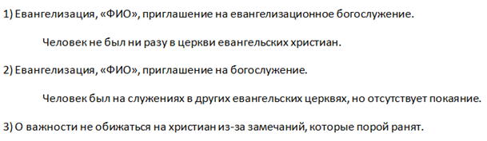

[&#8592; Глава 13](../13-Христианская-этика "Христианская этика: христианский взгляд на эвтаназию") &ensp;&ensp;&ensp;&ensp;[Оглавление](https://github.com/nyakovchuk/seminary-study-book) &ensp;&ensp;&ensp;&ensp; [Глава 15 &#8594;](../15-Соборные-послания "Соборные послания: благодать в первом послании Петра")

#### Часть 2
# Глава 14. Евангелизация и ученичество
# Отчет по проведению благовестия и ученичества

[Вступление](#intro)

[14.1. Отчёт по проведению личного благовестия №1](#p141)

[14.2. Отчёт по проведению личного благовестия №2](#p142)

[14.3. Отчёт по консультированию в вопросах духовной жизни](#p143)

Наконец-то появилась возможность лёгкого отдыха в обучении. Очень простая работа для студентов. Я был очень рад, что именно в этом месяце так мало нужно было писать. Не исключено, что я столкнулся бы с большими трудностями при написании полноценной работы в этот период. Я благодарил Бога за Его милость к нам (студентам), и ко мне в частности.

Работа заключалась в описании двух своих свидетельств о Боге неверующим людям, а также описания одной истории о совершении душепопечения. Вопрос душепопечения закрыл на следующий день, прямо во дворе церкви. Решил, что история о ободрении верующего брата отлично подходит в эту категорию. Заранее не готовился и тем более при общении не думал, что сейчас происходит практика душепопечения, всё было спонтанно. Потом по приезду домой, я решил, что эта беседа попадает под категорию душепопечения. В целом это был обычный разговор, мне кажется, таких историй множество у верующих, после каждого богослужения. В вопросах свидетельства о Боге, не всё так радужно, выбор был не такой большой, но мне сразу захотелось описать одну свежую историю, которая была в процессе на момент написания и одну давнюю историю, которая произошла чуть больше года назад. Они не были похожи друг на друга, именно эту цель я преследовал, когда выбирал вторую историю, чтобы не было однотипности.

Несмотря на небольшой объём работы, который напоминал отчёт, я также использовал черновой документ, он был единственным. На **рис. 14.1** он приведён полностью, указанные персональные данные людей (фамилии и имена) скрыл.

**Рис. 14.1.** Черновой документ по евангелизации и ученичеству

## Отчёт по проведению личного благовестия №1

**Место и время проведения:** январь-февраль 2020 г., остановка общественного транспорта и другие общественные места.

**Субъект благовестия:** человек, знакомый мне с ранних лет, посещавший иногда евангельскую церковь, но не принявший Иисуса Христа, как личного Спасителя. В жизни которого наступили не простые финансовые дни, погрузившие его в долги.

**Обстоятельство встречи:** договорился встретиться с человеком после его работы в общественном месте для оказания финансовой помощи. Данные встречи происходили неоднократно, но они имели характер консультирования в жизненных вопросах.

**Содержание встречи:** при возникновении затруднительной ситуации, человек обратился за финансовой помощью. При оказании данной помощи, мною было заострено внимание на важности ходить в церковь, где помощь могут оказать и поддержать не только уверовавшие люди, но самое главное Господь – Иисус Христос. После оказания помощи, общение с человеком не потеряно, установлена связь, происходит общение в интернет-мессенджерах и продолжается акцентирование внимания на важности обращения своего взора в сторону Иисуса Христа и на Его путь.

## Отчёт по проведению личного благовестия №2

**Место и время проведения:** сентябрь 2018 г., возле своего дома.

**Субъект благовестия:** человек, знакомый по работе, который посещал православные храмы, но ни разу не был в евангельской церкви.

**Обстоятельство встречи:** предоставление компьютерной услуги необходимой для работы человека. Встреча происходила возле моего дома.

**Содержание встречи:** человек попросил оказать ему срочную услугу по распечатыванию информации необходимой для его работы. Для этого он приехал к дому моего проживания. В нашей поместной церкви, в ближайшее воскресение должно было пройти особое евангелизационное богослужение. Я знал, что данный человек иногда посещал православный храм. После оказания технической услуги необходимой для его работы, поинтересовался, был ли он, хоть раз, в евангельской церкви. После отрицательного ответа, рассказал о предстоящем служении в нашей церкви и пригласил его посетить богослужение.

## Отчёт по консультированию в вопросах духовной жизни

**Место и время проведения:** февраль 2020 г., на территории поместной церкви, после окончания воскресного служения.

**Субъект ученичества:** член церкви, в жизни которого существует некая обида на грубость верующих людей, которые давали «неправомерные» замечания.

**Обстоятельство встречи:** при общении с человеком, после окончания служения, выяснилось, что у него в жизни есть «осадок» от замечаний верующих людей и непонимание как так могут поступать дети Божьи.

**Содержание встречи:** отвечая на этот вопрос, отметил, что действительно верующим людям не подобает резкие, иногда даже, необоснованные замечания или нападки в сторону других людей. Тем не менее, необходимо учитывать, что Господь пришёл спасать грешников и церковь состоит хоть из спасённых, но из грешных людей, а не ангелов. И им, как людям, присуще слабости, переживания и т.д.

В нашей жизни, к сожалению, бывают моменты, в которых мы не пободрствовали, дали место дьяволу, своей плоти или ещё не до конца преображённому, ветхому характеру и т.д. Результат такого не бодрствования может ранить окружающих людей. Несмотря на всё это, верующий человек стремится к Богу, к встрече с Ним, он кается, сокрушается, желает приблизиться к Создателю.

Укрепил и ободрил человека сказал, что не стоит огорчаться на верующих, все мы много согрешаем, особенно в слове ([Иак.3:2](# "ибо все мы много согрешаем. Кто не согрешает в слове, тот человек совершенный, могущий обуздать и все тело")). Когда это осознаём, жалеем об этом, поэтому необходимо прощать друг друга, мы не ангелы, мы на Земле. Если каждый из нас начнёт уходить из церкви из-за того, что его обидели, то церковь быстро опустеет. Задача христианина преображаться в образ Христа и этот процесс, к сожалению, длинною во всю жизнь. Не обижаться, но молиться, поддерживать и благословлять необходимо друг друга всегда – этого ждёт от нас Бог, даже когда нам не легко, к этому нужно прикладывать и свои силы.

[&#8592; Глава 13](../13-Христианская-этика "Христианская этика: христианский взгляд на эвтаназию") &ensp;&ensp;&ensp;&ensp;[Оглавление](https://github.com/nyakovchuk/seminary-study-book) &ensp;&ensp;&ensp;&ensp; [Глава 15 &#8594;](../15-Соборные-послания "Соборные послания: благодать в первом послании Петра")
