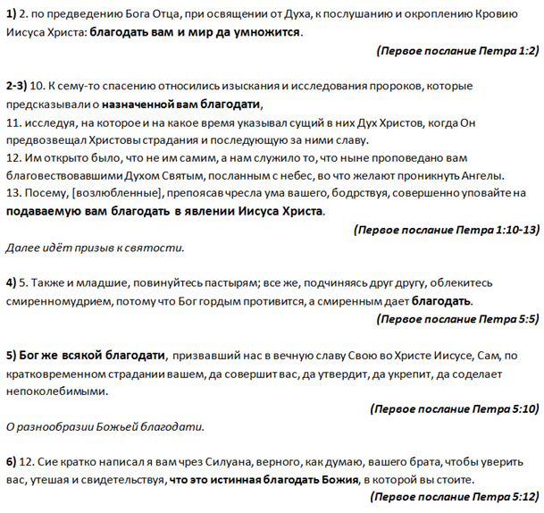

[&#8592; Глава 14](../14-Евангелизация-и-ученичество "Евангелизация и ученичество: отчет по проведению благовестия и ученичества") &ensp;&ensp;&ensp;&ensp;[Оглавление](https://github.com/nyakovchuk/seminary-study-book) &ensp;&ensp;&ensp;&ensp; [Глава 16 &#8594;](../16-Сотериология "Сотериология: возрождения (рождение свыше)")

#### Часть 2
# Глава 15. Соборные послания
# Благодать в первом послании Петра

[**Вступление**](#intro)

[**15.1. Обзор первого послания Петра**](#p151)

&ensp;&ensp;[15.1.1. Автор](#p1511)

&ensp;&ensp;[15.1.2. Время и место написания](#p1512)

&ensp;&ensp;[15.1.3. Получатели](#p1513)

&ensp;&ensp;[15.1.4. Цель](#p1514)

[**15.2. Благодать в Послании**](#p152)

&ensp;&ensp;[15.2.1. Благодать в приветствии](#p1521)

&ensp;&ensp;[15.2.2. Благодать – долгожданный подарок Христа](#p1522)

&ensp;&ensp;[15.2.3. Благодать – удел смиренных](#p1523)

&ensp;&ensp;[15.2.4. Благодать многоразличная и совершенная](#p1524)

&ensp;&ensp;[15.2.5. Истинная благодать](#p1525)

[**Вывод**](#conclusion)

К соборным посланиям относится и послание Иуды, работа по которому была у меня на первом курсе. Ещё на лекциях возникла мысль: «не пойти ли по проторенной дорожке сэкономив время»? Уточнял этот вопрос у нашего куратора семинарии, получил отрицательный ответ. В итоге в перечне тем для рефератов послание Иуды даже не упоминалось. Снова выбор темы был осуществлён не сразу, хоть и не был затянут. Мне сразу легла на сердце тема: *«благодать в первом послании Петра»*, но было одно препятствие, о благодати я уже писал в послании к Римлянам, и вот снова необходимо возвращаться к данной теме. Речь не идёт о том, что тема не важная, не интересная и т.д., ведь благодать – это ключевая тема Нового Завета, в ней Божья полнота, всё наше спасение, вся наша вера имеет смысл только благодаря Божьей благодати, которую нам принёс Иисус Христос. Вопрос был в другом, она мне казалась тождественной к написанной ранее работе из сессии [«послание к Римлянам»](../11-Послание-к-Римлянам), а хотелось что-то нового. Странно получается, с одной стороны я был готов вернуться заново к описанию послания Иуды, с другой стороны тема о благодати не давала мне приступить к работе из-за её присутствия в перечне моих предыдущих работ. Перечитывая первое послание Петра, размышлял, что же писать о благодати, Смущало, что так мало стихов содержащих упоминание благодати, по сравнению с посланием к Римлянам. Несмотря на все душевные терзания, выбор темы был определён, я просто не мог оставаться равнодушным к благодати, активно размышляя над ней. Получается, что **одна из основных линий в работах второго курса это ярко выраженная линия Божьей благодати**, которая находила своё отражении и в работах по аннотациям на книги. Работа о благодати по предмету [«послание к Римлянам»](../11-Послание-к-Римлянам) внесла значительный вклад в реферат. Впервые в список используемых источников я добавил свою предыдущую работу.

Черновых документов было фактически два, первый содержал все стихи послания, где упоминалось слово благодать. Второй содержал сведенья из книг о послании Петра: тему и цель написания, получателей, время написания. По объёму черновые документы были очень краткими. Черновой документ со стихами занимал меньше одной странички и полностью приведён на **рис. 15.1**. Документ со справочной информацией из книг был на полторы странички, в нём была включена информация из трёх книг.

**Рис. 15.1.** Черновой документ со стихами о благодати первого послания Петра

Работа была написана, по времени, очень быстро. Я старался не выйти из необходимого лимита по страницам. Последние работы были существенно больше требуемого, это с учётом того что я их сокращал до минимума. Вкратце говоря, после этой работы понял, что значит писать реферат быстро, не затягивать. При таком подходе и опыте мне начало казаться, что за обучение в семинарии я уже могу особо не переживать, ведь перестал чувствовать нагрузку в работе. Господь это видел, и уже две последующие работы имели совершенно иной подход и вид. Будучи уверен, что к началу второй недели после окончания занятия все работы будут готовы (тесты, аннотация и реферат), я с трудом и напряжённым ускорением закончил следующий реферат на пятой, последней неделе после занятия. Но об этом в следующем разделе.

## Вступление

Благодать не основная тема 1-го послания Петра. Ей уделено немного внимания, о ней явно написано только в первой и пятой главе данного послания, т.е Пётр уделяет ей внимание в начале своего обращения к церквям и возвращается к ней в заключительных стихах своего послания. Разработать учение спасительной или действующей благодати, как это было на основании послания к Римлянам, где апостол Павел обстоятельно изложил основы и цели благодати, здесь не получится. С другой стороны такой цели в задании нет, такой цели не было и у апостола Петра при написании послания, но благодать там встречается и она будет объектом пристального нашего рассмотрения в текущей работе.

В работе будет уделено внимание рассмотрению благодати в послании, почему к ней обращается апостол Пётр, к чему его направлял Дух Святой.

Прежде чем перейти к вопросу благодати в послании, будет кратко дан обзор этому посланию, авторство, цель, время написания, всё это позволит глубже погрузиться и понять Божественную линию благодати в обращении Петра к святым.

## 15.1. Обзор первого послания Петра

Первое письмо Петра относится к числу так называемых Соборных посланий в Новом Завете. Из всех Соборных посланий это письмо, наряду с первым письмом Иоанна является самым авторитетным. Это объясняется как важностью его содержания, так и личностью автора **[1]**.

### 15.1.1. Автор

Ранняя Церковь никогда не сомневалась, что Апостол Пётр написал первое послание Петра. *«Слова и фразы из 1-го Петра повторяются в таких трудах конца I и начала II столетия как послание Варнавы, первое послание Климента, Пастырь Ермы и послания Игнатия. Самым ранним, сохранившимся до наших дней трудом, прямо цитирующим 1-е Петра, является послание Поликарпа к Филиппийцам, вероятно, написанное во втором десятилетии II века»* **[2]**.

### 15.1.2. Время и место написания

С точным временем написания послания определённости нет, достоверно неизвестно, написано ли оно до гонений (заранее подкрепляя верующих) в 60-х годах или уже после них. Приведём выдержки из различных версий:
1. до гонений:
      - *«традиционно считается, что письмо написано незадолго до начала гонений Нерона, так что дата его написания 62-64 гг.»* **[3]**.
      - *«самой вероятной датой написания 1-го послания Петра является период перед гонениями Нерона, наступившими после большого пожара летом 64-го года, уничтожившего Рим»* **[4]**. 

2. после гонений:
     - *«Первое послание Петра было написано из Рима самим апостолом Петром около 67 г., в эпоху непосредственно после первых гонений на христиан при императоре Нероне»* **[5]**.

Что касается места написания, то Пётр сообщает, что пишет из Вавилона. *«Вероятно, имеется в виду сам Рим, ведь в I веке христиане называли Вавилоном столицу империи»* **[6]**. Толкователи данного письма хоть и рассматривают различные возможные варианты, но в итоге приходят к такому выводу как наиболее верному.

### 15.1.3. Получатели

*«Пётр адресовал своё послание христианам, жившим «в Понте, Галатии, Каппадокии, Асии и Вифинии» (1:1), – областях Римской  империи, являющихся частью современной Турции. Порядок их перечисления, возможно, показывает маршрут, которым шёл курьер, доставлявший послание (Силуан, 5:12)»* **[7]**.

### 15.1.4. Цель

Цель и причины написания письма во многих суждениях авторов схожи. Это не удивительно, послание практическое и простое для понимания. Вот что сообщается в предисловии к посланию в Библии учебного издания: *«Причина написания письма состояла в укреплении веры христиан, рассказав им о той надежде, которая дожидается их в небесах. Христиане жили во враждебном окружении и постоянно подвергались преследованиям и клеветническим нападкам»* **[8]**. Джон Мак Артур в своей книге, по толкованию этого послания, отмечает, что *«явно выраженной целью Петра в написании этого послания было утвердить читателей в истинной благодати Божьей (5:12) перед лицом нарастающих гонений и страданий. Пётр хотел, чтобы его читатели жили радостной жизнью во враждебной среде, не оставляя надежды, не тая горечи, не теряя веры во Христа и помня о Его втором пришествии»* **[9]**. Фраза *«утвердить читателей в истинной благодати»* идеально подчёркивает тему реферата. Пётр желает не просто ободрить читателей в сложнейшие времена гонений, но утвердить их в том, что учение, которое они приняли, есть истинно. Благодать в этом учении сильна, чтобы спасать, действовать и подаваться вовремя.

## 15.2. Благодать в Послании

Слово *«благодать»* упоминается в 1-м послании Петра всего шесть раз, такое малое количество упоминаний позволит прикоснуться к каждому отрывку или стиху где она упоминается. Какой-то стих будет рассмотрен более ёмко, другой более кратко, но без внимания не останется ни одно упоминание о благодати, оставленное в первом своём обращении к святым, апостолом Петром.

### 15.2.1. Благодать в приветствии

>**1.**… избранным, 
**2.** по предведению Бога Отца, при освящении от Духа, к послушанию и окроплению Кровию Иисуса Христа: благодать вам и мир да умножится ***(1 Пет.1:1-2)***.

Апостол Павел множество своих посланий к церквям начинает с пожелания благодати: *«благодать вам и мир от Бога Отца и Господа нашего Иисуса Христа»* (***Гал.1:3***, ***Еф.1:2***, ***Фил.1:2***, ***Кол.1:3*** и т.д.). Апостол Пётр вторит апостолу Павлу в своих приветствиях. Первое и второе послание содержат абсолютно идентичную фразу-пожелание *«благодать вам и мир да умножится»* (***1 Пет.1:2***, ***2 Пет.1:2***) – **это универсальное апостольское приветствие**. Несомненно, это важное пожелание, с этого начинаются послания Петра к избранным, с этого должен начинаться и любой наш день, чтобы Божья благодать и мир умножались в жизни каждого верующего человека. Существует недосказанность в этом пожелании, которая заключается, как достигать данного благословенного умножения в жизни? Слава Богу, что есть второе послание Петра, где он восполняет эту недосказанность, указывая путь к достижению этой цели. Взглянем на эту фразу в контексте второго послания: *«благодать и мир вам да умножится в познании Бога и Христа Иисуса, Господа нашего»* ***(2 Пет.1:2)***. Приведу толкование этого стиха: *«благодать не только должна воцариться в жизни верующего человека, но она должна умножаться, именно при её умножении, её царствование в человеке становится сильнее. Благодать умножается через познание Бога. Чем дальше от Бога, тем пренебрежительней отношение к благодати считая, что её недостаточно, необходимо что-то ещё. Когда приближаемся к Богу, то понимаем: всё наше нечисто, нечем хвалиться, всё что имеем только от Него и благодаря Ему. Всё, что мы имеем в Нём открывается нам всё более и более, понимая в какую величественную славу Божью входим и с нетерпением ожидаем её»* **[10]**.

### 15.2.2. Благодать – долгожданный подарок Христа

>**10.** К сему‐то спасению относились изыскания и исследования пророков, которые предсказывали о назначенной вам благодати, **11.** исследуя, на которое и на какое время указывал сущий в них Дух Христов, когда Он предвозвещал Христовы страдания и последующую за ними славу. **12.** Им открыто было, что не им самим, а нам служило то, что ныне проповедано вам благовествовавшими Духом Святым, посланным с небес, во что желают проникнуть Ангелы. **13.** Посему, [возлюбленные], препоясав чресла ума вашего, бодрствуя, совершенно уповайте на подаваемую вам благодать в явлении Иисуса Христа. ***(1 Пет.1:10-13)***

Это самый объёмный отрывок о благодати в Послании, возможно, центральный, поэтому он будет рассмотрен подробно. Слово *«благодать»* в нём встречается два раза. Прежде, чем перейти к наставлению христианам вести святой образ жизни, апостол Пётр обращается к благодати. Это очень верный подход, которого придерживался и апостол Павел в своих посланиях. Каждый верующий должен знать, что он получил от Бога для того, чтобы преображаться в образ Христов. Не своею силою, стремлением, своим пониманием праведности пытаясь её достигнуть. Верующий становится способным исполнить заповедь Бога – *«будьте святы, потому что Я свят»* ***(Лев.11:45)***, только уповая на благодать от Христа, на Его силу, верующий способен не сообразоваться с похотями, грехом, миром – это единственный путь. Этот путь был непонятен для пророков, они, повинуясь Духу Святому, предсказывали, что наступят времена, когда спасение будет по благодати. Они исследовали время, когда это должно осуществиться, это означает то, что они желали и ожидали этого часа, прекрасного времени, времени действия благодати Божьей на Земле, это восхищало их. Отмечу, что дважды в этом отрывке употребляется слово *«исследование»* по отношению к пророкам, что говорит о том, что они были не просто проводниками Слова Божьего через себя, а они вникали и тщательно разбирали то, что Дух Святой говорил через них. Господь открывал пророкам, что благодать придёт не лёгким путём, для этого должен будет пострадать Сын Божий, который смирив себя до конца, оказался способным испить чашу страданий до последней капли и Бог вознёс Его пред глазами всех ангелов, всего духовного мира выше всего. Для ангелов эта дорога страданий и унижений ради людей была непонятна, она непонятна и многим людям. Только так Господь возносит во славу тех, которые отдают себя на служение людям, на которое их поставил Бог. Именно так принёс спасение Иисус Христос, отвергнув себя, благодаря Его славному служению верующий в Него имеет благодать. Это дивно и прекрасно, в уразумение такого спасения желают проникнуть и ангелы. Каждый верующий должен осознавать дар благодати и препоясать свой ум так, чтобы его мысли не выходили за пределы благодати, что он способен на что то без неё, что он и так хорош, праведный, сильный. Следует бодрствовать над этим и вовремя подтягивать ремень истины, чтобы наш ум всегда был препоясан и не выходил за пределы благодати данной нам Христом. Чтобы не упразднить первое пришествие Иисуса Христа на Землю и Его величайший подвиг и дар, который ныне доступен каждому.

### 15.2.3. Благодать – удел смиренных

>Также и младшие, повинуйтесь пастырям; все же, подчиняясь друг другу, облекитесь смиренномудрием, потому что Бог гордым противится, а смиренным дает благодать. 
***(1 Пет.5:5)***

Последние три упоминания о благодати, находятся в последней, пятой главе. Первое её упоминание в пятой главе происходит в контексте повиновения, подчинения и облечением смиренномудрием. Держась главной нашей цели, рассмотрение благодати, не будем исследовать и приводить толкование первой части стиха, кому он адресован, кто такие «младшие» и т.д. Сосредоточимся на благодати, ведь понимая и применяя её возможно осуществить и первую часть стиха.

**Это факт что, благодать получают смирённые люди**. Тот кто осознаёт себя грешником понимает, что без Бога он ни на что доброе не способен, к такому благоволит Бог и такой человек получает благодать данную Христом через веру в Него. Именно это напоминает апостол Пётр, поэтому смирение крайне важно для каждого верующего, оно должно сопровождать его на протяжении всей жизни и в каждой ситуации. Это касается и повиновению пастырям и служению друг другу. Интересное противопоставление делает Пётр, называя всех, у кого отсутствует смирение, гордыми. Гордые люди не могут рассчитывать на Бога, на Его помощь, защиту, Он им противится, можно даже сказать сражается против них. В данном контексте гордые люди это те, которые не хотят иметь над собой никакой власти, не подвластные никому, своевольные.

### 15.2.4. Благодать многоразличная и совершенная

>Бог же всякой благодати, призвавший нас в вечную славу Свою во Христе Иисусе, Сам, по кратковременном страдании вашем, да совершит вас, да утвердит, да укрепит, да соделает непоколебимыми. 
***(1 Пет.5:10)***

В данном отрывке апостол Пётр сообщает нам, что Божья благодать многоразличная, т.е она проявляется во всех сферах нашей жизни. Пётр также сообщает о том, что любая благодать она от Бога. Каждое даяние доброе оно исходит от Бога. Данной благодати для нас и её проявления в нас достаточно для жизни и благочестия, она совершенна, дополнять её ничем не надо. Во всех наших обстоятельствах, даже в самых сложных, она способна совершить и соделать непоколебимым каждого верующего. Это очень ободряющий отрывок, в первую очередь для тех, кому адресовано это послание, для гонимых христиан. Оно также очень ободряющее для каждого христианина, который переносит страдание, а также для назидания всякого верующего.

Верующие в Бога призваны в вечную славу, а без Его благодати туда никак не попасть. Божьей благодати достаточно для совершения нашего спасения во всех обстоятельствах и она действует, Бог сделал всё для этого.

### 15.2.5. Истинная благодать

>Сие кратко написал я вам чрез Силуана, верного, как думаю, вашего брата, чтобы уверить вас, утешая и свидетельствуя, что это истинная благодать Божия, в которой вы стоите. 
***(1 Пет.5:12)***

Это завершающий стих учения всего первого послания Петра, далее следует два стиха содержащие приветствия. Данный стих итог всего послания, он неразрывно связан со всем посланием и провозглашает что оно истинно. Фраза *«что это истинная благодать Божия»* является ссылкой на богодухновенность послания **[11]**, Пётр не своими умозаключениями делился, Дух Святой вдохновлял и вразумлял его. Именно здравое понимание благодати должно вырабатываться и утверждаться у каждого верующего, читающего это послание. Благодать Божья не отменяет страдания, гонения, различные переживания у христиан, но она даёт силы всё перенести так, чтобы имя Божье было прославлено. Она ведёт нас к смирению, благодать – это величайший дар Божий, который мы имеем во Христе, через неё всё: спасение, искупление, оправдание, усыновление. Это и есть истинная благодать. Лжеучений о благодати много, людей извращающих Писание не мало, но послания апостола Петра достаточно, чтобы «уверить» каждого верующего, что именно благодать, которая описана в этом послании есть истинная. В этой истинной благодати необходимо стоять.

## Вывод

В данной работе были рассмотрены все стихи с первого послания Петра связанные с благодатью. Проанализирован каждый из них. Не смотря на то, что благодати уделено не так много внимания она является тем фундаментом, на котором строится весь наш духовный храм. Без неё невозможно найти ответы и силы для утешения, ободрения, перенесения страданий за Христа.

Вкратце подытожим основные пункты, на которых акцентировал внимание апостол Пётр, связанные с благодатью. Итак, благодать:
* должна умножаться;
* назначена (принадлежит) верующим в Иисуса Христа;
* подаётся для помощи, поэтому уповаем на неё;
* для смирённых;
* многоразличная;
* в ней надо стоять.

Всё это должно активно проявляться в жизни каждого христианина. И Господь благодаря действию Его благодати *«да совершит вас, да утвердит, да укрепит, да соделает непоколебимыми»* каждый день жизни верующего в Него.

---
1. Библия. Современный русский перевод. Учебное Издание. – С.2489.
2. Джон Ф. Мак-Артур. Толкование книг нового завета. 1-е послание Петра. – С.12.
3. Библия. Современный русский перевод. Учебное Издание. – С.2490.
4. Джон Ф. Мак-Артур. Толкование книг нового завета. 1-е послание Петра. – С.16.
5. Баркли У. Толкование Первого послания Петра. – С.2.
6. Библия. Современный русский перевод. Учебное Издание. – С.2490.
7. Джон Ф. Мак-Артур. Толкование книг нового завета. 1-е послание Петра. – С.15.
8. Библия. Современный русский перевод. Учебное Издание. – С.2490.
9. Джон Ф. Мак-Артур. Толкование книг нового завета. 1-е послание Петра. – С.16.
10. Яковчук Н.П. Разработка учения спасения по благодати: Реферат. – С.9.
11. Джон Ф. Мак-Артур. Толкование книг нового завета. 1-е послание Петра. – С.293.

[&#8592; Глава 14](../14-Евангелизация-и-ученичество "Евангелизация и ученичество: отчет по проведению благовестия и ученичества") &ensp;&ensp;&ensp;&ensp;[Оглавление](https://github.com/nyakovchuk/seminary-study-book) &ensp;&ensp;&ensp;&ensp; [Глава 16 &#8594;](../16-Сотериология "Сотериология: возрождения (рождение свыше)")
