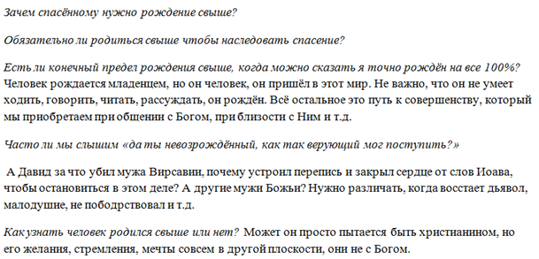
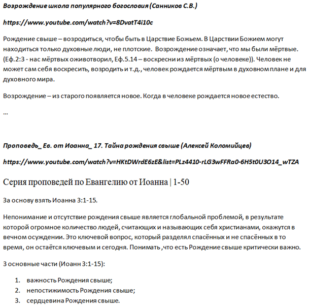

[&#8592; Глава 15](../15-Соборные-послания "Соборные послания: благодать в первом послании Петра") &ensp;&ensp;&ensp;&ensp;[Оглавление](https://github.com/nyakovchuk/seminary-study-book) &ensp;&ensp;&ensp;&ensp; [Глава 17 &#8594;](../17-История-Церкви–2 "История Церкви – 2: начало религиозной реформы")

#### Часть 2
# Глава 16. Сотериология
# Возрождения (рождение свыше)

[**Вступление**](#intro)

[**16.1. Виды названий рождения свыше**](#p161)

[**16.2. Христианская проблематика рождения свыше**](#p162)

&ensp;&ensp;[16.2.1. Расхождение в списке пути спасения](#p1621)

&ensp;&ensp;[16.2.2. Расхождение в возникновении (происхождении)](#p1622)

&ensp;&ensp;&ensp;&ensp;[16.2.2.1. Во время покаяния](#p16221)

&ensp;&ensp;&ensp;&ensp;[16.2.2.2. Во время водного крещения](#p16222)

&ensp;&ensp;&ensp;&ensp;[16.2.2.3. Во время духовного крещения](#p16223)

&ensp;&ensp;&ensp;&ensp;[16.2.2.4. После покаяния](#p16224)

&ensp;&ensp;[16.2.3. Расхождение в понимании что рождается](#p1623)

&ensp;&ensp;[16.2.4. Расхождение в признаках](#p1624)

[**16.3. Богословие рождения свыше**](#p163)

&ensp;&ensp;[16.3.1. Истинное покаяние](#p1631)

&ensp;&ensp;&ensp;&ensp;[16.3.1.1. Характеристика истинного покаяния](#p16311)

&ensp;&ensp;&ensp;&ensp;[16.3.1.2. Покаяние и рождение свыше](#p16312)

&ensp;&ensp;[16.3.2. Важность рождения свыше](#p1632)

&ensp;&ensp;[16.3.3. Рождение от воды](#p1633)

&ensp;&ensp;[16.3.4. Рождение от духа](#p1634)

&ensp;&ensp;[16.3.5. Характеристики рождённого свыше человека](#p1635)

&ensp;&ensp;&ensp;&ensp;[16.3.5.1. Не возрождённый или плотской](#p16351)

&ensp;&ensp;&ensp;&ensp;[16.3.5.2. Возрождение начало освящения](#p16352)

[**Вывод**](#conclusion)

Последние две работы особые, кроме раскрытия темы, они носят исследовательский характер, особенно это ярко выражено в данной работе. После написания работы впервые поймал себя на мысли, что получившаяся работа недалека от дипломной. Достаточно добавить ещё один большой пункт с анализом слова *«рождение свыше»* на древнегреческом языке, расширить существующие разделы и в целом всё готово – объём соответствует, исследования есть, работа над ними и выводы достойные, за наполнение работы у меня вопросов не возникало. Эти работы были написаны в период весеннего карантина (апрель-май) 2020 г., поэтому я назвал их *«карантинные»*. Сам карантин никак не повлиял на них, ни на время написания, ни на тему, ни на что иное.

Тему работы студенты выбирали с оглавления в методичке – это новая практика предоставления тем рефератов. В принципе все темы сотериологии просты, не имеющие неоднозначности в трактовке: *искупление*, *оправдание*, *примирение*, *покаяние* и т.д. Тема *«рождение свыше»* родилась сама собою, она отличается от остальных сотериологических тем своей сложностью. Я рассчитывал, что мне для написания работы достаточно будет взглянуть на третью главу от Иоанна, подробно её проработать, описать и на этом всё, реферат готов. Не планировал тратить на неё много времени, откровенно говоря, рассчитывал поставить новый рекорд выполнения домашнего задания – закончить все работы сессии, включая реферат, в первую неделю после получения заданий. Причина, почему всё пошло не по плану, послужил взгляд на этот вопрос всесторонне, решил что раз есть время, то изучу как о *«рождении свыше»* рассуждают христиане разных конфессиональных групп. Для этого в [youtube](https://www.youtube.com) нашёл различные видео на эту тематику и сохранил их. Я ни в ком случае не хотел и не собирался подвергать критике взгляды верующих, которые не согласны с тем, что будет написано мной. Изначально я не хотел включать раздел реферата *«христианская проблематика рождения свыше»* в данную книгу, исключив её из книжной версии реферата. Ещё раз напомню, всё что изложено в реферате это моё мнение, при написании работы у меня и мыслей не было унизить кого-то с другими взглядами на этот вопрос, всё было наоборот, цель была укрепить христианина, а не обидеть и смутить верующего человека.

Из-за отсутствия опыта в таких работах у меня собралось много черновых документов. В каждой ситуации создавал себе новый рабочий документ. Взглянем на них подробней.

**Первый черновой** документ был основным, он содержал размышления на данную тематику, все свои мысли я заносил и разрабатывал в нём. Данный документ был довольно большим, состоял из пяти страниц.

**Второй документ** содержал отрывок с Евангелие ***от Иоанна 3:1-21***. В нём я минимально комментировал некоторые стихи, выделял полужирным шрифтом важные цитаты, относящиеся к рождению свыше. Объём этого документа не превышал двух страниц.

**Третий справочный документ** состоял с вставок из книг о рождении свыше. Как для реферата, в нём было много обработано литературы, семь книг, с учётом методического пособия. Как следствие, его объём состоял из двадцати страниц. Кроме вставок из книг, данный документ содержал некоторые вопросы о рождении свыше и мои ответы **рис. 16.1.** Так делать не совсем правильно, надо разделять черновые документы по их назначению.

**Рис. 16.1.** Вопросы и ответы на вопросы о рождении свыше

**Чётвёртый рабочий документ** относился к содержанию реферата. Там я работал над содержанием, вносил и удалял пункты, которые собирался осветить. По уже привычной неправильной традиции, он также содержал мои размышления о рождении свыше в аспекте покаяние и рождение свыше, этим размышлениям было уделено две страницы. Общий объём данного документа четыре страницы.

Был также заготовлен **пятый документ** в котором содержался шаблон слов: «рожд\*, роди\*, возрожд\*, возроди\*, …». По всем этим шаблонам я планировал сделать поиск в Новом Завете и вынести все стихи содержащие эти слова в данный документ. Поиск я сделал, ознакомился со стихами, но ничего не стал переносить в документ. В целом задумка интересная.

**Шестой документ** состоял из некоторых стихов Слова Божьего, которые я обязательно хотел включить в реферат. Это [Ефес.2:5](# "И нас, мертвых по преступлениям, оживотворил со Христом, — благодатью вы спасены"), [2 Кор.5:17](# "Итак, кто во Христе, тот новая тварь; древнее прошло, теперь все новое"), [Тит.3:5,6](# "Он спас нас не по делам праведности, которые бы мы сотворили, а по Своей милости, банею возрождения и обновления Святым Духом,
Которого излил на нас обильно через Иисуса Христа, Спасителя нашего"), [Ин.1:12,13](# "А тем, которые приняли Его, верующим во имя Его, дал власть быть чадами Божиими,
которые ни от крови, ни от хотения плоти, ни от хотения мужа, но от Бога родились"), также я кратко прокомментировал некоторые из этих стихов. Объём документа меньше страницы.

**Седьмой документ** содержал транскрибацию (ручной перевод речи в текст) сохранённых видео в текстовый документ. Это заняло немало времени. Краткий вид этого документа на **рис. 16.2**. Вначале я хотел записывать только основные мысли, но по итогу записывал почти все слова проповедников. Сразу хочу заметить, что это была первая версия документа, она содержит множество недостатков, сейчас я бы ставил перед каждым абзацем, а то и предложением, тайм-коды. Объём документа десять страниц.

**Рис. 16.2.** Транскрибация видео с youtube

Все эти исследования, размышления повлияли на срок написания работы, которую спешно заканчивал писать в начале пятой недели. Эта работа разительно отличается от всех предшествующих ей работ. Именно после написания, взглянув на неё, у меня возникла мысль, что я недалёк от дипломной работы. Поразмышлял, что ещё необходимо было в ней сделать, если бы это была дипломная работа. Пришёл к выводу, что в целом, текущая работа это уже 70-80 процентов дипломной работы.

Отдельно коснусь дополнительной литературы при написании работ, Божье благословение сопровождает и здесь, очень часто при написании работы мне «попадаются» книги как раз по тематике реферата. В данном случае в процессе написания реферата, я увидел книгу *«Мидраш рассказывает»*, она по объёму большая, с ней сложно в рамках работы ознакомится детально. Интерес к ней не проходил, я решил сделать по ней поиск слова *«благочестивый»*, чтобы узнать описание понятия *«благочестивый»*, это позволило бы лучше понять идеи фарисейства. В одном из результатов поиска, ниже этого слова я увидел описание, когда еврей может грешить и это не будет ему вменяться в грех. Это была очень интересная и важная находка для работы.

## Вступление

Рождение свыше это основополагающее действие в жизни человека принявшего Иисуса Христа, без него невозможно увидеть Царствие Божие [(Ин.3:3)](# "Иисус сказал ему в ответ: истинно, истинно говорю тебе, если кто не родится свыше, не может увидеть Царствия Божия"). Не смотря на всю важность этого события в жизни верующего человека, оно является самым неоднозначным в изложении, определении и признаков в учении о спасении человека.

В данной работе рассматривается проблематика рождения свыше, существующие неоднозначности в его понимании. Работа не претендует на исследовательский статус, хотя рассматривает различные христианские взгляды на учение о рождении свыше. Всё это лишь позволяет шире увидеть христианский мир, проблемы с которыми он сталкивается, начиная с учения о спасении. Цель работы не устранять или критиковать «не правильные» учения о возрождении, врядли такой подход является христианским путём, но стремится показать проблематику рождения свыше. Во второй части работы будет приведён авторский взгляд (разнообразие взглядов не позволяет назвать его евангельским, это будет не корректно по отношению к другим мнениям) на рождение свыше, рассмотрены основные его составляющие и признаки возрождённого человека.

## 16.1. Виды названий рождения свыше

У рождения свыше существует множество названий, которые могут «запутать» христианина. В данной работе будут использоваться некоторые из них. Для однозначности понимания работы при чтении, приведу их названия.

**Самое популярное в употреблении название рождения свыше – это возрождение**. Данное название чаще всего используется в богословских книгах, особенно зарубежных авторов. С названием возрождение связан также термин *«духовное возрождение»*, что по сути является тем же самым названием что и возрождение, но оно подчёркивает происхождение возрождения, употребляется крайне редко. Очень часто особенно в зарубежной литературе встречается название *рождение заново*, именно таким словосочетанием переведено в английской Библии рождение свыше в третьей главе от Иоанна. В действительности греческое слово, которое употребляет Иисус Христос, в общении с Никодимом, несёт двойственное значение, которое можно перевести как рождение свыше, так и рождение заново. Какое словосочетание правильнее использовать *«рождении свыше»* или *«рождение заново»* – это ещё одна область дискуссии и размышлений богословов, но следует отметить, что чаша весов отечественных богословов на стороне названия рождение свыше. Существуют и другие, менее популярные, названия рождения свыше, например, духовное воскресение, перерождение, но все эти названия не имеют широкого употребления в христианском мире.

## 16.2. Христианская проблематика рождения свыше

Существует ряд серьёзных разногласий относительно рождения свыше в христианском мире и эти разногласия не имеют строго конфессиональных границ, хотя определённо зная конфессию, можно почти гарантированно определить их вероучение относительно возрождения. Следует учитывать, что в пределах одной конфессии, всё же могут быть разные взгляды на рождение свыше.

Существующие разногласия рождения свыше касаются также его местонахождением в сотериологическом списке, его возникновением, отличительными признаками и определением. Все эти расхождения будут рассмотрены в этом разделе, кроме определения, оно будет пропущено, так как оно определяется из возникновения и признаков рождения свыше.

### 16.2.1. Расхождение в списке пути спасения

О причинах расхождении в арминианстве и кальвинизме в вопросе спасения знают многие и основное их расхождение в данном вопросе – это избрание. В кальвинизме путь Божий для спасения человека начинается именно с избрания. Причины, почему всё начинается с избрание это отодвигание вглубь, в Божьем плане спасения, Божьего предвидения. Начальный список пути спасения у кальвинистов выглядит следующим образом: избрание, предопределение, предвидение, призыв. У арминианцев – предвидение, избрание, предопределение, призыв.

Второе значительное расхождение в пути спасения это возрождение. Приведу полный путь спасения у кальвинистов: *избрание*, *предопределение*, *предвидение*, *призыв*, **возрождение**, *покаяние*, *вера*, *оправдание*, *освящение* и *прославление*. Арминианцы видят путь спасения следующим образом: *предвидение*, *избрание*, *предопределение*, *призыв*, *покаяние*, *вера*, **возрождение**, *оправдание*, *освящение* и *прославление* **[1]**. В кальвинизме возрождение предшествует вере. Сначала человек возрождается, а потом обретает веру и спасение. В арминианстве сначала человек обретает веру, а затем оправдание и возрождение. Согласно учению кальвинизма, грешник не может верить, если он еще не возрожден. Когда кальвинисты называют веру даром, они подразумевают, что если человек имеет спасительную веру, то это всецело действие Божие. Все зависит от Бога **[2]**.

В данной работе при описании рождения свыше придерживался арминианского взгляда. Следовательно, рождению свыше будет обязательно предшествовать покаяние, именно в такой последовательности рассматривается план Божьего спасения.

### 16.2.2. Расхождение в возникновении (происхождении)

Один из ключевых вопросов рождение свыше – когда оно происходит? Существуют два наиболее популярных ответа на вопрос, когда происходит возрождение человека, это при покаянии и крещении водой. Третий вариант, менее популярный и имеет строго пятидесятнический оттенок это при крещении Духом Святым (имеется в виду традиционное пятидесятническое понимание крещения Духом Святым со знамением иных языков). Четвертый вариант носит мистический характер, в какой-то момент хождения в Боге, человек явно почувствовал, что изменилась его внутренность, разум, сердце.

Вкратце рассмотрим все варианты возникновения рождения свыше, приведём их аргументацию, чтобы было ясно, что они не безосновательные. Ни один из аргументов не будет подвержен критике, все они приведены для ознакомления.

#### 16.2.2.1. Во время покаяния

Самый популярный вариант у евангельских христиан заключается в том, что рождение свыше происходит после обращения человека к Богу. Этого учения придерживаются почти все верующие баптистского, адвентистского, харизматического учения, основная группа пятидесятнического направления также учит этому. Приведу несколько цитат:
* *«когда мы отвечаем на призыв Бога и побуждение Духа и Слова, то Бог исполняет Свои независимые деяния, через которые мы входим в семью Его царства: Он возрождает мертвых во грехе»* **[3]**;
* чтобы родиться свыше, человеку необходимо: **1)** уверовать в Евангелие. Когда грешник осознает, что жертвы Иисуса достаточно для спасения, то станет «возрождённым»; **2)** принять Иисуса Христа своим Спасителем **[4]**;
* вера в распятого Сына Божьего **[5]**;
* *«рожденные свыше очень просто – нужно принять Христа как своего Спасителя и Господа»* **[6]**;
* *«покаяние – прощение грехов – рождение свыше»* – такой последовательности действий Бога обучает Ледяев А.С. **[7]**;
* «мы рождаемся Свыше, когда слышим Божье Слово и откликаемся на него. Способность откликнуться на Слово Божие даёт Дух Святой»* **[8]** – цитата из проповеди ректора теологического института ХВЕ в г. Минске Поднюка С.С.;
* «возрождение – особое действие Святого Духа при покаянии, изменяющее сердце, обновляющее жизнь человека …»* **[9]**;
* многие богословы прямо не называют, когда происходит возрождение свыше у верующего человека, но из содержания их учения очевидно, что оно связанно только с покаянием и прощением грехов. Таким примером служит учение о возрождении Санникова С.В. **[10]**

***Аргументация***. Рассмотрим обоснования для данного учения. Богословы, держащиеся данного подхода к возрождению, почти однозначно утверждают, что рождение от воды – это рождение посредством Слова Божьего. В целом хочется отметить, что неоднозначность в подходах к рождению свыше состоит в понимании, что есть рождение от воды. Рождением от воды чаще всего понимают рождением от Слова Божьего или рождение посредством водного крещения. Учение о рождение свыше после покаяния утверждает, что возрождение происходит при участии Слова Божьего. С рождением от духа сомнений не возникает у всех евангельских конфессий это рождение от Духа Святого. Конечно, трактовать рождение от Духа Святого можно по-разному и этого момента коснёмся в разделе о возрождении после крещения Духом Святым.

Основные места Писания, которые приводятся для подтверждения данного учения:
* *«восхотев, родил Он нас словом истины, чтобы нам быть некоторым начатком Его созданий»* ***(Иак.1:18)***;
* *«чтобы освятить ее, очистив банею водною, посредством слова»* ***(Еф.5:26)***;
* *«как возрожденные не от тленного семени, но от нетленного, от слова Божия, живого и пребывающего вовек»* ***(1 Пет.1:23)***;
* *«Он спас нас не по делам праведности, которые бы мы сотворили, а по Своей милости, банею возрождения и обновления Святым Духом»* ***(Тит.3:5)***;
* *«и окроплю вас чистою водою, и вы очиститесь от всех скверн ваших, и от всех идолов ваших очищу вас. И дам вам сердце новое, и дух новый дам вам; и возьму из плоти вашей сердце каменное, и дам вам сердце плотяное. Вложу внутрь вас дух Мой и сделаю то, что вы будете ходить в заповедях Моих и уставы Мои будете соблюдать и выполнять»* ***(Иез.36:25-27)***.

#### 16.2.2.2. Во время водного крещения

Прежде всего, этого учения придерживаются православные верующие. Только водное крещение гарантирует рождение свыше. Хотя стоит отметить, что такое понимание встречается, хоть и гораздо реже, у евангельских христиан. Цитаты богословов:
* *«обычное толкование родиться от воды и духа – это таинство крещения»* **[11]** – ответ на вопрос, что есть рождение свыше заслуженного профессора Московской духовной академии Осипова А.И.;
* *«церковь всегда связывала рождение свыше с водным крещением»* **[12]** – представитель Кызыльской епархии Антоний Дулевич.

***Аргументация***. Основная аргументация состоит в том, что церковь всегда на протяжении всех столетий понимала именно так: рождение свыше происходит через водное крещение. В доказательство приводятся слова Иоанна Златоуста, Архимандрита Михаила, Феофилакта Болгарского и т.д о рождении свыше. Данное учение подтверждается стихами из Слова Божьего, основные из них:
* *«быв погребены с Ним в крещении, в Нем вы и совоскресли верою в силу Бога, Который воскресил Его из мертвых»* ***(Кол.2:12)***;
* *«Он спас нас не по делам праведности, которые бы мы сотворили, а по Своей милости, банею возрождения и обновления Святым Духом»* ***(Тит.3:5)***;
* *«итак, мы погреблись с Ним крещением в смерть, дабы, как Христос воскрес из мертвых славою Отца, так и нам ходить в обновленной жизни»* ***(Рим.6:4)***.

#### 16.2.2.3. Во время духовного крещения

Не могу обойти учение о том, что рождение свыше происходит только в момент крещения Духом Святым: *«крещение Духом Святым и рождение от Духа это одно событие»* **[13]**. Это учение находится довольно близко к нам, так как оно принадлежит союзу ОЦХВЕ Украины, поэтому следует ясно понимать, что речь идёт не о искажённом понимании крещения Духом Святым, а о первоапостольском образце – крещением со знамением иных языков. Приведу некоторые цитаты начальствующего епископа ОЦХВЕ Бабия Г.А.: *«В момент покаяния Дух Святой пребывает с верующим, трудится над ним, открывает Слово Божие. Это не означает что мы родились, Дух Святой ведёт (помогает) нам родиться свыше»*, *«в момент крещения Духом Святым мы впервые услышали свидетельство Духа духу нашему, что мы дети Божьи»*, *«если Церковь родилась в день Сошествия на неё Духа Святого, то и христианин рождается в день крещения Духом Святым»* **[14]**.

***Аргументация***. Отмечается, что рождение церкви произошло в день Пятидесятницы, но не тогда когда за Христом следовали ученики, когда они слышали Слово Божье о покаянии и принимали это слово в свои сердца. Если Церковь родилась в день сошествия на неё Духа Святого, то и христианин рождается в день крещения Духом Святым. Много приводится аргументов о важности крещения Духом Святым, которое приравнивается с важностью рождения свыше. Существуют в учении и логические моменты, обращённые к разуму: *«живой дух, как и живой человек – имеет функцию говорить. Живые говорят»* **[15]**. Следовательно, стихи из Слова Божьего, которые говорят о крещении Духом Святым разъясняются под углом рассмотрения возрождения человека, приведу их с комментариями Бабия Г.А. из учения о рождении свыше в богословской семинарии **[16]**:
* *«сей самый Дух свидетельствует духу нашему, что мы – дети Божии»* ***(Рим.8:16)***. Дух Святой засвидетельствовал духу нашему во время крещения Духом;
* *«восхотев, родил Он нас словом истины, чтобы нам быть некоторым начатком Его созданий»* ***(Иак.1:18)*** – у нас родилась вера, когда мы услышали весть Евангелия, но не дух;
* *«Петр же сказал им: покайтесь, и да крестится каждый из вас во имя Иисуса Христа для прощения грехов; и получите дар Святого Духа»* ***(Деян.2:38)***. Дар Святого Духа и есть рождение свыше – рождение от Слова Божьего и Духа Святого.

#### 16.2.2.4. После покаяния

Сложно обойти тот факт, что много христиан считает, что рождение свыше происходит не после обращения человека к Богу, точнее сказать оно может произойти в момент покаяния, но это бывает редко, чаще всего возрождение происходит в какой-то неопределённый момент времени после покаяния. Можно приписать этому действию даже некий мистический характер, когда в один момент человек почувствовал, что внутри него произошли изменения. Изменилось его сердце, разум, отношение к Богу и к греху. Именно о таком возрождении часто проповедуют, когда говорят, что человек родился свыше.

***Аргументация***. Существует множество свидетельств людей, с признаками описанные выше, в жизнь которых в какой-то момент времени приходило радикальное отторжение греха и приближение к Богу. Нельзя не отметить, что это путь каждого христианина. Когда речь идёт о рождении свыше, то речь идёт о рождении что-то нового, многие верующие считают, что ветхое должно уйти. Это истинно, но верно и то, что новое рождается в ветхой природе, со всеми её старыми страстями, похотями, желаниями, но отличие в том, что именно это новое способно быть сокрытым во Христе, умерщвлять плоть, распиная её. Приводить аргументацию этого мнения стихами из Слова Божьего не буду, просто рассмотрел переживания верующих людей касательно рождения свыше.

### 16.2.3. Расхождение в понимании что рождается

Ещё одно расхождение в понимании, что происходит в человеке при рождении свыше. Что рождается новое в нём? Это ключевой вопрос, на который необходимо знать ответ, ведь именно для этого нужно перерождение. В ответе на данный вопрос также есть незначительные расхождения у богословов. По их мнению, в момент рождения свыше в человеке рождается:
* новое естество (в старом человеке появляется что-то новое) **[17]**;
* новая природа **[18]**;
* новое творение **[19]**;
* духовное тело (которое имеет все те же органы чувств, что и физическое) **[20]**;
* внутри Христос (рождается младенцем и должен возрастать) **[21]**;
* вкладывается зерно Царства Божьего **[22]**.
Можно допустить (исходя из контекста), что под выражением: новое естество, новая природа и новое творение, подразумевается одно и тоже действие или духовный процесс в момент возрождения, который можно объединить одним выражением – новый человек. Это самое популярное понимание у богословов, но из-за расхождение в определении названия, объединять и присваивать им единое название не стал. Тем более в этих названиях не все могут усматривать синонимичность.

### 16.2.4. Расхождение в признаках

Учитывая расхождения в возникновении, когда происходит рождение свыше, можно ли ожидать единство в понимании признаков результатов рождения свыше? На удивление можно, но и здесь есть некоторые различия, которые будут приведены, в них нет явно выраженного конфессионального признака (без учёта знамения говорения на иных языков), скорее всего всё зависит от приоритета и понимания самого богослова. Вот некоторые из них:
* борьба с грехом; любовь к людям; желание общаться с Богом; человек имеет внутреннее свидетельство, что рождён свыше **[23]**;
* вера, что Иисус есть Христос; наличие Божьей любви, праведная жизнь **[24]**;
* смирение перед Богом; любовь к окружающим людям; стремление служить Богу **[25]**;
* искреннее стремление к святости и желание угодить Богу **[26]**.

## 16.3. Богословие рождения свыше

Подходя к изложению богословия рождения свыше становится ясно, что оно всех не устроит. Представляется даже невозможным убедить сторонников одной позиции в другом. С другой стороны убеждать и настаивать на своём, считая только собственное мнение верным это не путь мира и явление Христа в себе. В данном разделе будет описано рождение свыше, которое совершается Духом Святым в человеке во время обращения его к Богу. Это понимание не претендует на истинность и универсальность, но именно такого понимания я придерживаюсь.

Прежде всего, следует ясно разобраться, что есть покаяние. Покаяние – это одна из центральных тем проповеди Евангелия, а значит и сотериологии. **Верный отклик на добрую весть может быть выражен только в одном – покаянии**. В покаянии кроме сознательной части человека есть ещё и решение, к которому необходимо приложить волю. Без покаяния ни о каком рождении свыше, во всех пониманиях, невозможно говорить, тем более исключены оправдание, примирение, усыновление человека Богом. После описания, что представляет собой разворот человека в сторону Бога, будет рассмотрено рождение от воды и духа, что это означает.

### 16.3.1. Истинное покаяние

Для спасения необходимо поверить Богу и покаяться, т.е повернутся в сторону Бога. Правильная вера всегда приводит к покаянию, истинное покаяние невозможно без веры. Из-за такой глубокой связи веры и покаяния, некоторые богословы считают, что это одно условие для спасения, а не два: *«когда мы говорим о значении покаяния и веры для спасения, то речь идет об одном условии спасения, а не о двух. Опыт покаяния и опыт веры – это, в общем, один и тот же опыт»* **[27]**. Рассуждая таким образом становится ясно, почему покаяние и вера встречаются вместе только в трёх стихах Нового Завета ([Мк.1:15](# "И говоря, что исполнилось время и приблизилось Царствие Божие: покайтесь и веруйте в Евангелие"); [Деян.20:21](# "Возвещая Иудеям и Еллинам покаяние пред Богом и веру в Господа нашего Иисуса Христа") и [Евр.6:1](# "Посему, оставив начатки учения Христова, поспешим к совершенству; и не станем снова полагать основание обращению от мертвых дел и вере в Бога…")). В остальных случаях встречается только вера, как условие для спасения: [Ин.1:12](# "А тем, которые приняли Его, верующим во имя Его, дал власть быть чадами Божиими"); [3:16](# "Ибо так возлюбил Бог мир, что отдал Сына Своего Единородного, дабы всякий, верующий в Него, не погиб, но имел жизнь вечную"), [3:18](# "Верующий в Него не судится, а неверующий уже осужден, потому что не уверовал во имя Единородного Сына Божия"), [3:36](# "Верующий в Сына имеет жизнь вечную, а не верующий в Сына не увидит жизни, но гнев Божий пребывает на нем"); [Деян.16:31](# "Они же сказали: веруй в Господа Иисуса Христа, и спасешься ты и весь дом твой"); [Рим.3:22](# "Правда Божия через веру в Иисуса Христа во всех и на всех верующих, ибо нет различия"), [Рим.3:28](# "Ибо мы признаём, что человек оправдывается верою, независимо от дел закона"); ***Рим.4:1-25***; [Рим.5:1](# "Итак, оправдавшись верою, мы имеем мир с Богом через Господа нашего Иисуса Христа"); [Гал.2:16](# "Однако же, узнав, что человек оправдывается не делами закона, а только верою в Иисуса Христа, и мы уверовали во Христа Иисуса, чтобы оправдаться верою во Христа, а не делами закона; ибо делами закона не оправдается никакая плоть"); ***Гал.3:1-18***; [Еф.2:8-9](# "Ибо благодатью вы спасены через веру, и сие не от вас, Божий дар:
не от дел, чтобы никто не хвалился"); [1 Ин.5:13](# "Сие написал я вам, верующим во имя Сына Божия, дабы вы знали, что вы, веруя в Сына Божия, имеете жизнь вечную") или только покаяние: [Лк.24:47](# "И проповедану быть во имя Его покаянию и прощению грехов во всех народах, начиная с Иерусалима"); [Деян.2:38](# "Петр же сказал им: покайтесь, и да крестится каждый из вас во имя Иисуса Христа для прощения грехов; и полу́чите дар Святого Духа"); [Деян.3:19](# "Итак, покайтесь и обратитесь, чтобы загладились грехи ваши"); [Деян.5:31](# "Его возвысил Бог десницею Своею в Начальника и Спасителя, дабы дать Израилю покаяние и прощение грехов"); [Деян.11:18](# "Выслушав это, они успокоились и прославили Бога, говоря: видно, и язычникам дал Бог покаяние в жизнь"); [Деян.17:30](# "Итак, оставляя времена неведения, Бог ныне повелевает людям всем повсюду покаяться"); [Деян.26:20](# "Но сперва жителям Дамаска и Иерусалима, потом всей земле Иудейской и язычникам проповедовал, чтобы они покаялись и обратились к Богу, делая дела, достойные покаяния"); [2 Тим.2:25](# "С кротостью наставлять противников, не даст ли им Бог покаяния к познанию истины"); [Евр.6:6](# "И отпадших опять обновлять покаянием, когда они снова распинают в себе Сына Божия и ругаются Ему"), [2 Пет.3:9](# "Не медлит Господь исполнением обетования, как некоторые почитают то медлением; но долготерпит нас, не желая, чтобы кто погиб, но чтобы все пришли к покаянию"). Ещё один интересный факт, что *«слова каяться и покаяние не встречаются у Иоанна ни в Евангелии, ни в его посланиях»* **[28]**.

#### 16.3.1.1. Характеристика истинного покаяния

Правильное покаяние включает в себя не простое отвращение от греховных дел и осознания себя грешником. Но и полную зависимость от Иисуса Христа, что включает в себя исповедание Его Господом, который пришёл в этот мир: пострадал, умер и воскрес для оправдания грешника. Неправильное крещение, крещение покаяния (только в прощение грехов) привело к тому, что апостол Павел перекрестил учеников в Ефесе [(Деян.19:3-5)](# "Он сказал им: во что́ же вы крестились? Они отвечали: во Иоанново крещение.
Павел сказал: Иоанн крестил крещением покаяния, говоря людям, чтобы веровали в Грядущего по нем, то есть во Христа Иисуса.
Услышав это, они крестились во имя Господа Иисуса"). Исповедание Иисуса Христа своим Господом это важная часть христианской жизни, которая усиливается на протяжении всей жизни, но всё начинается с покаяния.

Очень важно правильно покаяться, осознавая, что происходит. Конечно, не исключено, что со временем может открываться глубина покаяния, ведь Дух Святой трудится над человеком и со временем ему открывается и суть следования за Господом и понимание что Иисус есть Господь. Крайне желательно этому учить сразу, поэтому важно понимать, что есть покаяние и что оно включает в себя. Неправильное покаяние может привести к проблеме рождения свыше, когда человек только через какое-то время осознает, кто есть Иисус Христос и вверяет свою жизнь всецело Богу. В результате этого и может возникать понимание, что рождение свыше и покаяние это разные вещи. **Покаяние, в котором только сожаление о своих греховных делах, сложно назвать истинным покаянием**. Без чёткого осознания, что Иисус Христос пострадал и умер за мои грехи и воскрес для моего оправдания, это скорее всего, можно назвать раскаянием, сожалением о себе, своём положении.

#### 16.3.1.2. Покаяние и рождение свыше

Рассмотрим, почему рождение свыше происходит после покаяния. Изложение разбито по пунктам и представлено в виде тезисов или вопросов, которые специально имеют резкий, а в некоторых случаях бескомпромиссный или безапелляционный характер. Не рассматриваются все стихи из Писания касающиеся покаяния, возрождения, освящения, а только очень кратко предоставлен основной посыл:

* **понятие верующий включает в себя спасение**, к примеру, в [Деян.5:14](# "Верующих же более и более присоединялось к Господу, множество мужчин и женщин") и во всём Новом Завете речь везде идёт о верующих людях, а не о возрождённых. Верующий в Бога имеет спасение. Бог каждому верующему даёт спасение и следовательно возрождает его. Нельзя даже допустить, что для кого-то поверившего в Бога, Господь утаил рождение свыше;
* **никто не может обвинить Бога, что Он не сделал Свою часть и он не рождён свыше**. Покаяние это обращение в сторону Бога. И это обращение Бог делает эффективным возрождая человека. Разве может человек сказать: *«я покаялся, а Бог не совершил во мне возрождение по какой-то причине? Именно из за этого все мои стремления к освящению напрасны, не имеют успеха, поэтому я во грехах живу и нет надежды, Бог не захотел возрождать меня»*. Может ли  человек так обвинить Бога или это нонсенс? Бог всегда реагирует на покаяние, Он не заставляет человека мучиться, Он рождает Его свыше. Дух Святой, который производил работу в сердце человека для его обращения к Богу, производит эту работу до конца;
* **ангелы радуются об одном кающемся грешнике** [(Лк.15:10)](# "Так, говорю вам, бывает радость у Ангелов Божиих и об одном грешнике кающемся"). Если рождение свыше не связано с покаянием, то чему радуются ангелы, первому шагу человека в сторону Бога или тому, что ещё один человек вошёл в Царство Божие?
* **Павел призывает людей из коринфинской церкви в [2 Кор.6:14-18](# "Не преклоняйтесь под чужое ярмо с неверными, ибо какое общение праведности с беззаконием? Что общего у света с тьмою?
Какое согласие между Христом и Велиаром? Или какое соучастие верного с неверным?
Какая совместность храма Божия с идолами? Ибо вы — храм Бога живого, как сказал Бог: «вселюсь в них и буду ходить в них; и буду их Богом, и они будут Моим народом».
«И потому выйдите из среды их и отделитесь, говорит Господь, и не прикасайтесь к нечистому; и Я прииму вас».
«И буду вам Отцом, и вы будете Моими сынами и дщерями, говорит Господь Вседержитель»") к освящению**, но не к возрождению, что пора возродиться. Хотя возможно необходимо людям, которые не осознают различия между светом и тьмой, праведности и беззаконием призвать к возрождению или напомнить о возрождении. В целом во всех посланиях встречается только призыв к освящению, вопрос необходимости возрождения не обсуждается и не поднимается. Это может означать, что этот вопрос уже закрыт;
* **можем ли мы называть братьями и сёстрами не возрождённых людей**, ведь они не увидят Царствие Божие, т.е не войдут туда? *«Анания пошел и вошел в дом и, возложив на него руки, сказал: брат Савл! Господь Иисус, явившийся тебе на пути, которым ты шел, послал меня, чтобы ты прозрел и исполнился Святого Духа»* ***(Деян.9:17)***. Анания называет Савла братом до водного крещения и крещения Духом Святым, до этого он называл его просто человеком [(Деян.9:13)](# "Анания отвечал: Господи! я слышал от многих о сем человеке, сколько зла сделал он святым Твоим в Иерусалиме"), но когда Господь сказал, что это есть Его избранный сосуд, то Анания с дерзновением называет его братом. Савл после явления Иисуса Христа был три дня в посте (не ел и не пил), это период глубокого переосмысления, сожаления, покаяния и осознания, что Иисус Христос есть Господь. Анания был уверен, что Савл уже брат, а не через какое-то время им станет. Людей, кающихся в церкви, мы также называем братьями и сёстрами, но если нет возрождения свыше, то это выглядит лицемерно. Если без возрождения свыше нет спасения, а значит, говоря, что они приняты в Божью семью мы их обманываем и делаем Бога бессильным, утверждая, что Он не может спасти своих детей и им нужно ещё что-то сделать своими силами. Идёт обесценивание жертвы Христа.

Таких пунктов и вопросов можно привести много, если мы рассуждаем, что возрождение не от покаяния. Зачем апостол Павел хвалится в коринфинской церкви, что он не многих крестил (водное крещение) [(1 Кор.1:14)](# "Благодарю Бога, что я никого из вас не крестил, кроме Криспа и Гаия"), если без этого невозможно увидеть Царствия Божия? **Зачем во всех проповедях звучит главный лейтмотив – покаяние**, если это всего лишь одна ступень к возрождению свыше, не лучше ли сразу говорить о самом главном?

### 16.3.2. Важность рождения свыше

Ключевой отрывок для понимания рождения свыше это беседа Иисуса Христа с Никодимом **(Ин.3:1-21)**. Там содержатся ответы на вопросы о рождении свыше. Первое о чём нужно знать каждому, что без рождения свыше невозможно увидеть Царствие Божие – это то, с чего начал общение Иисус Христос с Никодимом. Иисус проигнорировал его приветствие, которое было достаточно любезным, Иисус проигнорировал слова о том, что они (фарисеи) знают, что с Ним Бог. Всё внимание Иисус концентрирует на рождение свыше. Очень важно понимать, почему Иисус говорит Никодиму не о покаянии, а именно о рождении свыше. Пред Христом предстал благочестивый иудей в своих глазах и в понимании всего иудейского общества. Эти люди, которые жили не только Торой письменной, но и поступали согласно Мидрашу (часть устной Торы, толкование письменной Торы), всё это было крайне одобряемо во времена Христа. К примеру, рассмотрим один из двух грехов осквернения Божественного имени согласно Мидрашу: *«когда еврей грешит (даже приватно) не потому, что его одолело искушение, но единственно с целью разгневать Создателя нарушением Его воли (он срамит честь Всевышнего в своих же глазах)»* **[29]**. Существуют люди, которые своими делами считают себя благочестивыми и знающими Бога, но в своей сути никогда не пережили рождение свыше – это огромная беда. Они живут по некоторому своду правил, но не воспринимают Христа как единственный путь к спасению. Они считают, что с Христом был Бог, у Него можно чему-то научиться, взять себе что-то на заметку, но не более. Такой был и Никодим. Говорить о покаянии такому человеку необходимо через понимание рождения свыше, только так можно достучаться до него. К этому сразу и переходит Иисус Христос, Он не теряет время. В приведённой выше цитате из Мидраша уже становится ясным, что грешит скрытно, когда тебя одолело искушение это терпимо, не осуждается. Иисус начинает учить, что для каждого человека необходимо рождение заново для вхождение в Царство Божие – это принципиально новое учение для иудеев. Никодим не понимает Христа, как вообще может родиться новый человек с новым характером, наследством, состоянием, не войдя заново в утробу матери, это не возможно по человеческому разумению. Христос объясняет, что это рождение не по плоти, но от воды и Духа. У рождения заново совершенно новый источник рождения, не человеческий, небесный, поэтому это рождение правильнее называть рождением свыше.

### 16.3.3. Рождение от воды

Рождение свыше – это рождение нового человека, но нового не в плоти, а в духе. Человек, рождённый в духе, способен жить по духу, мыслить по духу, отображать образ Христа. *«Первый человек – из земли, перстный; второй человек – Господь с неба. Каков перстный, таковы и перстные; и каков небесный, таковы и небесные. И как мы носили образ перстного, будем носить и образ небесного»* ***(1Кор.15:47-49)***. Уверовавший становится способным отобразить образ Сына Божьего, в нём рождается новый человек посредством Духа Святого. Рождение нового человека происходит от воды, вода и Дух Святой начинают производить действия, которые возрождают человека. Возникает вопрос, что есть вода? В разделе о расхождении в происхождении рождения свыше были описаны самые популярные понимания толкователей Слова Божьего. Одно из толкований говорит, что это есть Слово Божье. Может возникнуть вопрос, **какая связь между водой и Словом Божьим**, что позволяет это утверждать? Какой смысл Христу было образно говорить о воде, а не сказать Никодиму прямо, что рождение возникает посредством Слова Божьего? Христос часто употреблял выражение вода, чтобы не назвать сущность, а указать на действие, которое она производит. Совершал это Иисус Христос не для того, чтобы усложнить понимание вещей, а наоборот, чтобы человеку стало ясно, что должно происходить. В беседе с самарянкой Иисус говорит о воде живой. Образ воды, в беседе у колодца, состоит в том, что она утоляет жажду. Это очень яркий и понятный образ, если бы Иисус говорил прямо о Духе Святом это не было бы понятно самарянке. В общении с Никодимом Христос не сообщает, какое действие производит вода, это говорит о том, что собеседник понимал, о чём идёт речь, этот образ был ясен для него. Вода в Ветхом Завете это символ омовения, очищения от всякого рода нечистоты. В данном случае она указывает на очистительный процесс Слова Божьего при рождении нового человека. Множество мест Писаний пишут об этом, приведу один из них: *«чтобы освятить ее, очистив банею водною, посредством слова»* ***(Еф.5:26)*** – речь о церкви и о Христе. Рождение от Слова Божьего также указывает, что в новом человеке есть отпечаток (начало) Слова Божьего. Результатом рождения от Слова Божьего запись заповедей Божьих в сердце человека Духом Святым. Запись заповедей Божьих в сердце это обетования Бога за множество сотен лет до рождения Иисуса Христа: *«…вложу закон Мой во внутренность их и на сердцах их напишу его…»* ***(Иер.31:33)***. Заповеди пишутся на новом сердце в новом, возрождённом человеке.

### 16.3.4. Рождение от духа

С рождением от духа разномыслий гораздо меньше, чем с рождением от воды. Очевидно и однозначно Слово Божье указывает, что рождение от духа – рождение от Духа Святого. Именно невидимая и непостижимая работа, для нашего разума, Духа Святого, совершает рождение нового творения, во всяком человеке поверившего в искупительную жертву Иисуса Христа. Именно Дух Святой, который живёт в новом человеке, побуждает каждого верующего человека жить в согласии заповедей Божьих записанных в человеческих сердцах. *«Вложу внутрь вас дух Мой и сделаю то, что вы будете ходить в заповедях Моих и уставы Мои будете соблюдать и выполнять»* ***(Иез.36:27)***. В рождении нового человека участвует вся Божественная Троица. В новом человеке пребывает Дух Святой, Он поселяется в человеке. Пребывание Духа Святого делает каждого верующего в Бога храмом Божьим: *«разве не знаете, что вы – храм Божий, и Дух Божий живет в вас?»* ***(1Кор.3:16)***. Святое святых человеческого храма не видно, это новое сердце, но внешние предела храма видны – это тело наше: *«не знаете ли, что тела ваши суть храм живущего в вас Святого Духа, Которого имеете вы от Бога, и вы не свои?»* ***(1Кор.6:19)***. Тело искупленного человека теперь также преображается и освобождается от жизни и власти скверн плоти, оно перестаёт платить цену издевательств над ним, повреждённого грехом, разума. Оно получает покой от всяких поруганий (порезы, нарезы, раскрасы, проколы и т.д.) над ним, цель которых уничижить творение Бога.

### 16.3.5. Характеристики рождённого свыше человека

Рождение свыше обязательно необходимо человеку для вхождения в Царствие Божие. Получение новой природы ведёт к тому, что он способен жить по духу, а не по вожделениям плоти. Иисус Христос совершил всё для спасения, примирения, усыновления, оправдания верующего. Рождение свыше позволяет жить Христу в верующем, потому что у него появляется небесное начало. Христианин может победоносно встать на путь освящения. Результатом рождения свыше становится способность:
* **мыслить духовно**. *«Ибо живущие по плоти о плотском помышляют, а живущие по духу – о духовном. Помышления плотские суть смерть, а помышления духовные – жизнь и мир»* ***(Рим.8:5,6)***. *«Что и возвещаем не от человеческой мудрости изученными словами, но изученными от Духа Святого, соображая духовное с духовным. Душевный человек не принимает того, что от Духа Божия, потому что он почитает это безумием, и не может разуметь, потому что о сем надобно судить духовно»* ***(1Кор.2:13,14)***. Мышление рождённого свыше человека меняется, это мышление ведёт его к жизни, он становится способным понимать Божьи истины. Благодаря Духу Святому живущему в возрождённом человеке, он не смешивает плотское с духовным, т.е не мудрствует, не философствует рассуждая о духовном. Он соединяет свою жизнь со словами от Духа. Имеет ум Христов: *«а мы имеем ум Христов»* ***(1Кор.2:16)***;
* **жить по духу, а не по плоти**. Меняются не только мысли возрождённого человека, но и его жизнь. *«Но вы не по плоти живете, а по духу, если только Дух Божий живет в вас. Если же кто Духа Христова не имеет, тот и не Его»* ***(Рим.8:9)***. *«Итак, братия, мы не должники плоти, чтобы жить по плоти; ибо если живете по плоти, то умрете, а если духом умерщвляете дела плотские, то живы будете»* ***(Рим.8:12,13)***. Живущие по духу люди способны побеждать плоть во всех её проявлениях;
* **поклоняться в духе и истине**. *«Но настанет время, и настало уже, когда истинные поклонники будут поклоняться Отцу в духе и истине, ибо таких поклонников Отец ищет Себе. Бог есть дух, и поклоняющиеся Ему должны поклоняться в духе и истине»* ***(Ин.4:23,24)***.

Это не единственные характеристики духовных людей, но точно основные. Духовный человек может правильно «подправить» другого человека: *«братия! если и впадет человек в какое согрешение, вы, духовные, исправляйте такового в духе кротости, наблюдая каждый за собою, чтобы не быть искушенным»* ***(Гал.6:1)***. И многие другие характеристики и способности можно найти в Слове Божьем, которые открываются духовным – живущим по духу людям. **Самые ключевые изменения заключаются всё же в том, что возрождённый человек способен жить, мыслить, поклоняться духовно**.

#### 16.3.5.1. Не возрождённый или плотской

Одно из больших заблуждений, которые касаются возрождения, это что человек становится не способным жить по духу, а всегда живёт по духу. С этим связано и частые утверждения верующих, что кто-то из христиан не возрождён. Данное утверждение не просто серьёзное обвинение для верующего, но это ещё и обвинение Бога, что Он не возродил христианина, это является недопустимым. Плоть в жизни человека никуда не исчезла и есть всегда опасность свернуть с пути освящения на путь плоти: *«если мы посеяли в вас духовное, велико ли то, если пожнем у вас телесное?»* ***(1Кор.9:11)***, *«так ли вы несмысленны, что, начав духом, теперь оканчиваете плотью?»* ***(Гал.3:3)***. Рассмотрим состояние коринфинской церкви на момент написания ей первого послания апостола Павла. Павел называет их даже плотскими, тем не менее, речь не идёт о том, что они не спасены. Именно их Павел обличает, призывая  к освящению. Только спасённых можно так увещевать. Коринфинская церковь точно была собственностью Бога: *«Церкви Божией, находящейся в Коринфе, освященным во Христе Иисусе, призванным святым, со всеми призывающими имя Господа нашего Иисуса Христа, во всяком месте, у них и у нас…»* ***(1Кор.1:2)***, *«Который и утвердит вас до конца, чтобы вам быть неповинными в день Господа нашего Иисуса Христа»* ***(1Кор.1:8)***. Очень хорошее приветствие для церкви, которое не оставляет никаких сомнений, что она Божья, освящённая и призванная, над которой совершает Свой труд Иисус Христос, дабы она была неповинная. На протяжении всего Послания, Павел очень серьёзно обличает коринфинскую церковь: *«и я не мог говорить с вами, братия, как с духовными, но как с плотскими, как с младенцами во Христе»* ***(1Кор.3:1)***. Рассмотрим основные обличения апостола Павла направленные к этой церкви:
* *«потому что вы еще плотские. Ибо если между вами зависть, споры и разногласия, то не плотские ли вы? и не по человеческому ли обычаю поступаете?»* ***(1Кор.3:3)***. Павел снова, дважды называет коринфян плотскими. Это не были просто громкие, обвинительные слова, он подкрепляет их доказательствами. Доказательства плотской жизни: зависть, споры, разногласия, которые продолжают находиться в возрождённых людях;
* *«как я не иду к вам, то некоторые у вас возгордились…»* ***(1Кор.4:18)***. Гордость может вернуться к возрождённым людям. Все люди живут во плоти. Она остаётся та же всю нашу жизнь. Только теперь у возрождённого человека есть дух, есть возможность сражаться с плотью и одерживать победу. До возрождения, человек терпел крах, грех царствовал в нём, не смотря на все его усилия, старания, вплоть до аскетического образа жизни – осознание, что плоть необходимо смирять. Все эти старания и усилия без возрождения не имели полной победы, только разочарование. Но если родившегося духовного (внутреннего) человека не подкреплять, то плоть вернёт своё владычество во всех своих направлениях;
* *«И вы возгордились, вместо того, чтобы лучше плакать, дабы изъят был из среды вас сделавший такое дело»* ***(1Кор.5:2)***. Второе проявление гордости – от сделанных грехов. Страшное состояние. И эта гордость уже не индивидуальна, она поразила всю церковь. Сложно себе даже представить такую гордость в церкви и как она может выражаться, здесь признак некого обольщения. Возрождённые люди обольстились грехом и возгордились этим. Обольщение грехом – это потеря стыда (израильтянин демонстративно шёл прелюбодействовать на виду у Моисея и старейшин, пока его не убил Финеес [(Чис.25:6-8)](# "И вот, некто из сынов Израилевых пришел и привел к братьям своим Мадианитянку, в глазах Моисея и в глазах всего общества сынов Израилевых, когда они плакали у входа скинии собрания.
Финеес, сын Елеазара, сына Аарона священника, увидев это, встал из среды общества и взял в руку свою копье,
и вошел вслед за Израильтянином в спальню, и пронзил обоих их, Израильтянина и женщину в чрево ее: и прекратилось поражение сынов Израилевых")). От потери стыда происходит гордость, показ, демонстрация своего греха.
* *«но я писал вам не сообщаться с тем, кто, называясь братом, остается блудником, или лихоимцем, или идолослужителем, или злоречивым, или пьяницею, или хищником; с таким даже и не есть вместе. Ибо что мне судить и внешних? Не внутренних ли вы судите? Внешних же судит Бог. Итак, извергните развращенного из среды вас»* ***(1 Кор. 5:11-13)***. В данном отрывке описаны страшные грехи, которые продолжали действовать в людях внутри церкви. Комментировать что-то касательно грехов нечего, они ярки и страшны, это трагедия. А вот рассудить было ли возрождение у так называемых «братьев» необходимо. Апостол Павел называет их внутренними, т.е своими, те которые стали частью церкви. Очевидно, что все эти люди покаялись, стали называться братьями, но произошло ли в их жизни возрождение? Возрождение это работа Бога, не человека. Человек не может обвинить Бога, что из-за того что Ты меня не возродил, у меня осталось старое сердце, дух во мне мёртв и я остаюсь в рабстве греха. С точки зрения Евангелия такое невозможно и граничит с богохульством. В данном случае ответственность оставаться таким как был, или идти по пути истины – выбор человека. Бог сделал и дал всё, чтобы человек был способным победить грех;
* *«Как смеет кто у вас, имея дело с другим, судиться у нечестивых, а не у святых? Разве не знаете, что святые будут судить мир? Если же вами будет судим мир, то неужели вы недостойны судить маловажные дела? Разве не знаете, что мы будем судить ангелов, не тем ли более дела житейские?»* ***(1Кор.6:1-3)***. Из контекста видно, что Павел без сомнения называет коринфян святыми. И именно их он уверяет, что они не просто святые для земли, но это и небесный статус, благодаря которому они будут судить мир и ангелов. Тем не менее, этим святым присущи суды, причём в довольно отягощенной форме, когда ни одна сторона не готова уступать другой и все идут до конца – обращение к судовой инстанции. Павел, обличает их в этом, и подчеркивает, что суды являются «весьма унизительными» для христиан и предлагает лучше терпеть лишения, чем судиться. Павел понимает несостоятельность коринфян в вопросе «терпеть лишения», предлагает им разрешать судовые споры внутри церкви, если по-другому они не способны примириться;
* *«Или не знаете, что неправедные Царства Божия не наследуют? Не обманывайтесь: ни блудники, ни идолослужители, ни прелюбодеи, ни малакии, ни мужеложники…»* ***(1Кор.6:9)***. *«Бегайте блуда; всякий грех, какой делает человек, есть вне тела, а блудник грешит против собственного тела»* ***(1Кор.6:18)***. Одно из самых сильных обличений в посланиях. Во-первых, кому-то может показаться странным, но христианам нужно напоминать о грехах, которые являются препятствием вхождения в Царство Божие. Во-вторых, познавшим Христа, необходимо говорить, чтобы убегали от блуда. Возможно, кто-то думает, что в этом напоминании нуждались только коринфяне, но апостол Павел не пренебрёг заострить внимание на делах плоти и назвать её греховные проявления по именам. Это не превентивные меры для обличения христиан, это возможные их реальные проявления в жизни верующих. Павел дважды в 9 и 10-м стихе сообщает коринфянам, что они оставаясь в этих грехах *«Царства Божия не наследуют»*. Именно слово «наследуют» употребляет в данном случае Павел. Он обращается к ним как к сынам, но к таким сынам, которые могут потерять наследство, если останутся в таком состоянии. Усыновление одно из самых великих проявлений благодати для христиан. Усыновлённые – это возрождённые люди, имеющие печать Бога на себе, что они Его;
* *«Если же о Христе проповедуется, что Он воскрес из мертвых, то как некоторые из вас говорят, что нет воскресения мертвых?»* ***(1Кор.15:12)***. Некоторые коринфяне, не смотря на все проявления в их церкви даров Духа Святого, отвергают воскресение мёртвых. Речь идёт не о воскресении мёртвых в земной жизни, но что после смерти, в определённое и отведенное Богом время, люди воскреснут, чтобы пребывать с Ним вечно.

Получается довольно вместительный список плотских проявлений в жизни коринфинской церкви, откровенно говоря, к сожалению это всё продолжает встречаться и будет встречаться в церквях, если не обличать плоть, не жить по духу, отдаваться греховным страстям. Приведённый здесь список беззаконий, которые имели проявления в коринфинской церкви, является далеко не полным, в нём не описаны обличения Павла христианам, которые пребывают в капищах, в худых сообществах, являются соблазном на вечерях любви и т.д.

Павел, несмотря на все недостатки коринфян, называет их братьями. В одной лишь пятнадцатой главе, слово «братья» употребляется 4 раза, кроме [первого стиха](# "Напоминаю вам, братия, Евангелие, которое я благовествовал вам, которое вы и приняли, в котором и утвердились") это выражение встречается ещё в [31-м](# "Я каждый день умираю: свидетельствуюсь в том похвалою вашею, братия, которую я имею во Христе Иисусе, Господе нашем"), [50-м](# "Но то скажу вам, братия, что плоть и кровь не могут наследовать Царствия Божия, и тление не наследует нетления"), [58-м](# "Итак, братия мои возлюбленные, будьте тверды, непоколебимы, всегда преуспевайте в деле Господнем, зная, что труд ваш не тщетен пред Господом") стихе. Павел напоминает, что он проповедовал Евангелие здравое, чистое, в центре которого Христос, умерший за грехи наши и воскресший – это Евангелие спасения, которое он вкратце ниже и напоминает. Но этого спасения можно лишиться в жизни, если перестать его удерживать, если не дорожить им. Когда христианин не дорожит Евангелием которым спасается, оно ему безразлично, то это тщетная вера, она напрасна, смысла в ней нет ни для земной жизни, ни для небесной.

#### 16.3.5.2. Возрождение начало освящения

Рождение свыше означает, что Бог желает, чтобы верующие люди освящались, чтобы были с Ним, в Его присутствии, носили Его образ. Для этого Бог возрождает христианина, чтобы он был способным жить в Новом Завете, мог идти путём освящения. Своими силами человек не пройдёт, только с Господом, если Бог будет властвовать в Своём новом храме – в человеке. Господь тем не менее, преображает человека не самолично, но с его участием и согласием, в некоторых случаях с прикладыванием собственных сил, когда верующий распинает свою плоть, для того чтобы сообразоваться с духовным. Бог желает действовать с нами вместе. Освящение не идёт по пути, когда Богу что-то не нравиться, а мне нравиться и Бог это насильно убирает. Должно присутствовать желание и воля верующего. Господь открывает человеку, что неугодно Ему, с этим Он не будет мириться, это препятствия для христианской жизни. Бог желает освящать человека, что бы он носил не только статус святой, но был действительно отделен от греха. Желание живущих по духу быть с Богом, они реагируют на Него. Плоть может брать своё, где-то не пободрствовать, где то оступиться, а может в чём-то и закостенеть. Христианин – это Божье дитё, поэтому Бог стучится, обличает и если человек не отступил от Бога, обновлённая внутренность реагирует на этот призыв. Коринфинская церковь во втором послании отреагировала на обличения Павла. Христианин должен правильно реагировать на обличения, это один из признаков освящения.

## Вывод

Подведём некоторые выводы – Бог воскресил во Христе, каждого кто принял Иисуса Христа своим Господом, соделав его новым творением посредством Слова Божьего и Духа Святого. Рождение свыше входит в план Божьего спасения через Иисуса Христа, как прощение грехов, усыновление, примирение и т.д. Это невидимое дело Божьего спасения во Христе Иисусе, его нельзя получить или заслужить своими делами, праведностью и т.д. оно входит в искупление, цена которого кровь Иисуса Христа.

Апостолы не ставят под сомнение Божью часть, что Он её не совершил. На протяжении всего Нового Завета не встречаются обвинительные выражения: не усыновлённые, не возрождённые и т.д. Следует отметить, что при всем обилии благодати для уверовавших во Христа, они могут не знать Бога: *«Отрезвитесь, как должно, и не грешите; ибо, к стыду вашему скажу, некоторые из вас не знают Бога»* ***(1Кор.15:34)***. Причина из-за чего христианин приходит к такому состоянию это выбор продолжать жить по плоти или возвращение к жизни по плоти, а не пребывать в жизни по духу. Именно эту причину, которая во власти человека обличает апостол Павел: *«…не плотские ли вы?...»* ***(1Кор.3:3)***.

Проповедь о рождении свыше может являться евангелизационной, именно через возрождение Иисус Христос подготавливает почву сердца Никодима к слышанию спасительной вести, которую Он ему возвещает после обсуждения возрождения. Христос подводит его к истинному покаянию. Он мог бы сразу это сделать, но сделал с божественной мудростью, дал осознать человеку его не состоятельность в борьбе с плотью. Поэтому нам во всяком деле, а особенно в деле евангелизации и благовестия нужно просить у Бога мудрости, как правильно подойти к изложению Евангелия.

В данной работе была раскрыта проблематика рождения свыше в понимании у христиан. Рассмотрено учение о рождение свыше, в чём оно заключается и чем характеризуется. Всё это должно способствовать пониманию каждого христианина, что он рождён свыше и возгреть его желание жить по духу.

---
1. Систематическое богословие / Под ред. Стэнли Хортона. – С.500.
2. Ф. Лерой Форлайнс. Библейская систематика. – С.228.
3. Систематическое богословие / Под ред. Стэнли Хортона. – С.515.
4. Гай П. Даффилд, Натаниэль М. Ван Клив. Основы пятидесятнического богословия – С.191.
5. [https://www.youtube.com/watch?v=2TCb-QWsgW0](https://www.youtube.com/watch?v=2TCb-QWsgW0) – Проповедь: "Ев. от Иоанна: 17. Тайна рождения свыше" (Алексей Коломийцев).
6. [https://www.youtube.com/watch?v=KwreNw-aQfk](https://www.youtube.com/watch?v=KwreNw-aQfk) – Рождение свыше. Аудио проповедь. Дерек Принс.
7. [https://www.youtube.com/watch?v=9vwvxL7-fSQ](https://www.youtube.com/watch?v=9vwvxL7-fSQ) – "Рождение свыше": первый урок курса "Новое мировоззрение" (Алексей Ледяев), 2018.
8. [https://www.youtube.com/watch?v=CaeoLNAyQZs](https://www.youtube.com/watch?v=CaeoLNAyQZs) – Сергей Поднюк – Библия о Спасении – Рождение свыше (возрождение) – Часть 4 (Вефиль, 22.10.2017).
9. Джон Рехурек. Богословие 5. Сотериология. – С.102.
10. [https://www.youtube.com/watch?v=8DvatT4i10c](https://www.youtube.com/watch?v=8DvatT4i10c) – Возрождение. Школа популярного богословия – 15.
11. [https://www.youtube.com/watch?v=oMqzg_1tsY0](https://www.youtube.com/watch?v=oMqzg_1tsY0) – Рождение свыше. Осипов Алексей Ильич.
12. [https://www.youtube.com/watch?v=uoO4dmOAgko](https://www.youtube.com/watch?v=uoO4dmOAgko) – Что такое "Рождение свыше"? Ответ протестантам.
13. [https://www.youtube.com/watch?v=h-xfKLi0tK0](https://www.youtube.com/watch?v=h-xfKLi0tK0) – Георгий Бабий – О рождении свыше.
14. Там же.
15. [https://www.youtube.com/watch?v=wgeX2DdiKzg](https://www.youtube.com/watch?v=wgeX2DdiKzg) – Пётр Новорок – о рождении свыше.
16. [https://www.youtube.com/watch?v=h-xfKLi0tK0](https://www.youtube.com/watch?v=h-xfKLi0tK0) – Георгий Бабий – О рождении свыше.
17. [https://www.youtube.com/watch?v=8DvatT4i10c](https://www.youtube.com/watch?v=8DvatT4i10c) – Возрождение. Школа популярного богословия – 15.
18. [https://www.youtube.com/watch?v=2TCb-QWsgW0](https://www.youtube.com/watch?v=2TCb-QWsgW0) – Проповедь: "Ев. от Иоанна: 17. Тайна рождения свыше" (Алексей Коломийцев).
19. [https://www.youtube.com/watch?v=CaeoLNAyQZs](https://www.youtube.com/watch?v=CaeoLNAyQZs) – Сергей Поднюк – Библия о Спасении – Рождение свыше (возрождение) – Часть 4 (Вефиль, 22.10.2017).
20. [https://www.youtube.com/watch?v=9vwvxL7-fSQ](https://www.youtube.com/watch?v=9vwvxL7-fSQ) – "Рождение свыше": первый урок курса "Новое мировоззрение" (Алексей Ледяев), 2018.
21. Там же.
22. [https://www.youtube.com/watch?v=uoO4dmOAgko](https://www.youtube.com/watch?v=uoO4dmOAgko) – Что такое "Рождение свыше"? Ответ протестантам.
23. [https://www.youtube.com/watch?v=8DvatT4i10c](https://www.youtube.com/watch?v=8DvatT4i10c) – Возрождение. Школа популярного богословия – 15.
24. [https://www.youtube.com/watch?v=ncYeNgEoioc](https://www.youtube.com/watch?v=ncYeNgEoioc) – Правда о рождении свыше. Часть 1. Главные признаки рождения от Бога.
25. [https://www.youtube.com/watch?v=2TCb-QWsgW0](https://www.youtube.com/watch?v=2TCb-QWsgW0) – Проповедь: "Ев. от Иоанна: 17. Тайна рождения свыше" (Алексей Коломийцев).
26. [https://www.youtube.com/watch?v=EJmUJ2A92G4](https://www.youtube.com/watch?v=EJmUJ2A92G4) – Что означает рождение свыше?
27. Ф. Лерой Форлайнс. Библейская систематика. – С.221.
28. Там же. – С.219.
29. Рабби Моше Вейсман. Мидраш рассказывает. Том1-2. – С.805.

[&#8592; Глава 15](../15-Соборные-послания "Соборные послания: благодать в первом послании Петра") &ensp;&ensp;&ensp;&ensp;[Оглавление](https://github.com/nyakovchuk/seminary-study-book) &ensp;&ensp;&ensp;&ensp; [Глава 17 &#8594;](../17-История-Церкви–2 "История Церкви – 2: начало религиозной реформы")
