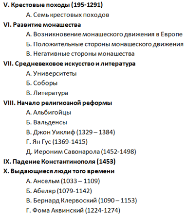
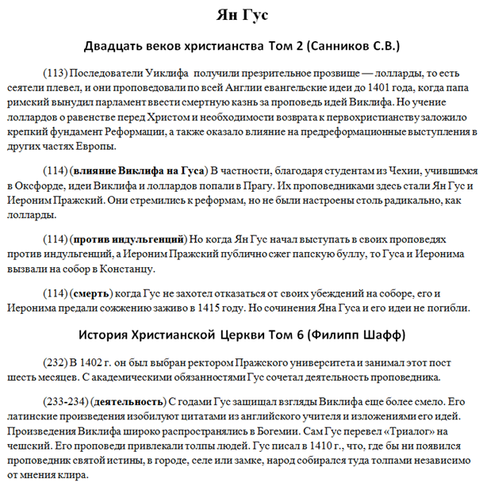

[&#8592; Глава 16](../16-Сотериология "Сотериология: возрождения (рождение свыше)") &ensp;&ensp;&ensp;&ensp;[Оглавление](https://github.com/nyakovchuk/seminary-study-book) &ensp;&ensp;&ensp;&ensp; [Приложение &#8594;](../Appendix "Приложение")

#### Часть 2
# Глава 17. История Церкви – 2
# Начало религиозной реформы

[**Вступление**](#intro)

[**17.1. Христианские группы**](#p171)

&ensp;&ensp;[17.1.1. Альбигойцы](#p1711)

&ensp;&ensp;&ensp;&ensp;[17.1.1.1. Возникновение](#p17111)

&ensp;&ensp;&ensp;&ensp;[17.1.1.2. Вероучение](#p17112)

&ensp;&ensp;&ensp;&ensp;[17.1.1.3. Практическая жизнь](#p17113)

&ensp;&ensp;&ensp;&ensp;[17.1.1.4. Гонения](#p17114)

&ensp;&ensp;[17.1.2. Вальденсы](#p1712)

&ensp;&ensp;&ensp;&ensp;[17.1.2.1. Возникновение](#p17121)

&ensp;&ensp;&ensp;&ensp;[17.1.2.2. Распространение](#p17122)

&ensp;&ensp;&ensp;&ensp;[17.1.2.3. Вероучение](#p17123)

&ensp;&ensp;&ensp;&ensp;[17.1.2.4. Практическая жизнь](#p17124)

&ensp;&ensp;&ensp;&ensp;[17.1.2.5. Гонения](#p17125)

[**17.2. Христианские лидеры**](#p172)

&ensp;&ensp;[17.2.1. Джон Уиклиф](#p1721)

&ensp;&ensp;&ensp;&ensp;[17.2.1.1. Вероучение](#p17211)

&ensp;&ensp;&ensp;&ensp;[17.2.1.2. Практическая жизнь и деятельность](#p17212)

&ensp;&ensp;&ensp;&ensp;[17.2.1.3. Характер](#p17213)

&ensp;&ensp;&ensp;&ensp;[17.2.1.4. Последние годы и смерть](#p17214)

&ensp;&ensp;&ensp;&ensp;[17.2.1.5. Наследие](#p17215)

&ensp;&ensp;[17.2.2. Ян Гус](#p1722)

&ensp;&ensp;&ensp;&ensp;[17.2.2.1. Вероучение](#p17221)

&ensp;&ensp;&ensp;&ensp;[17.2.2.2. Практическая жизнь и деятельность](#p17222)

&ensp;&ensp;&ensp;&ensp;[17.2.2.3. Последние годы и смерть](#p17223)

&ensp;&ensp;&ensp;&ensp;[17.2.2.4. Наследие](#p17224)

&ensp;&ensp;[17.2.3. Джироламо Савонарола](#p1723)

&ensp;&ensp;&ensp;&ensp;[17.2.3.1. Монастырские годы](#p17231)

&ensp;&ensp;&ensp;&ensp;[17.2.3.2. Проповеди](#p17232)

&ensp;&ensp;&ensp;&ensp;[17.2.3.3. Принципы в проповеди](#p17233)

&ensp;&ensp;&ensp;&ensp;[17.2.3.4. Влияние проповеди](#p17234)

&ensp;&ensp;&ensp;&ensp;[17.2.3.5. Мученическая смерть](#p17235)

&ensp;&ensp;&ensp;&ensp;[17.2.3.6. Наследие](#p17236)

[**17.3. Слово Божье – движущая сила реформации**](#p173)

&ensp;&ensp;[17.3.1. Уроки реформации от Слова Божьего](#p1731)

&ensp;&ensp;[17.3.2. Одним лишь Словом Божьим?](#p1732)

[**Вывод**](#conclusion)

Последняя работа второго курса – реферат по истории церкви-2. После предыдущей работы я сделал некоторые выводы. **Первый вывод** – это необходимость конспектирования текста с видео по тайм-кодам, **второй** – текст из книг следует переносить в черновой документ с разбивкой не по названию книг, а по содержанию работы. Конечно, содержание работы нужно проработать заранее. Из-за подхода к работе, её объёма, а также что она содержит аналитические моменты, я смело внёс её в группу под неоднозначным названием «карантинные» работы, т.е работы в которых есть подразделы, они также имеют широкий взгляд, который включает внешнее, стороннее мнение (не только автора работы), присутствует аналитический вывод.

Тему работы мы (студенты) снова брали с содержания методического пособия, в этом подходе заключается очевидный плюс для учащегося, так как сразу известны подразделы темы. На **рис. 17.1** показано как выглядит оглавление методического пособия. Видно, что каждый раздел, почти всегда имеет подразделы. Тему для написания работы выбрал *«начало религиозной реформы»*.

**Рис. 17.1.** Оглавление методического пособия

**Первый черновой документ** назывался *«Реформация и Слово Божие»*. В нём я планировал для каждой европейской страны того времени, описать получения перевода Библии на её родном языке. Это должно было показать глубокую связь между Реформацией и Словом Божием. Для этого я просматривал статьи в интернете о переводе Библии и т.д. В итоге, этот документ остался не заполненным, мне показалось это крайне избыточной исследовательской информацией. Ведь можно написать о Реформации и переводе Слова Божьего без подтверждающей исследовательской информации, в целом эти данные и так на поверхности, это не уникальный вывод.

**Второй черновой документ** являлся основным. Вся подготовительная работа для реферата проводилась в нём. Во-первых, он, как отмечалось ранее, был структурирован по разделам реферата. И уже в рамках этого раздела содержал соответствующие ей тексты из книг. На **рис. 17.2** представлен фрагмент этого документа. В данном документе текст был проработан. Я его переносил не целиком в документ как делал ранее, а фрагментарно. Это нашло отражение и на структуре этого документа. Почти каждый абзац начинался с пояснительной информации, заключённой в двух скобках. В первых скобках был указан номер страницы книги, откуда был этот фрагмент. Это позволяло при использовании ссылок на этот текст сразу указать номер нужной страницы, не ища её снова в книге. Во вторых скобках кратко озаглавливал фрагмент текста. Это оказалось очень удобно во многих аспектах. Сразу видно, о чём пишут авторы чаще всего. Благодаря этой технике, можно для каждого подраздела реферата выделить пункты, из которых он будет состоять. Ведь при написании работы мне не нужно каждый раз перечитывать весь текст с книги, ища необходимую информацию, сразу видны нужные разделы, которые содержат необходимый текст. Такой подход оказался очень удобным, особенно если учитывать, что информации было много, документ состоял из двадцать одной страницы.

**Рис. 17.2.** Фрагмент чернового документа по истории церкви-2

## Вступление

Реформация 1517г., которую произвёл Мартин Лютер, не родилась спонтанно, она не была первой попыткой повернуть Церковь в сторону Слова Божьего, но она оказалась самой эффективной. В 1517 году огонь реформации невозможно было потушить, он разгорался всё сильнее и сильнее, наступало время отрезвления и пробуждения. Этот огонь был всегда и временами он возгорался довольно ярко, его тушили, но он оставлял после себя тлеющие угли, которых становилось с каждым разом всё больше и в следующий раз они воспламенялись всё сильнее и сильнее, до такой степени, что в определённый момент времени, потушить огонь было уже невозможно.

В работе рассматривается возникновение и учение внецерковных групп в частности вальденсы и альбигойцы, а также людей, предвестников реформации: Джона Уиклифа, Яна Гуса, Джироламо Савонарола, жившие в XII-XV веке, которые желали вернуть Церковь к её истокам, к Слову Божьему. Всё это послужило фундаментом Реформации, именно их взгляды и жизнь побуждали реформаторов задуматься над происходящим и обратить свой взор на Писание, увидеть, что они не единственные, кто видит великое отступление от Слова Божьего. Попытка дореформационных людей жить по Слову Божьему, не всегда была успешно осуществима, но она была не просто протестом против текущего положения Церкви, ею управляло желание угодить Господу, на основании Его Слова, а не на суевериях и предрассудках.

## 17.1. Христианские группы

В данном разделе рассмотрим две внецерковные группы – это альбигойцы (катарская группа) и вальденсы. Вальденсы отличались происхождением и учением от катаров и других групп. Все эти группы осуждали официальную церковь. Все они желали вернуться в апостольский век, используя для этого Слово Божье, но их пути были различны: одни отвергали истинность всей Библии, смешивая её с апокрифическими книгами и различными учениями, другие стремились следовать строго Святому Писанию, распространяя Слово Божье среди населения. Обе группы будут рассмотрены: их возникновение, учение, практическая жизнь и гонения, которым они подвергались.

### 17.1.1. Альбигойцы

Первая рассматриваемая внецерковная группа – альбигойцы, это одна из групп катар. Определение катар означает *«по-гречески – «чистый», подчеркивая стремление сохранить себя и свою церковь в чистоте и неоскверненноети от мира и уклонений»* **[1]**.

#### 17.1.1.1. Возникновение

Группы, именовавшие себя катарами, были распространенны в XII веке в Италии, Англии, Германии. По некоторым документам, этих групп было семьдесят две **[2]**, но особое распространение они получили на юге Франции. Именно о французской группе, получившее своё название от центрального города, той местности – Альбы, пойдёт речь в этом разделе.

Вероятнее всего эти группы возникали естественно и независимо друг от друга под влиянием Священного Писания и Духа Божьего. Они стремились очистить церковное учение и вернуться к первоисточнику христианства, и этим объясняется их мировоззренческое единство. И только позже, встав на путь реформ, они начинали искать единомышленников, союзников и предшественников, имевших аналогичный духовный опыт **[3]**.

#### 17.1.1.2. Вероучение

С вероучением альбигойцев, всё сложно, не смотря на всё желание следовать Слову Божьему, они имели значительные отклонения в этом добром начинании. В основу вероучения катар-альбигойцев был положен только Новый Завет, однако он был переосмыслен в гностическом духе **[4]**. Они отвергали всякую церковную обрядность и таинства и подчеркивали жизнь под непосредственным водительством Духа Святого. Водное крещение они заменили возложением рук и апокрифического евангелия Иоанна на крещаемого; Вечерю Господню они совершали духовно, принимая пищу, освященную молитвой «Отче наш». Ветхому Завету не придавали никакого значения **[5]**. Всё это отчётливо напоминает манихейский дуализм **[6]**. Бог Нового Завета – это не Бог Ветхого Завета, они противники друг другу, антогонисты.

Они вкладывали духовное толкование в чудеса и превращали притчи в вольные аллегории. Для понимания этих вольных аллегорий, посмотрим трактовку притчи о добром самарянине: человек, попавший в руки разбойников, был Адамом, дух которого, по Божьему велению, сошел с небес на землю и попал к разбойникам в нижний мир. Священник и левит – это Мелхиседек и Аарон, которые прошли мимо, то есть не помогли ему **[7]**.

В отношении Иисуса Христа, похоже, катары прославляли Его, хотя отрицали полную реальность Его человеческой природы. Он был сотворен на небесах и не был рожден на земле, но прошел через Марию как через сосуд. Он не ел материальную пищу и не пил материальное питье **[8]**.

#### 17.1.1.3. Практическая жизнь

Альбигойцы отличались высоконравственным образом жизни. В быту они вели себя очень скромно и сурово, считая, что всякий грех смертен, а совершенные последователи принимали на себя обет нищеты, подражая Христу и апостолам, отвергая брак и мясную пищу. Именно высокой нравственностью, убедительной проповедью, подтвержденной жизнью и героическим поведением во время мученичества, объясняется популярность и широкая распространенность катаров **[9]**.

#### 17.1.1.4. Гонения

Во второй половине XII века количество и влияние катаров на юге Франции резко возросло, и папы римские начали принимать решительные меры к их искоренению. Особенно серьезную борьбу начал папа Иннокентий III. Иннокентий организовал широкомасштабный крестовый поход против катаров, в котором участвовало более 100 тысяч человек **[10]**. Крестоносцы самым варварским образом стали грабить страну, уничтожая ее население, не особенно разбираясь в их религиозных убеждениях.

Более 20 лет продолжалась эта война, закончившаяся практически полным  физическим уничтожением катаров и беспрецедентным в истории средневековой Франции геноцидом. *«Страна, которая могла принести в Европу возрождение интеллектуальной культуры, отстала теперь от своих соседей»* **[11]**.

### 17.1.2. Вальденсы

Вальденсы впервые появились в Южной Франции, но они не были многочисленны в сравнении с альбигойцами в тех краях. Из Франции они проникли в Пьемонт, а также в Австрию и Германию. В Италии они продолжают жить в долинах своих предков и с 1870 г. пользуются полными гражданскими правами **[12]**.

Вальденсы и их название происходят от Петра Вальда или Вальдеса. Их называли также лионскими бедняками – по городу на Роне, в котором они  появились, или сандалиатами (sandalati, «обутые в сандалии») – от грубой обуви, которую они носили **[13]**.

#### 17.1.2.1. Возникновение

История Вальда не проста, процветающий торговец из Лиона, после смерти одного из религиозных лидеров осознал, что жизнь коротка и надо готовиться к небесам. С этими переживаниями он пошёл к священнику, который сказал ему, что есть много путей на небеса, но если он хочет быть совершенным, то должен выполнять  заповеди Христа: продать все, что у него есть, раздать деньги нищим и следовать за Ним. Вальд последовал совету священника. Отказался от собственности и отправил двух своих дочерей в монастырь, выделил жене часть имущества, а остальное раздал бедным. Это  произошло около 1170 г. **[14]**.

Свои жизненные правила Вальд черпал из простых предписаний Библии. Он попросил Бернара Идроса и Стефана из Ансы перевести на разговорный язык Евангелия и другие части Писания, а также высказывания отцов церкви. Он  активно проповедовал, и его последователи, подражая его примеру, проповедовали на улицах и в селениях, ходя по двое.

#### 17.1.2.2. Распространение

Вальденсы всё время подвергались гонениям, как следствие вальденсы распространились не только во Франции, но и на север до Кенигсберга и Штеттина, они встречались в Швабии, Польше, Баварии, особенно в Богемии, и в австрийской епархии Пассау. В Австрии, в начале XIII века было не менее сорока двух общин вальденсов и ряд их школ, по некоторым свидетельствам в епархии Пассау у группы было восемь тысяч сторонников **[15]**.

Вальденсы активно распространяли Евангелие, как среди бедных слоёв населения, так и среди богатых. Один из методов евангелизации заключался в том, что они под видом странствующих торговцев обходили дома благородных семейств, предлагая сначала драгоценности и другие товары, а затем –  величайшую драгоценность из всех, Слово Божье **[16]**.

#### 17.1.2.3. Вероучение

Вальденсы были близки к катарам географически и упоминались  вместе в постановлениях соборов, папских декретах и литературных опровержениях ереси, но их взгляды радикально отличались от катаров. Они никогда не принимали манихейских элементов. Они не отвергали системы таинств официальной церкви и не придумывали собственных странных обрядов. Они были далеки от мистицизма и не имели отношения к германской мистике, в отличие от других общин. Следует заметить, что они не были похожи на протестантов, и не стоить искать у них учение об оправдании верой **[17]**.

Одним из самых значительных и отличительных принципов вальденсов был авторитет Писания и использование его народом. В этом вальденсы опять предвосхитили протестантскую Реформацию, возможно, сами не осознавая полного смысла своих требований. Действительно, чтение Библии тогда не было еще запрещено, но Вальд уже превратил ее в живую книгу, а его последователи неустанно распространяли ее перевод на разговорный язык. *«Анонимный автор из Пассау говорил, что видел мирян, которые знали евангелия Матфея и Луки наизусть почти полностью, так что можно было процитировать слова из них, а они продолжали читать текст по памяти»* **[18]**.

Вальденсов также отличал принцип важности проповеди и право мирян проповедовать. Петр Вальд и его соратники были мирянами-благовестниками.

Они далеко пошли в упразднении древних обычаев, утверждая, что женщины имеют такое же право проповедовать, как и мужчины. Когда же упоминались слова Павла, требовавшего от женщин молчания, они отвечали, что речь у него идет, скорее, о наставлении, чем собственно о проповеди **[19]**.

К этим основополагающим принципам, вальденсы, на основании Нагорной проповеди, прибавляли отказ от принесения клятв, осуждение смертной  казни, а некоторые из них отвергали учение о чистилище и молитвы за умерших. Они учили, что после смерти, можно попасть либо на небеса, либо в ад **[20]**.

#### 17.1.2.4. Практическая жизнь

Смысл жизни вальденсов заключался в проповеди Евангелия. Несмотря на запреты, они продолжали проповедовать на дорогах, по домам, а когда у них была такая возможность, то и в церквях.
*«В своей практической жизни они принимали «исповедание нищеты», как говорит Этьен де Бурбон, или «ложное исповедание нищеты», как заявляет Бернар Гюи. С помощью проповедей и бедности они стремились к евангельскому совершенству»* **[21]**. Несмотря на критику такой жизни со стороны католической церкви, именно благодаря тому, что вальденсы избрали путь бедности, им удалось оказать влияние на католическую церковь, в частности на основателя нищенствующего ордена францисканцев.

#### 17.1.2.5. Гонения

Вальденсы подвергались гонениям всё время, но из-за своего географического расположения, эти гонения не были столь истребляющими как у альбигойцев. Гонения усилились с конца XV века, когда против них был собран крестовый поход. «Самые тяжкие страдания пришлись на долю «альпийского Израиля» в XVI – XVII веках, после того как они приняли Реформацию. По словам [Леже](# "Жан Леже – вальденский пастор, автор книги «Всеобщая история евангельских церквей Пьемонта или вальденсов Долин», 1669г.") , все, что вальденсы терпели до сих пор, было *«розами и цветами» в сравнении с тем, что пришлось им вынести теперь. Иннокентий собрал армию в восемнадцать тысяч человек. Пьемонтские вальденсы были вынуждены подняться выше в горные долины, где страдали от почти невероятных лишений»* **[22]**.

## 17.2. Христианские лидеры

Кроме внецерковных групп, которые отделились от Церкви, отступившей от библейских принципов, и жили, отделившись, в определённых географических местностях, были также и люди, которые продолжали находиться внутри общества, часто для них враждебного, и нести весть об обращении к Богу и Его учению согласно Слову Божьему. Все они заслужено получили звание *«реформаторов до Реформации»*. Среди них были: Джон Уиклиф в Англии, Ян Гус в Богемии, Иероним Савонарола во Флоренции. Именно об учении, взглядах и стремлениях этих людей будет описано ниже.

### 17.2.1. Джон Уиклиф

>*«если между Библией и  церковью есть разногласия, мы должны следовать Библии, а если совесть и человеческие авторитеты находятся в конфликте,
то мы должны следовать совести»* **[23]**.

Первый человек, которого рассмотрим, будет Джон Уиклиф (1328-1384). Почти все историки, рассматривающие предреформационные движения, начинают свои рассказы с этого человека. Он получил звание *«утренней звезды Реформации»* повлияв на всех последующих предтеч Реформации. Сам же Уиклиф, несмотря на обвинения в связях со средневековыми сектами и группами, говорил что источником его взглядов было Писание, именно изучение Слова Божьего повлияло на него **[24]**.

#### 17.2.1.1. Вероучение

С 1378г. приходится явная деятельность Уиклифа как реформатора богословских доктрин. Он критиковал богословскую структуру в ряде пунктов, а также злоупотребления проникшие в церковь. Свои аргументы Уиклиф основывал на Слове Божьем и здравом смысле. Он писал свои проповеди и трактаты не только на латыни, но и на английском языке, делая их понятным народу. В своих трудах он мог смело использовать иронию и оскорбления (в чём убедимся в высказываниях о папстве). Он был развит всесторонне – *«хорошо знаком с трудами Златоуста, Августина, Иеронима и других латинских отцов церкви, а также средневековых богословов от Ансельма до Дунса Скота, Брадуардина, Фитцральфа и Генриха Гентского»* **[25]**. Уиклиф часто цитирует других ученых, но с течением лет все чаще ссылается на Писание **[26]**.

*Основные направления в учении Уиклифа:*
* **Папа никогда не был необходим церкви и непогрешим** **[27]**. Врядли найдётся известный нам реформатор, кто высказывался бы о папе и папстве более резко, чем Уиклиф. В своих трактатах последних лет и в проповедях он заклеймил папу как антихриста, называя его наместником дьявола. В папстве он видел откровение об человеке греха. Должность папы считал целиком и полностью порочной. Также он высмеивал обращение *«святейший отец»*;
* **«священники, которые следуют за Христом, – это истинные священники, и только они»** **[28]**. Эффективность отпущения священниками грехов зависит от того, отпущены ли были Христом их собственные грехи. Задача священника – возвестить о прощении, уже дарованное Богом, а не даровать его;
* **подлинного сердечного раскаяния достаточно для отпущения грехов** **[29]**. Как следствие Уиклиф критиковал обычай устной исповеди, утверждая, что во времена Христа не требовалось, чтобы человек исповедовался перед человеком;
* **сатана внушил людям представление, будто их обычные фантазии и мечты являются якобы религиозным созерцанием** **[30]**. Это прямая критика жизни монахов. Уиклиф резко высказывался и о распространенных заблуждениях, связанных с жизнью в созерцании, утверждая, что этим они оправдывают свою лень. Иоанн Креститель и Христос покинули пустыню, чтобы жить среди людей.
* *«пресуществление – величайшая из ересей, противоречащая логике, грамматике и всем естественным наукам»* **[31]**. Уиклиф является первым специалистом по богословию, который подверг критике это учение утверждённое Четвертым Латеранским собором. Он учил, что тело Христа, если вообще можно говорить о Его местоположении, находится на небесах. Само тело не присутствует непосредственно в хлебе ни в реальном присутствии (импанации), ни посредством отождествления, ни тем более пресуществления. *«Христос присутствует в хлебе, как царь – во всех землях своего царства или душа – во всем теле. При преломлении хлеба Его тело преломляется не больше, чем ломается солнечный луч, когда разбивается стекло»* **[32]** . Именно за это убеждение больше всего критиковали Уиклифа, считая его загубленным еретиком.
* **проповедь – это долг каждого служителя** **[33]**. Проповедь Уиклиф объявлял *«высшим служением»*, так как даже Христос уделял Свое время главным образом этому занятию. Проповедь Слова Божьего является более важным занятием, чем отправление таинств;
* **доступность Библии** **[34]**. Уиклиф считал, что Библию должны изучать все христиане, ибо *«в ней – вся полнота истины»* **[35]**. Она дана церкви, а потому ее учение – для всех, как и Сам Христос. Лишать мирян Писания – серьезный грех. Учить Писанию людей на их родном языке – первая обязанность священника.

Конечно, привести всё, что возмущало Уиклифа в данной работе невозможно, но уже этого достаточно, чтобы понять насколько смелым человеком он был. Он открыто называл *«индульгенцию «мерзостью запустения в святилище», а крестовый поход, организованный в период его жизни, как ни что иное, как борьбу за мирскую власть»* **[36]**. Единственное, что его спасало от смерти: влиятельные друзья Англии, всенародная любовь, а также борьба за папский престол, которая развернулась во время активности Уиклифа.

Собор 1382г. в Англии осудил 24 положения, приписываемые реформатору, десять из которых были объявлены еретическими, а остальные – противоречащими мнению церкви.

#### 17.2.1.2. Практическая жизнь и деятельность

Уиклиф был не просто ученым и публицистом, осуждающим «достижения» современной церкви. Для него была характерна практическая направленность, он пытался заново возвестить Англии чистое Евангелие. Он также подготовил и отправил на служение группу странствующих евангелистов-благовестников. *«Эти «бедные священники» (pore priests), как их называли, были набраны из числа выпускников Оксфорда»* **[37]**. Естественно, для эффективности проповеди Евангелия нужна была Библия, к которой люди могли обращаться, черпая живую воду. Уиклиф посвятил большую часть своей жизни переводу Библии на английский язык, которая была бы понятна народу.

#### 17.2.1.3. Характер

Кратко рассмотрим свидетельства об Уиклифе как о человеке, какой он был во взаимоотношениях с окружающими людьми, отражалась ли на них его остроумие и дерзость, каким он предстаёт в своих письменных работах и проповедях.

По характеру он был подвижным, остроумным, безупречным в плане нравственности. По отношению к врагам он был резок, хотя никогда не грубил и не сквернословил. Уильям Торпе, молодой современник из окружения архиепископа Арунделя, свидетельствует, что *«он был изможден телесно и весьма слаб, и поведения самого невинного»* **[38]**.

#### 17.2.1.4. Последние годы и смерть

Уиклиф до последних дней был верен своим убеждениям. Он заявлял *«что, если он заблуждается в своих заявлениях, то готов принять наказание, даже смерть. Если бы в его власти было бы представить эти взгляды в Риме, он охотно отправился бы туда. Но Бог поместил на его пути препятствие и научил повиноваться Ему, а не людям»* **[39]**. Этим препятствием был частичный паралич, который случился после сердечного удара за два года до смерти. Несмотря на это обстоятельство Уиклиф не был инвалидом, и посещал церковь до дня смерти. Именно в церкви произошёл второй сердечный удар, после которого он не смог оправиться и через два или три дня его жизнь остановилась. О нём говорили, что он *«зажег огонь, который никогда не угаснет»* **[40]**.

#### 17.2.1.5. Наследие

После смерти Уиклифа его не оставили в покое. *«Согласно постановлению, его произведения были запрещены, и этому приказу следовали так тщательно, что первые английские печатники не выпустили ни одного экземпляра его трудов»* **[41]**. Уиклиф был первым, кто дал народу всю Библию на родном языке. После своей смерти он имел много сторонников, которые следовали его учению и практическому служению, распространяя весть Евангелия, их называли лолларды. В истории интеллектуального и морального развития английского народа он являлся главным героем Средневековья.

Отрицая ошибочную систему средневековой церкви, Уиклиф сильно опередил свой век и предвосхитил эпоху протестантской Реформации  **[42]**.

### 17.2.2. Ян Гус

>*«Что мы потеряем, если ради Него утратим богатство, друзей, мирские почести
 и нашу несчастную жизнь?.. Лучше хорошо умереть, чем плохо жить.
Мы не осмелимся грешить ради того, чтобы избежать казни.
Закончить эту жизнь в благодати значит быть избавленным от погибели.
В конечном итоге истина победит.
Тот, Кто заклан, побеждает и не даст овладеть вами никакому беззаконию»* **[43]**.

Ян Гус (1369-1415) познакомился с учением Уиклифа, благодаря студентам из Чехии, учившимся в Оксфорде, через которых идеи Уиклифа и лоллардов (проповедники Евнгелия, последователи Уиклифа) попали в Прагу. Влияние Уиклифа на Гуса сложно переоценить, свои идеи он взял из его трудов, он даже включал целые параграфы из его книг в свои произведения. За него напишут *«ни у одного учителя не было более преданного ученика, чем тот, которого английский реформатор приобрел в лице Гуса»* **[44]**.

#### 17.2.2.1. Вероучение

Богословие Яна Гуса идёт в полном согласии во взглядах с Уиклифом. Формально оно содержит подтверждение всех мнений высказанных его учителем. Тем не менее, приведу основные положения. Следует отметить, что в вопросах пресуществления Гус не был столь категоричен как Уиклиф, и в обвинительных статьях против него красной нитью прослеживает другое ключевое обвинение, в котором Ян Гус был повинен, *«что человек, живущий в смертном грехе, не может иметь власти над христианами»* **[45]**.

*Основные идеи вероучения Гуса:*
* **Отрицание непогрешимости папы Римского и видимой церкви**. Папа может заблуждаться из-за невежества и сребролюбия, и бунтовать против заблуждающегося папы – значит повиноваться Христу **[46]**. Отрицал право папы вести войну или браться за светский меч. Гус говорил: *«если Иоанн собирается следовать за Христом, он должен молиться о своих врагах и говорить: «Царство мое не от мира сего»»* **[47]**;
* **прощение грехов не во власти священников**. *«Власть прощать грехи не принадлежит ни одному смертному, как не принадлежала она и священнику, к которому Христос послал прокаженных. Искренней исповеди достаточно для спасения души, если раскаяние чистосердечно»* **[48]** – так учил Гус;
* **церковь – это люди**. Святая католическая церковь – это сообщество всех избранных, усопших, живых и тех, кто еще не родился. Термин «католический» значит «всеобщий». Римский понтифик и кардиналы – не церковь. Церковь может существовать без кардиналов и папы – и кардиналов действительно не было в течение сотен лет **[49]**. *«Если церковь – сообщество избранных, то Бог правит в Своем народе и этот народ неподвластен никому другому»* **[50]**;
* **проповедь – основное служение каждого священника**. Гус настаивал на том, что священники обязательно должны проповедовать, и писал, что любой, кто, повинуясь указу папы или архиепископа, перестает проповедовать, идет наперекор воле Бога и ставит под угрозу свое собственное спасение **[51]**.

Ян Гус как и Уиклиф выступал против продажи индульгенций и крестового похода, который был развёрнут папой Римским в период его жизни. Именно эти причины привели Гуса ко второй волне возмущения действиями папства, которые католическая церковь заглушила смертной казнью.

#### 17.2.2.2. Практическая жизнь и деятельность

Ян Гус активно проповедовал Евангелие, его проповеди привлекали тысячи людей. Он перевёл «Триалог» Уиклифа на чешский язык, был активным защитником его книг, выступая против их сожжения. Его деятельность была очень активно связана с письменностью, кроме многочисленных писем, которые он писал своим сторонникам, он осуществлял написание и богословской литературы. Самым известным его трудом является книга о церкви. В ней Гус давал определение церкви и раскрывал суть ее власти над ключами. Подробно описал смысл служения, которое Христос вверил Петру, *«Гус утверждал, что Христос называл Скалой Себя и Церковь основана на Нем в силу предопределения, Петр никогда не был главой Святой Католической Церкви»* **[52]**.

#### 17.2.2.3. Последние годы и смерть

На суде Гусу вручили 39 обвинительных статей, 26 из которых были взяты из его труда о церкви. Через короткое время его приговорили к сожжению, до конца его дней убеждая отречься от своих взглядов, пытаясь дискредитировать, подсылая лукавых людей, которые предлагали ему сбежать с тюрьмы. Гус был верен до конца, он не мог отречься Христа. И умер с молитвой и песней.

#### 17.2.2.4. Наследие

Своей смертью Ян Гус поразил основания иерархической системы. Он истолковал обращенные к Петру слова Господа так, что нанес смертельный удар папистской теории. Он считал Писание высшим авторитетом и говорил, что совесть выше папы, собора и канонического права в вопросе толкования истины. Его смерть потрясла население Богемии до такой степени, что начала угрожать существованию папского правления в этой стране. Ни одно движение несогласия в средние века не приобретало такого размаха **[53]**. Это движение обрело название гуситы, которые кроме протеста против папства, выдвигали требования, основанные на учении Яна Гуса. Например, чтобы мирянам давали чашу **[54]**.

### 17.2.3. Джироламо Савонарола

> *Кто выдержит день пришествия Его и кто устоит, когда Он явится?...* **[55]** ***(Мал.3:2)***

Завершим описание реформаторов до реформации флоренским католическим проповедником Джироламо Савонаролы (1452-1498). Он не предлагал вероучительных изменений, но был из *«самых влиятельных  проповедников средних веков и один из самых знаменитых проповедников праведности со времен апостола Павла»* **[56]**.

#### 17.2.3.1. Монастырские годы

В возрасте 23-х лет покинув отчий дом, он отправился в доминиканский монастырь. Причиной такого решения, по его собственным словам, послужила *«развращенность ослеплённого народа Италии, которую он не мог более выносить»* **[57]**.

Именно в монастыре Савонарола начал изучать активно Писание, части которого он запоминал наизусть. Он говорил о важности изучения Библии на еврейском и греческом языке. *«Во Флоренции сохранилось два экземпляра Библии со многочисленными собственноручными заметками Савонаролы на полях, между строками и на дополнительных листах»* **[58]**. Кроме Библии Савонарола изучал труды Августина и Фомы Аквинского.

#### 17.2.3.2. Проповеди

Савонарола стал известным благодаря своим проповедям. О его проповедях свидетельствуют, что они были *«подобны вспышкам молнии и ударам грома»* **[59]**. Его цель в проповедях заключалась, скорее, в том, чтобы искоренить распущенность и разврат, нежели в том, чтобы дать утешение прощения и направить к общению с Богом. В его проповедях присутствовали нежные слова о Божьей любви и милости, но плача по греховности эпохи в них было больше, чем кротких призывов **[60]**. Он не боялся смело и открыто обличать папу Римского, монахов, священников, правителей. Искоренение и нетерпимость ко злу и греху – основная цель его проповедей.

В его проповедях обязательно присутствовал библейский элемент. В своих мыслях и описаниях он всегда руководствовался Библией. Он настаивал на авторитете Писания: *«я проповедую возрождение церкви, и руководствуюсь только Писанием»* **[61]** – говорил он.

#### 17.2.3.3. Принципы в проповеди

Дабы понять насколько сильно и смело Савонарола обличал грех, который поразил всю Италию в то время, приведём его высказывания. Также здесь будут отмечены его понимание библейских доктрин:

* **Обличение священников**. Священников он обличал в жадности, за тягу к показным церемониям, а не к внутренней любви души. А также за отсутствие в их проповедях Библии, он говорил, что они даже не знают из каких книг состоит Библия. Основная их цель это упражнение в красноречии: *«Отправляйтесь в Рим и посмотрите! В домах великих прелатов беспокоятся только о поэзии и об ораторском искусстве. Идите туда и посмотрите! Вы увидите, что они держат в руках книги человеческой учености и рассказывают друг другу, как наставлять людей с помощью Вергилия, Горация и Цицерона...»* **[62]** – слова Савонаролы. *«Священник – всего лишь орудие Всемогущего и что без присутствия Бога любой прелат или даже папа – это всего лишь «сломанный железный инструмент»* **[63]**. *«У каждого римского священника, есть наложница»* – так обличал и проповедовал Савонарола;
* **обличение папы Римского**. Савонарола смело утверждал, что папа может ошибаться и *«быть введенным в заблуждение не только недостоверными рассказами, но и по причине собственной греховности»* **[64]**. Он активно выступал против симонии.
* **о итальянских монастырях** он говорил, что монахини в них хуже блудниц **[65]**;
* **о верховенстве Бога**. Место верховного правителя в народе должен занимать только Бог. *«Только Бог, будет твоим королем, о Флоренция, как был Он царем Израиля при ветхом»* **[66]** – так восклицал он с кафедры;
* **об оправдании только Божьей милостью, а не делами**. *«Не своими заслугами, о Господь, и не собственными делами они были спасены, чтобы ни один человек не хвалился, но потому, что это было угодно Тебе»* – так писал Савонарола в *«Размышлениях»* **[67]**.

Савонарола не был протестантом и ни когда не относил себя к таковым, для него Римская церковь была матерью всех церквей, а папа – ее главой. В своем *«Триумфе Креста»* он явно утверждает, что семь таинств были учреждены Христом и что Христос *«полностью и по сущности присутствует в каждом из даров причастия»* **[68]**. Тем не менее, он был новатором, а его понимание и акцентирование внимания на Божьей благодати соответствует учению Реформации. О нём и его трудах очень лестно отзывался Мартин Лютер.

#### 17.2.3.4. Влияние проповеди

Проповедь Савонаролы не была напрасной, его горячие проповеди всегда ждали, по свидетельствам, на его проповеди приходили 10-12 тысяч людей **[69]**. И самое главное для проповедника, его проповеди меняли людей, меняли общество и законы. Приведу пример: карнавал, который проходил на улицах Флоренции под влиянием Савонаролы изменился. Если раньше он был связан с дикими гуляньями, то стал почти религиозным праздником. Мальчишки, которые привыкли веселиться на карнавалах, прибегая к варварским крайностям, стали маршировать по улицам, распевая гимны, сочиненные Савонаролой и его другом Бенивьени, а также стояли на выделенных для них местах, собирая пожертвования для бедных **[70]**. А в 1497 г. последний день карнавала, состоялось так называемое сожжение мирского имущества. Молодые энтузиасты, вдохновленные проповедями Савонаролы, ходили из дома в дом и просили людей отдавать свои безделушки, непристойные книги, игральные кости и другие азартные игры, арфы, зеркала, маски, косметику и портреты красивых женщин, а также другие предметы роскоши. Все это было сложено на площади города пирамидой под 30м высотой и диаметром у основания более 70м **[71]**.

#### 17.2.3.5. Мученическая смерть

Как было во времена Христа, когда от *«пальмового»* восторженного въезда в Иерусалим до распятия прошло меньше недели. Также стремительно развивались события и у Савонаролы. После того как по разным причинам не состоялась [ордалия](# "Испытание пыткой (огнём, водой и т.д.), цель которой доказать правоту обвиняемого"), которую выдвинули противники Савонаролы называя его еретиком и лжепророком. И он может отвергнуть эти обвинения, только если не пострадает от огня. Близкий друг Савонаролы решил вместо него осуществить это действие, хотя сам Савонарола был против такого мероприятия, но народ поддержал это стремление и Савонарола не пошёл против народа. В силу разных причин и изысканий, в которых многие обвиняют папу Римского, это подготовленное действие, которого все ожидали, не осуществилось, что привело народ в ярость. Они посчитали себя обманутыми и что ими манипулировали. На следующий день яростная толпа штурмом взяла монастырь, в котором был Савонарола, схватили его и его друзей, попутно разграбивши монастырь. Остались слова свидетеля этих событий: *«невозможно было сказать ни слова в защиту Савонаролы. Такого человека немедленно растерзали бы»* **[72]**. В таком случае обвинения против Савонаролы не были столь важны, достаточно было заявить, что он еретик и раскольник. Сообщают, что *«в последнюю ночь сон Савонаролы был спокоен, как сон младенца. Проснувшись, осужденный провел остаток ночи в молитве»* **[73]**. На следующее утро он встретился со своими осуждёнными друзьями и вместе они совершили служение причастия.

Все они были приговорены к повешению, после чего тела сожгли, а пепел выбросили в реку.

#### 17.2.3.6. Наследие

Кроме неизгладимых проповедей изменивших жизнь множества народа, Савонарола оставил свои книги, в *«Триумфе креста»* он доказывает существование Бога и бессмертие души, после чего объясняет учение о Троице, о котором он пишет, что оно выше человеческого разумения, и описывает статьи апостольского символа веры. Эта книга завершается опровержением мусульманства и других ложных религий. Кроме этого он написал книги: *«Учебник откровений»*, *«Диалог об истине и пророчестве»* и другие. Его влияние было велико на реформаторов XVI века, протестантами он отнесён к предтечам Реформации **[74]**.

## 17.3. Слово Божье – движущая сила реформации

>*Велик мир у любящих закон Твой, и нет им преткновения*  
***(Пс.118:165)***

Между всеми реформаторами есть нечто общее, фундамент на котором они строили свою веру, в чём они были уверены. Они были готовы согласиться со всеми обвинениями, если они будут аргументированы Словом Божьим. Они были готовы признать себя виновными и праведно отлученными, если то, о чём они говорят, не согласуется со Словом Божьим. Дерзновение и уверенность давало им Божье Слово. Почти все они начинали свою борьбу за истину с чтения и изучения Слова Божьего, это изучение не начиналось как протест против чего-то. Они просто читали его по роду своей деятельности и оно просвещало их разум.

### 17.3.1. Уроки реформации от Слова Божьего

**Первый урок** для каждого верующего, хочешь быть в тонусе, **трезвым в учении – читай Слово Божье**, полюби его. Ян Гус страдал, это выливалось в плаче в письмах, от того что у него не было Библии в заключении. Да и невозможно любить Бога, не полюбив Его Слово. Также невозможно понять любовь Бога без Слова Божьего, которое открывает Его милость к людям.

**Второе**, что невозможно не отметить, это **желание делиться Словом Божьим**, сделать его доступным для людей. Только в Слове Божьем находиться истина о том, как правильно служить Богу и эту истину должен знать каждый. Верующий не может служить так как ему хочется, как ему представляется или подсказали. Ему необходимо служить, так как этого желает Бог, а Божьи желания записаны в Его Слове. Каждый верующий желает, чтобы люди знали истину, знали в действительности Бога – это причина распространения Евангелия. Именно поэтому многие реформаторы прикладывали множество усилий, чтобы Слово Божье было переведено на национальные языки, дабы каждый мог его читать.

**Третье**, оно идёт очень рядом со вторым, это **проповедь**. Все реформаторы, независимо от того жили они до Реформации, во время неё или после, очень активно проповедовали Слово Божье. Проповедь Евангелия ставили на первое место в служении каждого священника. Эта цель не заключалась только в проповеди внутри церкви, но и за её пределами. Они шли к тем, кто не шел в церковь. Этим особо отмечались христианские группы, именно желание распространять истинную весть о Боге, о спасении, делиться Словом Божьим, очень сильно активизировала миссионерскую ориентированность групп.

Конечно же, нельзя не отметить, что все они единогласно выступали против непогрешимости папы и в целом не занимались идеализированием священников, разрушая представление о том, что они посредники между Богом и человеком. Все они приходили к одному выводу, основанному на Слове Божьем, что **единый посредник между Богом и человеком – это Иисус Христос**, и именно с Ним лично необходимо иметь отношение каждому верующему. Священники всего лишь Его служители, которым Он вверил служение людям, поэтому их задача заботиться об Его овцах, помогать им в следовании за Ним, за Христом. Именно видя несостоятельность священников и папы Римского в этих вопросах, которые считали, что не они, а им должны служить, вызвана их яркая критика.

Слово Божье приводит в порядок и богословские доктрины, открывая уклонения от истины. Это очень хорошо видно на примере отношения к новозаветному празднику жизни дарованной Христом Церкви – это причастие (евхаристия). Именно Слово Божье открывает суть и истину заложенную Иисусом Христом и способно приводить в порядок даже закостенелые отклонения в доктринах. В предреформационный период это очень хорошо прослеживается. Открывается истинное богословие в отношении спасения, становится очевидно, что оно по благодати и т.д. **Только Слово Божье способно вернуть на дорогу истины**, так как это истинный свет.

Следует отметить и внешние преобразования, которые приходят через Слово Божье, оно имеет силу менять человека, разделяя плотское и духовное, с ним проясняется что Божье, а что человеческое, что угодно Богу, а что мерзость для Него. Несмотря на принципиальность и резкость в высказываниях реформаторов, все они были благочестивыми людьми, имеющие свидетельства от внешних, за эту составляющую не могли зацепиться их противники, за это их любил народ. **Благочестие и Слово Божье приводило противников в молчание**.

Нельзя не заметить и творческую составляющую, которая открылась в написании богословских книг, трактатов, христианских гимнов. На всё это вдохновляло Слово Божье. Слово Божье действенно во все времена, это вечное Евангелие, готовое просветить и реформировать каждого, кто желает познавать истину.

### 17.3.2. Одним лишь Словом Божьим?

Вкратце рассмотрим, достаточно ли Слова Божьего для познания истины, нужна ли ещё другая литература для полного знания? Да, **одного Слова Божьего достаточно для того чтобы не заблудиться в этом мире**, не уклониться от верного пути, а уклонившись вернуться на дорогу истины. Конечно, здесь речь идёт о верующих людях. Человек, который не примирился с Богом, не может в полной мере вкусить Слово Божье. Вся задача Слова Божьего для неверующих людей примирить их с Богом посредством Иисуса Христа. Слово Божье оно самодостотаточное, т.е не требует чего то ещё, каких-то ключей для понимания и толкования. Речь идёт о дополнительных письменных изданиях, толкованиях, каких-то особых откровений и т.д. Вся Божественная Троица заинтересована и содействует, чтобы при чтении, изучении Слово Божьего, оно было понятным, ясным и практичным для жизни.

Всё это ни в коем случае не означает, что не нужно читать толкования или богословскую литературу, это означает давать Богу открывать Своё Слово. Тем более уже было отмечено, что при чтении Слова Божьего в человеке открывается творческий потенциал. Поэтому, это всего лишь означает, что не следует ставить в один ряд любую религиозную литературу и Слово Божье. Даже несмотря на то, что эти книги истинны, даже если они писались под водительством Духа Святого, человеком наполненного Духом Святым, даже если при чтении чувствуется как Дух Святой наполняет, это никогда не может являться поводом даже близко приравнять Слово Божье с любой христианской книгой. Всё должно вести к желанию личной близости с Богом и личного изучения Его Слова. Всегда нужно помнить, что есть вернейшее пророческое слово, вернейшее это по отношению к любой христианской литературе, к любому пророчеству, к любому духовному проявлению.

Смешивание Слова Божьего с философскими взглядами, с новозаветными апокрифами и т.д. вносит огромный отпечаток на понимание истин, примером могут послужить многие катарские группы, в частности альбигойцы. Уклонение от истины ощутимо, это не из-за того, что Слово Божье не может сокрушать ереси или неправильные представления, как раз было отмечено, что оно является самым эффективным способом для сокрушения всякой неправды и ереси, потому что Слово Божье – истина, чистое словесное молоко от самого Бога. Необходимо знать, что истина не терпит смешивания с ложью, не терпит смеси с чем-то ещё. Всё это отчётливо наблюдается и в наши дни, добавляя немного ереси в каких-то вопросах, люди часто приходят к упразднению целых библейских текстов или даже книг в Библии считая, что они ошибочны, в них нет силы и т.д.

Переживания и откровения, которые даёт Слово Божье сходятся с откровениями тех людей, которые также ставят в центр жизни Слово Божье. Мартин Лютер не знал Уиклифа, с учением Гуса он познакомился позже своих выводов, оно не повлияло на его заключения. Но выводы к которым все они пришли были схожи. Это касается многих мужей Божьих. Идеализировать не стоит, разномыслия были и есть, даже в пределах одной церкви, они бывают крайне ощутимы. Но ключевые истины спасения запечатлены Духом Святым в Слове Божьем ясно и понятно. Поэтому бояться того, что придёшь в заблуждение, искренне служа Богу и вникая в Его Слово, не стоит. Конечно хорошо, когда есть человек, церковь, литература, видео которые ответят на волнующие вопросы, но всегда необходимо спрашивать ещё и Бога, чтобы он открыл, направил, что означает то или иное в Его Слове. Господь может, как непосредственно просветить разум, так и направить к необходимому источнику (литература, видео, человек) который подскажет верно.

Подводя итог можно сказать, что **Слово Божье – движущая сила Реформации**. В нём заложено всё для познания истины. Без него невозможен христианский фундамент реформации и пробуждения. Это движущая сила для реформации каждого человека, общества, страны.

## Вывод

В данной работе были рассмотрены предреформационные группы: альбигойцы и вальденсы, а также мужи-предтечи Реформации: Джон Уиклиф, Ян Гус, Джироламо Савонарола. Была описана их жизнь, вероучение и гонения, которым они подвергались.

Также было рассмотрено, что двигало всеми ими к реформации, что поспособствовало преображению их ума. В действительности представляет ли каждый из нас, что пришлось перенести людям, чтобы распространить Слово Божье, чтобы каждый имел его на своём родном языке. Беря в руки Библию, задумываемся об этом? Возможно, не всегда у нас есть желание брать Божье Слово, его цена нам неизвестна, оно всегда доступно, не обязательно брать с собой печатный вариант, оно всегда с нами в телефоне, в различных переводах, читай как, где и когда хочешь. За всем этим стоит огромная цена многих людей, дабы Слово Божье могло быть в руках каждого человека, ведь оно способно изменить его жизнь, направить в сторону Бога. Для верующих это нескончаемый источник веры, силы, мудрости, освобождения и реформации. Осознаём ли мы цену этой доступности и в целом Слова Божьего, прибегаем ли к нему, черпаем силы от него? Да укрепит и поможет Господь каждому верующему, чтобы отношение к Его Слову было соответствующее и он мог отвечать на эти вопросы положительно, с лёгким сердцем.

---
1. Санников С.В. Двадцать веков христианства. Второе тысячелетие. Учебное пособие по истории христианства: В 2 т. – Т. 2. – С.106.
2. Филип Шафф. История христианской церкви. Том V. Средневековое христианство. От Григория VII до Бонифация VIII 1049 - 1294 г. по Р. X. – С.290.
3. Санников С.В. Двадцать веков христианства. Второе тысячелетие. Учебное пособие по истории христианства: В 2 т. – Т. 2. – С.106.
4. Там же. – С.107.
5. Там же. – С.107.
6. Хусто Л. Гонсалес. История христианства. Toм I. От основания Церкви до эпохи Реформации. – С.187.
7. Филип Шафф. История христианской церкви. Том V. Средневековое христианство. От Григория VII до Бонифация VIII 1049 - 1294 г. по Р. X. – С.291.
8. Там же. – С.292.
9. Санников С.В. Двадцать веков христианства. Второе тысячелетие. Учебное пособие по истории христианства: В 2 т. – Т. 2. – С.107.
10. Там же. – С.108.
11. Филип Шафф. История христианской церкви. Том V. Средневековое христианство. От Григория VII до Бонифация VIII 1049 - 1294 г. по Р. X. – С.315.
12. Там же. – С.302.
13. Там же. – С.302, 303.
14. Там же. – С.303.
15. Там же. – С.306.
16. Там же. – С.306, 307.
17. Там же. – С.307.
18. Там же. – С.307, 308.
19. Там же. – С.308.
20. Там же. – С.309.
21. Там же. – С.310.
22. Там же. – С.306.
23. Цитата из богословского трактата «Триалог» Джона Уиклифа.
24. Филип Шафф. История христианской церкви. Том VI. Средневековое христианство. От Бонифация VIII до протестантской Реформации 1294 - 1517 г. по Р. X. – С.224.
25. Там же. – С.210, 211.
26. Там же. – С.210, 211.
27. Там же. – С.214.
28. Там же. – С.215.
29. Там же. – С.216.
30. Там же. – С.216.
31. Там же. – С.217.
32. Там же. – С.217.
33. Там же. – С.212.
34. Там же. – С.220.
35. Там же. – С.220.
36. Там же. – С.208, 209.
37. Там же. – С.206.
38. Там же. – С.209.
39. Там же. – С.209.
40. Там же. – С.209.
41. Там же. – С.210.
42. Там же. – С.210. – С.218.
43. Цитата из последних писем Яна Гуса.
44. Филип Шафф. История христианской церкви. Том VI. Средневековое христианство. От Бонифация VIII до протестантской Реформации 1294 - 1517 г. по Р. X.  – С.238.
45. Там же. – С.239.
46. Там же. – С.237.
47. Там же. – С.238.
48. Там же. – С.238.
49. Там же. – С.237.
50. Там же. – С.247.
51. Там же. – С.236.
52. Там же. – С.237.
53. Там же. – С.251.
54. Там же. – С.251.
55. Лозунг Савонароллы, которому он старался следовать на протяжении всей жизни.
56. Филип Шафф. История христианской церкви. Том VI. Средневековое христианство. От Бонифация VIII до протестантской Реформации 1294 - 1517 г. по Р. X. – С.433.
57. Там же. – С.433.
58. Там же. – С.434.
59. Там же. – С.434.
60. Там же. – С.434.
61. Там же. – С.436.
62. Там же. – С.435.
63. Там же. – С.444.
64. Там же. – С.444.
65. Там же. – С.421.
66. Там же. – С.441.
67. Там же. – С.452.
68. Там же. – С.451.
69. Там же. – С.435.
70. Там же. – С.442.
71. Там же. – С.442.
72. Там же. – С.448.
73. Там же. – С.449.
74. Там же. – С.451.

[&#8592; Глава 16](../16-Сотериология "Сотериология: возрождения (рождение свыше)") &ensp;&ensp;&ensp;&ensp;[Оглавление](https://github.com/nyakovchuk/seminary-study-book) &ensp;&ensp;&ensp;&ensp; [Приложение &#8594;](../Appendix "Приложение")
